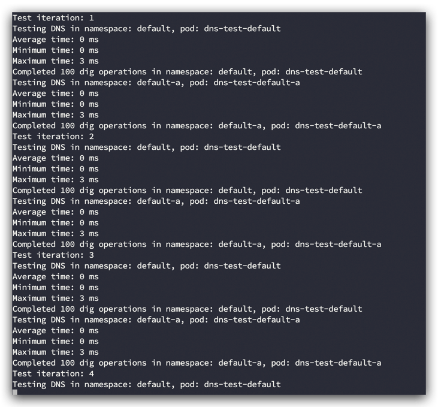
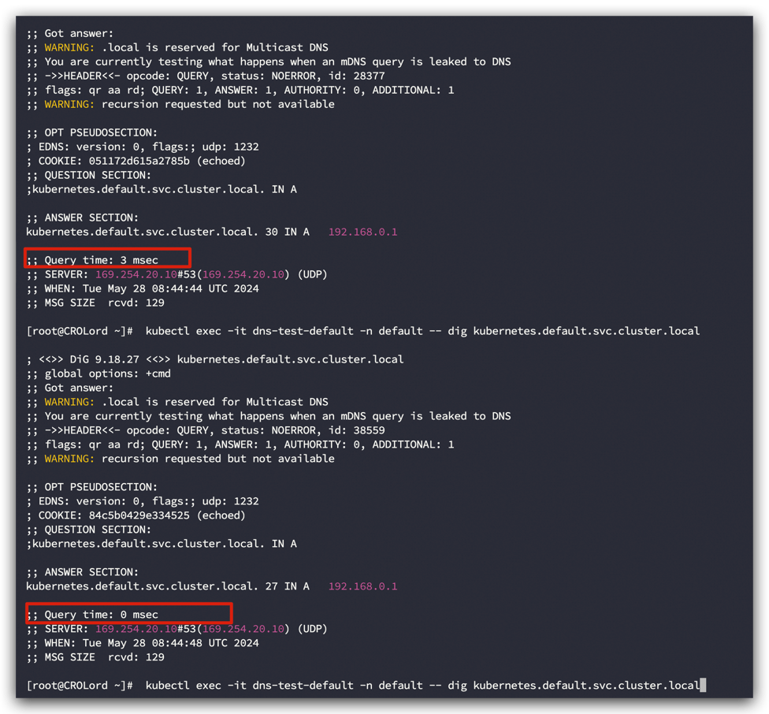
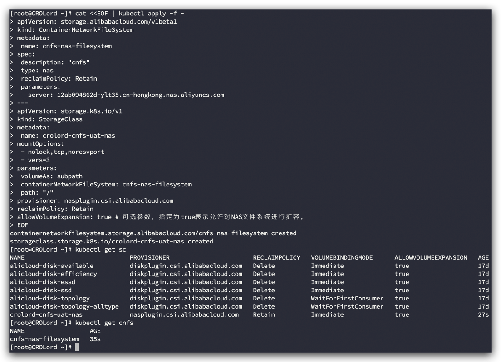

## 如何初始化 容器服务 Kubernetes 版 ACK 实践

1. **如何选择集群版本**
   - **识别版本号**：

     - 阿里云 ACK Kubernetes 版本号采用 x.y.z-aliyun.n 格式：
       x：主要版本（major version）
       y：次要版本（minor version）
       z：补丁版本（patch version）
       n：阿里云补丁版本（ACK patch version）
       例如，版本号 1.28.3-aliyun.1 表示基于 Kubernetes 1.28.3 版本的第一个阿里云补丁版本。[Kubernetes版本概览及机制](https://help.aliyun.com/zh/ack/ack-managed-and-ack-dedicated/user-guide/support-for-kubernetes-versions)
       关于 Kubernetes 版本号的详细说明，请参见 [Kubernetes Release Versioning.](https://github.com/kubernetes/sig-release/blob/master/release-engineering/versioning.md#kubernetes-release-versioning)
   - **低版本和高版本举例说明**：

     - 在 Kubernetes 的版本中，每个主要和次要版本更新都会引入新的特性、改进现有功能、修复漏洞以及可能的 API 变更,建议您在选择集群版本充分阅读官网文档帮助信息，尤其每个版本中 API 的变更情况，充分考虑后选择集群版本。
       Kubernetes 1.24 版本相较于 1.22 版本的主要改进点包括：

     1. 移除了 Dockershim，需要用户迁移到其他容器(Containerd、安全沙箱)运行时。
     2. Server-Side Apply (SSA) 达到 GA 提供了更好的资源管理方式。
     3. PodSecurity Admission 插件替代了 PodSecurityPolicy（PSP），提供了更简洁的安全管理。
     4. 改进了状态同步和健康检查机制。
        Kubernetes 1.22 版本的特点则主要体现在：
     5. 移除了许多旧的 API 版本，需要用户升级到新的 API。
     6. 增强了安全功能和可观察性，提供了更多的监控和诊断工具。
     7. 优先级和抢占（Priority and Preemption）功能达到 GA，提高了资源调度的灵活性。
     8. 选择合适的版本应根据项目需求、兼容性要求以及特性偏好来决定。
   - **官网文档帮助信息**：
     Kubernetes 版本发布页面：
     这个页面列出了每个版本的详细发布说明，包括新特性、改进、修复以及变更内容。
     [Kubernetes Release Notes](https://kubernetes.io/releases)

     Kubernetes 版本生命周期：
     这个页面提供了各个版本的支持状态，包括何时发布、支持期限等信息。
     [Kubernetes Version Skew Policy](https://kubernetes.io/releases/version-skew-policy/)

     Kubernetes API 变更：
     这个页面列出了每个版本中 API 的变更情况，包括新增的 API、弃用的 API 以及移除的 API。
     [Kubernetes API Changes](https://kubernetes.io/docs/reference/using-api/deprecation-guide/)

     Kubernetes 官方文档：
     这个页面提供了 Kubernetes 的完整文档，包括安装、配置、操作以及各个特性的详细说明。
     [Kubernetes Documentation](https://kubernetes.io/docs/home/)
2. **单集群 VPC 网段规划策略**

   - **VPC网段以及交换机网关规划**：
     - **核心要求**：选择一个与现有网络结构不冲突的VPC网段，并确保有足够的地址空间以支持未来的扩展需求。
     - **选择原则**：规划VPC网段时，建议选择子网掩码不超过 `/16` 的网段。交换机子网掩码应在 `/17` 到 `/29` 之间，子网掩码越小，可用的IP地址数量越多。
     - 示例：例如，如果现有 VPC 网络使用 `10.0.0.0/12`，可以选择 `192.168.0.0/16` 作为新的VPC网段。
     - 没有多地域部署系统的要求且各系统之间也不需要通过VPC进行隔离，那么推荐使用一个VPC
     - 有多地域部署系统的需求时，必须使用多个VPC。可以通过使用VPC对等连接、VPN网关、云企业网等产品实现跨地域VPC间互通。
       **参考**[VPC网络规格](https://help.aliyun.com/zh/vpc/getting-started/network-planning)
3. **多集群 VPC 网段规划策略**

   - **多集群 VPC网段以及交换机网关规划**：
     - **核心要求**：
       - 1. 多VPC情况，VPC地址段不重叠，VPC间通过CEN互联。
       - 2. 多集群Pod地址段不重叠。
       - 3. 多集群Pod地址段和Service地址段不能重叠。
     - **示例**：
       - **集群1**：
         - VPC网段：`10.0.0.0/16`
         - Pod网段：`10.1.0.0/16`
         - Service网段：`10.96.0.0/20`
       - **集群2**：
         - VPC网段：`10.2.0.0/16`
         - Pod网段：`10.3.0.0/16`
         - Service网段：`10.97.0.0/20`
           **参考**[多集群VPC网络规格](https://help.aliyun.com/zh/ack/distributed-cloud-container-platform-for-kubernetes)
           **IDC集群与云上互通场景** 当与IDC集群整合时，确保IDC网络与Kubernetes集群的VPC、Pod网段和Service网段不重叠。参考说明[分布式云容器平台ACK one 概述](https://help.aliyun.com/zh/ack/distributed-cloud-container-platform-for-kubernetes/product-overview/ack-one-overview)
4. **网络插件选择指南**

   1. Terway 与 Flannel 对比，参考地址 [Terway与Flannel对比](https://help.aliyun.com/zh/ack/ack-managed-and-ack-dedicated/user-guide/work-with-terway#section-wiw-s2f-tiw) |
   2. Pod 数量详解
      - Terway 计算逻辑,以`ecs.g8a.large` 举例说明，ENI弹性网卡数量:3，单网卡私有IPv4地址数:6，单网卡IPv6地址数:6

      1. 共享ENI多IP模式计算公式=（ECS支持的弹性网卡数-1）×单个ENI支持的私有IP数（EniQuantity-1）×EniPrivateIpAddressQuantity

         * 计算公式: (3 - 1) × 6 =12 ,故 Terway兼容性可以支持 Pod 最大数量为 12 Pod

      2. 共享ENI多IP模式+Trunk ENI= （ECS支持的弹性网卡数-1）×单个ENI支持的私有IP数（EniQuantity-1）×EniPrivateIpAddressQuantity

         * 计算公式:(3 - 1) × 6 x 1 =13 ,故 Terway兼容性可以支持 Pod 最大数量为 13 Pod

      3. 独占ENI模式= ECS支持的弹性网卡数-1   EniQuantity-1

         * 计算公式:(3 -1） =2 ,故 Terway兼容性可以支持 Pod 最大数量为 2 Pod
      - Flannel 计算逻辑

      1. 创建集群选择节点POD数量，最大可单节点 256 Pod，

         * 当前 Pod 网络 CIDR 配置下，每台主机最多容纳 256 个 Pod 时，集群内最多可允许部署 256 台主机。**创建成功后不能修改**
3. Terway DataPath V2模式与NetworkPolicy网络策略模式
   - 使用参考建议[Terway网络插件使用场景](https://help.aliyun.com/zh/ack/ack-managed-and-ack-dedicated/user-guide/work-with-terway#a3fb749478lsw)
5. **SNAT 配置决策**

   - **开启SNAT**：阿里云会自动为集群配置SNAT规则，使得集群内的Pod可以访问外部网络。
     1. 适用场景如集群内部需要访问公网资源，拉取公网镜像，访问三方接口等场景
     2. 黑白名单场景，如何找寻SNAT地址？
        - 容器服务 ACK > 集群名称/ID > 需要操作的集群id > 集群信息 > 集群资源 > 虚拟专有网络 VPC > vpc-****,选中后跳转 > 资源管理 > 公网NAT网关 > 查看弹性公网IP
          地址，如图所示：
          
   - **关闭SNAT**：已经有自定义的NAT网关配置。在这种情况下，需要手动配置NAT规则以满足特定需求。
     1. 关闭后如果需要手动开启则参考如下文档[为已有集群开启公网访问能力](https://help.aliyun.com/zh/ack/ack-managed-and-ack-dedicated/user-guide/enable-an-existing-ack-cluster-to-access-the-internet)
6. **Ingress 控制器选择**

   - **[Nginx Ingress、ALB Ingress和MSE Ingress对比](https://help.aliyun.com/zh/ack/ack-managed-and-ack-dedicated/user-guide/comparison-among-nginx-ingresses-alb-ingresses-and-mse-ingresses-1)**
   - **ALB Ingress**：基于阿里云应用型负载均衡ALB（Application Load Balancer），属于全托管免运维的云服务。单个ALB实例支持100万QPS，提供更强大的Ingress流量管理功能，适用于需要高性能、自动扩展和高级流量管理功能的应用。
   - **Nginx Ingress**：需要您自行运维，如果您对网关定制有强烈的需求，可以选择Nginx Ingress，开源社区支持的Nginx Ingress，适用于中小规模的集群，具有灵活的配置和广泛的社区支持。
     - **MSE Ingress**：基于阿里云MSE（Microservices Engine）云原生网关，属于全托管免运维的云服务。单个MSE云原生网关实例支持100万QPS，提供更为强大的Ingress流量管理功能，将传统流量网关、微服务网关和安全网关三合一，通过硬件加速、WAF本地防护和插件市场等功能，构建一个高集成、高性能、易扩展、热更新的云原生网关，支持流量灰度发布和熔断限流等高级功能。

   - **本文将以阿里云MSE云原生网关完成整个实践部署，通过这些优化的步骤和注意事项，可以帮助您根据具体需求和环境选择合适的ACK配置，确保集群在功能、性能和安全性方面达到最佳效果。**

2. 初始化 ACK 集群配置

   1. 配置免密镜像组件拉取策略
      - **aliyun-acr-credential-helper组件特性选择说明参考[免密拉取容器镜像组件托管差异说明参考](https://help.aliyun.com/zh/ack/ack-managed-and-ack-dedicated/user-guide/non-secret-pulling-container-image/#49255764a41jr)**

      1. 安装免密组件步骤参考，建议tokenMode 选择 auto 模式，安装组件参考控制台说明 [参考地址](https://help.aliyun.com/zh/acr/user-guide/use-the-aliyun-acr-credential-helper-component-to-pull-images-without-using-secrets#section-qvh-e83-hgj)
      2. 在具备操作 kubectl 节点执行自动配置脚本如下，（企业版实例ID为 acr 控制台 instance_id）
         ```shell
         #!/bin/bash
         prompt() {
         local prompt_text=$1
         local default_value=$2
         read -p "$prompt_text [$default_value]: " input
         echo "${input:-$default_value}"
         }

         instance_id=$(prompt "请输入企业版实例ID（个人版请留空）" "")
         watch_namespace=$(prompt "请输入watch-namespace或者输入 all" "default")
         notify_email=$(prompt "请输入通知邮箱（如果不需要请留空）" "")
         service_account=$(prompt "请输入service-account" "default")
         enable_webhook=$(prompt "是否启用webhook能力（true/false，默认false）" "false")

         domains=""
         region_id=""

         if [[ -n "$instance_id" ]]; then
         domains=$(prompt "请输入域名（如果不需要请留空）" "")
         region_id=$(prompt "请输入地域ID（如果为默认地域请留空）" "cn-hongkong")
         fi

         patch_content="{\"data\":{"
         patch_content+="\"watch-namespace\":\"$watch_namespace\","
         patch_content+="\"notify-email\":\"$notify_email\","
         patch_content+="\"service-account\":\"$service_account\","

         if [[ -n "$instance_id" ]]; then
         patch_content+="\"acr-registry-info\":\"- instanceId: \\\"$instance_id\\\"\\n  regionId: \\\"$region_id\\\"\\n  domains: \\\"$domains\\\"\","
         else
         patch_content+="\"acr-registry-info\":\"#- instanceId: \\\"\\\"\","
         fi

         if [[ "$enable_webhook" == "true" ]]; then
         patch_content+="\"webhook-configuration\":\"enable: true\\n  failure-policy: Ignore\\n  timeout-seconds: 10\","
         fi

         patch_content=${patch_content%,}
         patch_content+="}}"

         kubectl patch cm acr-configuration -n kube-system --type merge --patch "$patch_content"

         echo "ConfigMap 'acr-configuration' 更新成功。"
         ```
         **2.1执行结果示意图**
         ![update-configmap-acr.png](../resource/images/update-configmap-acr.png)
      3. 配置完成后，可通过ack控制台验证镜像是否拉取成功，如有问题可以提issue咨询。
  
   2. 配置NodeLocal DNSCache 缓存代理来提高集群DNS性能
      - **使用NodeLocal DNSCache 说明参考[使用NodeLocal DNSCache](https://help.aliyun.com/zh/ack/ack-managed-and-ack-dedicated/user-guide/configure-nodelocal-dnscache)**
      1. 根据以上文档安装配置好后，需要注意NodeLocal DNSCache 对 Pod 创建约束，需要配置Forward插件与上游VPC DNS服务器的默认协议参考操作微电脑[修改方式参考](https://help.aliyun.com/zh/ack/ack-managed-and-ack-dedicated/user-guide/dns-best-practice#29c283410edkw)
      2. 验证测试流程方案
      ```shell
       # 开启指定命令空间是否具备NodeLocal DNSCache能力
       kubectl label namespace default node-local-dns-injection=enabled
       # 创建测试命名空间验证流程
       ##1、创建测试程序
       kubectl run dns-test-default --namespace=default --image=alpine -- /bin/sh -c "apk add --no-cache bind-tools && sleep 3600"
       kubectl run dns-test-default-a --namespace=default-a --image=alpine -- /bin/sh -c "apk add --no-cache bind-tools && sleep 3600"
       ##2、编写脚本验证
       #!/bin/bash
            
       # 定义命名空间和Pod名称
       namespaces=("default" "default-a")
       pods=("dns-test-default" "dns-test-default-a")
            
       # 测试DNS解析时间的函数
       test_dns() {
         namespace=$1
         pod=$2
         echo "Testing DNS in namespace: $namespace, pod: $pod"
            
         times=()
         for i in $(seq 1 100); do
           result=$(kubectl exec -it $pod -n $namespace -- dig +tries=1 +time=1 kubernetes.default.svc.cluster.local | grep 'Query time:' | awk '{print $4}')
           if [[ $result =~ ^[0-9]+$ ]]; then
             times+=($result)
           fi
         done
            
         if [ ${#times[@]} -gt 0 ]; then
           total=0
           min=${times[0]}
           max=${times[0]}
           for t in "${times[@]}"; do
             total=$((total + t))
             if (( t < min )); then
               min=$t
             fi
             if (( t > max )); then
               max=$t
             fi
           done
           avg=$((total / ${#times[@]}))
           echo "Average time: $avg ms"
           echo "Minimum time: $min ms"
           echo "Maximum time: $max ms"
         else
           echo "No valid timing data collected."
         fi
         echo "Completed 100 dig operations in namespace: $namespace, pod: $pod"
       }
            
       # 循环测试并收集结果
       for i in $(seq 1 5); do
         echo "Test iteration: $i"
         for j in ${!namespaces[@]}; do
           test_dns ${namespaces[$j]} ${pods[$j]}
         done
       done
      ```
         3.  查看脚本执行结果

      

         4. (可选)执行dig命令验证，对比Query time字段结果，查询是否满足DNS优化需求
      ```shell
      kubectl exec -it dns-test-default-a -n default-a -- dig kubernetes.default.svc.cluster.local
      kubectl exec -it dns-test-default -n default -- dig kubernetes.default.svc.cluster.local
      ```
      

   3. 配置 terway 参数
      - **非特殊场景请勿修改** [Terway参数说明](https://help.aliyun.com/zh/ack/ack-managed-and-ack-dedicated/user-guide/terway-configuration-parameters)
      - 如果需要修改，请在初始化集群时完成，尽量在业务低峰时间操作
      
   4. 配置调度优化
      - **调度场景** [调度概述](https://help.aliyun.com/zh/ack/ack-managed-and-ack-dedicated/user-guide/scheduling-overview)
      - 本文不设计 GPU 异构计算场景示例，如有问题可以提issue，以及咨询官方客服。
        1. 自定义弹性资源优先级调度利用不同节点池做资源调度，
           - 需要使用ECI资源时，已部署ack-virtual-node。具体操作，请参见[ACK使用ECI](https://help.aliyun.com/zh/eci/user-guide/connection-overview)。
           - 为已有资源配置交互式创建为核心应用，开启配置CPU拓扑感知调度，脚本为开启NAMESPACE下当前资源类型配置[CPU拓扑感知调度](https://help.aliyun.com/zh/ack/ack-managed-and-ack-dedicated/user-guide/topology-aware-cpu-scheduling)
      ```bash
       #!/bin/bash
            
       # 读取用户输入的命名空间
       read -p "请输入命名空间: " NAMESPACE
            
       # 读取用户是否配置 cpu-policy: 'static-burst'
       read -p "是否配置 cpu-policy: 'static-burst' (yes/no): " CONFIG_CPU_POLICY
       if [[ "$CONFIG_CPU_POLICY" == "yes" ]]; then
       CPU_POLICY="cpu-policy=static-burst"
       else
       CPU_POLICY=""
       fi
            
       # 读取用户是否配置 cpuset-scheduler: "true"
       read -p "是否配置 cpuset-scheduler: 'true' (yes/no): " CONFIG_CPUSET_SCHEDULER
       if [[ "$CONFIG_CPUSET_SCHEDULER" == "yes" ]]; then
       CPUSET_SCHEDULER="cpuset-scheduler=true"
       else
       CPUSET_SCHEDULER=""
       fi
            
       # 函数：添加annotations
       annotate_resource() {
       local resource=$1
       local name=$2
       echo "Processing $resource: $name"
            
       # 构建 annotate 命令
       annotate_cmd="kubectl annotate $resource $name -n $NAMESPACE"
       if [[ ! -z "$CPU_POLICY" ]]; then
       annotate_cmd="$annotate_cmd $CPU_POLICY"
       fi
       if [[ ! -z "$CPUSET_SCHEDULER" ]]; then
       annotate_cmd="$annotate_cmd $CPUSET_SCHEDULER"
       fi
       annotate_cmd="$annotate_cmd --overwrite"
            
       # 执行 annotate 命令
       eval $annotate_cmd
       }
            
       # 获取所有资源类型的名称
       resources=("pods" "deployments" "daemonsets" "statefulsets")
       for resource in "${resources[@]}"; do
       items=$(kubectl get $resource -n $NAMESPACE -o jsonpath='{.items[*].metadata.name}')
       for item in $items; do
       annotate_resource $resource $item
       done
       done
            
       echo "Annotations added to all resources in namespace $NAMESPACE"
      ```
      - 可以通过`kubectl get pods -n [指定ns名称] -o jsonpath='{range .items[*]}{.metadata.name}{"\n"}{.metadata.annotations}{"\n\n"}{end}' `
        - 建议配置使用负载感知调度以及热点打散策略[使用负载热点打散重调度](https://help.aliyun.com/zh/ack/ack-managed-and-ack-dedicated/user-guide/use-load-aware-pod-scheduling)
        - 方案一 配置多可用区 Pod 打散，yaml 片段如下示意
          1.  `maxSkew` 定义了在指定的拓扑域（如区域、节点等）之间允许的最大偏差值。这里的值为 1，表示每个区域中最多只能比其他区域多 1 个 Pod。例如，如果一个区域有 2 个 Pod，那么其他区域中最多只能有 1 个或 3 个 Pod。
          2.  `topologyKey` 指定了拓扑域的键，这里使用的是 `topology.kubernetes.io/zone`，表示扩展约束是针对不同的区域（zone）进行的。您可以使用不同的键，如 `kubernetes.io/hostname` 针对不同的节点。
          3.  `whenUnsatisfiable` 指定了当无法满足拓扑扩展约束时应该采取的措施。`DoNotSchedule` 表示如果无法满足约束条件，则不要调度 Pod。这可以防止 Pod 被调度到不满足条件的节点或区域中。
          4.  `labelSelector` 定义了选择器，用于选择哪些 Pod 受这个拓扑扩展约束的影响。这里的选择器是通过 `matchLabels` 指定的，选择所有带有 `app: my-app` 标签的 Pod。
      ```yaml
        topologySpreadConstraints:
        - maxSkew: 1
        topologyKey: topology.kubernetes.io/zone
        whenUnsatisfiable: DoNotSchedule
        labelSelector:
        matchLabels:
        app: my-app
        ```

   5. 配置容器网络文件系统 CNFS
      - **[创建CNFS管理NAS文件系统](https://help.aliyun.com/zh/ack/ack-managed-and-ack-dedicated/user-guide/use-cnfs-to-manage-nas-file-systems-recommended)**
      - **[使用CNFS管理NAS共享存储卷（推荐）](https://help.aliyun.com/zh/ack/ack-managed-and-ack-dedicated/user-guide/use-cnfs-to-manage-shared-nas-volumes-recommended)**
      - **[使用CNFS管理NAS隔离存储卷（推荐）](https://help.aliyun.com/zh/ack/ack-managed-and-ack-dedicated/user-guide/use-cnfs-to-manage-isolated-nas-volumes-recommended)**
      - **[创建CNFS管理NAS文件系统](https://help.aliyun.com/zh/ack/ack-managed-and-ack-dedicated/user-guide/use-cnfs-to-manage-nas-file-systems-recommended)**
      - **截止2024年06月03日，仅支持分布式缓存支持的操作系统为Alibaba Cloud Linux 2，内核版本为v4.19.91-23至v4.19.91-26版本，Kubernetes版本为v1.20及以上，且存储插件选择为CSI。CSI-Plugin和CSI-Provisioner组件版本不低于v1.22.11-abbb810e-aliyun，storage-operator组件版本不低于v1.22.86-041b094-aliyun条件限制[开启CNFS NAS计算端分布式缓存](https://help.aliyun.com/zh/ack/ack-managed-and-ack-dedicated/user-guide/enable-the-distributed-caching-feature-of-the-cnfs-client)** 
      - 实践配置
      1. 优先建议使用已有 nas 创建，参考方案[创建已有nas](https://help.aliyun.com/zh/ack/ack-managed-and-ack-dedicated/user-guide/use-cnfs-to-manage-nas-file-systems#section-qqn-h8b-5u9)）
       ```shell
      cat <<EOF | kubectl apply -f -
      apiVersion: storage.alibabacloud.com/v1beta1
      kind: ContainerNetworkFileSystem
      metadata:
        name: cnfs-nas-filesystem
      spec:
        description: "cnfs"
        type: nas
        reclaimPolicy: Retain
        parameters:
          server: 4567897879-ylt35.cn-hongkong.nas.aliyuncs.com
      ---
      apiVersion: storage.k8s.io/v1
      kind: StorageClass
      metadata:
        name: crolord-cnfs-uat-nas
      mountOptions:
        - nolock,tcp,noresvport
        - vers=3
      parameters:
        volumeAs: subpath
        containerNetworkFileSystem: cnfs-nas-filesystem
        path: "/"
      provisioner: nasplugin.csi.alibabacloud.com
      reclaimPolicy: Retain
      allowVolumeExpansion: true # 可选参数，指定为true表示允许对NAS文件系统进行扩容。
      EOF
        ```
      
      2. 根据配置 StorageClass 可验证是否创建成功，业务pod是否完成。
      - **如果应用只需在一个节点上运行并访问存储，可以选择 RWO（ReadWriteOnce）,需要在多个节点上运行并共享存储，需要选择 RWX（ReadWriteMany）。**
    ```yaml
    # 创建CNFS、StorageClass和Deployment、StatefulSet对象。
    cat << EOF | kubectl apply -f -
    ---
    kind: PersistentVolumeClaim
    apiVersion: v1
    metadata:
      name: cnfs-nas-pvc
    spec:
      accessModes:
        - ReadWriteMany
      storageClassName: crolord-cnfs-uat-nas
      resources:
        requests:
          storage: 70Gi # 如果打开目录限额功能，则storage字段会生效，动态创建目录写入数据量最大为70 GiB。
    ---
    apiVersion: apps/v1
    kind: Deployment
    metadata:
      name: cnfs-crolord-deployment
      labels:
        app: nginx
    spec:
      selector:
        matchLabels:
          app: nginx
      template:
        metadata:
          labels:
            app: nginx
        spec:
          containers:
          - name: nginx
            image: nginx:latest
            volumeMounts:
            - mountPath: "/data"
              name: cnfs-nas-pvc
          volumes:
          - name: cnfs-nas-pvc
            persistentVolumeClaim:
              claimName: cnfs-nas-pvc
    ---
    apiVersion: apps/v1
    kind: StatefulSet
    metadata:
      name: cnfs-nas-sts
      labels:
        app: nginx
    spec:
      serviceName: "nginx"
      replicas: 2
      selector:
        matchLabels:
          app: nginx
      template:
        metadata:
          labels:
            app: nginx
        spec:
          containers:
          - name: nginx
            image: nginx:latest
            volumeMounts:
            - mountPath: "/data"
              name: www
      volumeClaimTemplates:
      - metadata:
          name: www
        spec:
          accessModes: [ "ReadWriteOnce" ]
          storageClassName: "crolord-cnfs-uat-nas"
          resources:
            requests:
              storage: 50Gi # 如果打开目录限额功能，则storage字段会生效，动态创建目录写入数据量最大为50 GiB。
    EOF
    ```

    2. 验证StatefulSet PVC是否生效
    ```shell
    kubectl exec cnfs-nas-sts-0 -ti -- sh -c 'dd if=/dev/zero of=/data/1G.tmpfile bs=1G count=1;'
    kubectl exec cnfs-nas-sts-0 -- ls -arlth /data
    kubectl exec cnfs-nas-sts-0 -- mount |grep nfs
    ```
至此配置 ACK 初始化完成，如有问题可以提 issue 咨询。