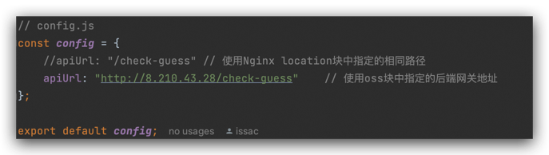
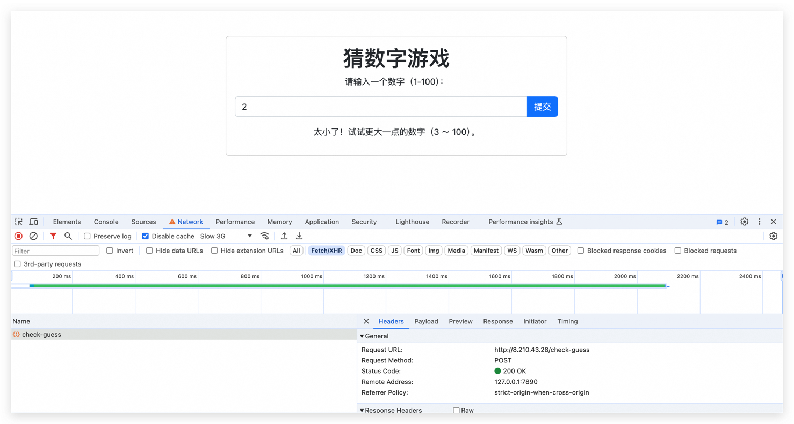

## Monolithic Application GO VUE项目前后分离部署到ACK环境

### 1. 概述

本篇文章将介绍如何将一个基于 GO 和 VUE 的应用进行前后端分离，并部署到阿里云的 Kubernetes 服务（ACK）环境，以及选择部署前端资源到 oss 。整个流程将涵盖 Jenkins Pipeline 的使用，以及安全和质量检测工具如 Trivy 和 SonarQube 的集成。此外，我们还将涉及多架构构建的相关内容。

### 2. 环境准备

#### 2.1 工具和服务

- **Jenkins**：用于持续集成和持续部署（CI/CD）的自动化工具。
- **Trivy**：用于容器安全扫描的开源工具。
- **SonarQube**：用于代码质量和安全分析的平台。
- **kaniko**：用于构建和管理容器化应用。
- **Kubernetes (ACK)**：阿里云的托管 Kubernetes 服务，用于容器编排和管理。

#### 2.2 基本配置项合集说明

- 阿里云 ACK 集群集群令牌获取，获取方式登录容器服务 ACK，选择目标集群，连接信息，复制 Kubeconfig 令牌信息，用于部署应用到目标集群。
- 阿里云 ACR 账户信息获取，使用 Docker 登录镜像仓库后，将 `/root/.docker/config.json`配置信息配置为secret凭据，用于 kaniko 构建镜像使用。
- SonarQube Server 登录 Sonarqube，在account选项/security，创建Generate Tokens，用于配置 jenkins 扫描代码。

### 3. 项目结构

```plaintext
.
├── go-guess-number
│   ├── Dockerfile
│   ├── go-guess-number.yaml
│   ├── go.mod
│   ├── go.sum
│   ├── jenkinsfile
│   └── main.go
└── vue-go-guess-number
    ├── Dockerfile
    ├── README.md
    ├── babel.config.js
    ├── default.conf
    ├── jsconfig.json
    ├── localhost.xml
    ├── package-lock.json
    ├── package.json
    ├── public
    │   ├── favicon.ico
    │   └── index.html
    ├── src
    │   ├── App.vue
    │   ├── GuessGame.vue
    │   ├── LogInGame.vue
    │   ├── assets
    │   │   └── logo.png
    │   ├── components
    │   │   └── HelloWorld.vue
    │   ├── config.js
    │   ├── main.js
    │   └── vue.config.js
    └── vue-go-guess-number.yaml

7 directories, 25 files

```

#### 4. Jenkins Pipeline 各个Stage分析与功能描述


#### 4.1 Pipeline 全局配置

- **agent**：指定使用 Kubernetes 作为 Jenkins agent，并且配置了相关的 Kubernetes 环境（本文涉及多阶段多个agent，故设置none）。
- **environment**：定义了一系列环境变量，包括 Git 分支、版本号、构建目标平台、镜像仓库地址、SonarQube 域名、OSS 部署路径等。
- **triggers**：设置了 GitHub Push 触发器，当有新的代码推送到 GitHub 仓库时触发构建（可选择注释）。
- **parameters**：定义了一些参数，允许用户在构建时提供输入，如 Git 分支、构建目录、镜像仓库地址、SonarQube 域名、OSS 部署路径等。

### 各个Stage分析

#### `前端部署 OSS Jenkinsfile`

##### 1. `Revert to Previous Version`

- **条件**：当参数 `REVERT_TO_PREVIOUS_VERSION` 为 `true` 时执行。
- **功能**：使用 OSS 的 `revert-versioning` 功能将 OSS Bucket 恢复到上一个版本。需要访问 OSS 的 Access Key 和 Secret。
- **操作**：
    - 使用 `ossutil config` 配置 OSS 访问。
    - 使用 `ossutil revert-versioning` 命令恢复到上一个版本。

##### 2. `Refresh CDN`

- **条件**：当参数 `REVERT_TO_PREVIOUS_VERSION` 为 `true` 时执行。
- **功能**：刷新 CDN 缓存，以确保最新版本的资源可以及时生效。
- **操作**：
    - 下载并执行 `cdn.go` 脚本。
    - 使用 OSS 的 Access Key 和 Secret 进行 CDN 刷新。

##### 3. `Main Pipeline`

- **条件**：当参数 `REVERT_TO_PREVIOUS_VERSION` 为 `false` 时执行。
- **功能**：执行主要的 CI/CD 流程，包括版本号更新、代码检出、目录检查、SonarQube 分析、OSS 推送和 CDN 刷新。

###### `Main Pipeline` 的子 stages

1. **Version**

    - **功能**：更新版本号。
    - **操作**：
        - 通过构建号设置 `PATCH_VERSION`。
        - 组合生成完整的版本号 `VERSION_NUMBER`。

2. **Checkout**

    - **功能**：检出代码。
    - **操作**：
        - 清理工作空间。
        - 检出指定分支的代码。
        - 输出检出完成信息。

3. **Check Directory**

    - **功能**：检查当前工作目录。
    - **操作**：
        - 输出当前工作目录。
        - 列出目录内容。
        - 存储源代码。

4. **SonarQube analysis**

    - **功能**：进行 SonarQube 分析。
    - **操作**：
        - 恢复源代码。
        - 使用 SonarQube 进行代码质量分析。
        - 检查 SonarQube 质量门。

5. **node oss push**

    - **功能**：构建并推送前端代码到 OSS。
    - **操作**：
        - 恢复源代码。
        - 安装并构建前端代码。
        - 使用 Trivy 扫描安全漏洞。
        - 配置 OSS 并检查存储桶是否存在。
        - 上传构建的前端代码到 OSS。

6. **Refresh CDN**

    - **功能**：刷新 CDN 缓存。
    - **操作**：
        - 下载并执行 CDN 刷新脚本 `cdn.go`。

### `4.2 前端部署 ACK Jenkinsfile`

1. **Version**

    - **功能**：更新版本号。
    - **操作**：
        - 通过构建号设置 `PATCH_VERSION`。
        - 组合生成完整的版本号 `VERSION_NUMBER`。

2. **Checkout**

    - **功能**：检出代码。
    - **操作**：
        - 清理工作空间。
        - 检出指定分支的代码。
        - 输出检出完成信息。

3. **Check Directory**

    - **功能**：检查当前工作目录。
    - **操作**：
        - 输出当前工作目录。
        - 列出目录内容。
        - 存储源代码。

4. **SonarQube analysis**

    - **功能**：进行 SonarQube 分析。
    - **操作**：
        - 恢复源代码。
        - 使用 SonarQube 进行代码质量分析。
        - 检查 SonarQube 质量门。

5. **Parallel Build**

    - **功能**：并行构建多架构 Docker 镜像。
    - **操作**：
        - 恢复源代码。
        - 并行为 `amd64` 和 `arm64` 构建 Docker 镜像。

6. **Push Multi-Arch Manifest**

    - **功能**：推送多架构镜像 Manifest。
    - **操作**：
        - 使用 `manifest-tool` 创建并推送多架构镜像的 manifest。

7. **Deploy to Kubernetes**

    - **功能**：部署到 Kubernetes 集群。
    - **操作**：
        - 恢复源代码。
        - 使用 `kubectl` 部署更新的镜像到 Kubernetes 集群。

### `4.3 后端部署 ACK Jenkinsfile`

1. **Version**

    - **功能**：更新版本号。
    - **操作**：
        - 通过构建号设置 `PATCH_VERSION`。
        - 组合生成完整的版本号 `VERSION_NUMBER`。

2. **Checkout**

    - **功能**：检出代码。
    - **操作**：
        - 清理工作空间。
        - 检出指定分支的代码。
        - 输出检出完成信息。

3. **Check Directory**

    - **功能**：检查当前工作目录。
    - **操作**：
        - 输出当前工作目录。
        - 列出目录内容。
        - 存储源代码。

4. **SonarQube analysis**

    - **功能**：进行 SonarQube 分析。
    - **操作**：
        - 恢复源代码。
        - 使用 SonarQube 进行代码质量分析。
        - 检查 SonarQube 质量门。

5. **Parallel Build**

    - **功能**：并行构建多架构 Docker 镜像。
    - **操作**：
        - 恢复源代码。
        - 并行为 `amd64` 和 `arm64` 构建 Docker 镜像。

6. **Push Multi-Arch Manifest**

    - **功能**：推送多架构镜像 Manifest。
    - **操作**：
        - 使用 `manifest-tool` 创建并推送多架构镜像的 manifest。

7. **Deploy to Kubernetes**

    - **功能**：部署到 Kubernetes 集群。
    - **操作**：
        - 恢复源代码。
        - 使用 `kubectl` 部署更新的镜像到 Kubernetes 集群。

通过以上分析，各个 `stage` 共同完成了从代码检出、质量分析、安全扫描、构建、部署到 OSS 和刷新 CDN 的整个 CI/CD 流程，确保了代码的质量和安全，同时提供了版本回滚的能力。

### 4. Jenkins Pipeline 配置前后端配置

#### 4.1 前端部署 OSS Jenkinsfile 

```groovy
pipeline {
    // 定义使用的 Jenkins agent 类型
    agent { kubernetes { /* 配置省略 */ } }
    
    // 定义环境变量
    environment {
        GIT_BRANCH = 'main' // Git主分支的默认值
        MAJOR_VERSION = 'v1' // 主版本号
        MINOR_VERSION = '0'  // 次版本号
        PLATFORMS = 'linux/amd64,linux/arm64' // 构建目标平台
        MAJOR = "${params.MAJOR_VERSION ?: env.MAJOR_VERSION ?: '1'}" // 主版本号，允许通过参数覆盖
        MINOR = "${params.MINOR_VERSION ?: env.MINOR_VERSION ?: '0'}" // 次版本号，允许通过参数覆盖
        PATCH = "${env.BUILD_NUMBER}" // 构建号，用作修订版本号
        VERSION_TAG = "${MAJOR}.${MINOR}.${PATCH}" // 组合版本标签
        IMAGE_REGISTRY = "${params.IMAGE_REGISTRY}" // 镜像仓库地址
        IMAGE_NAMESPACE = "${params.IMAGE_NAMESPACE}" // 镜像命名空间
        IMAGE_ID = "${params.IMAGE_NAMESPACE}" // 镜像ID
        SONARQUBE_DOMAIN = "${params.SONARQUBE_DOMAINE}" // Sonarqube 域名配置
        DEPLOY_PATH = "${params.OSS_DEPLOY_PATH}"
        OSSENDPOINT = "${params.OSSENDPOINT}"
        OSSBUCKET = "${params.OSSBUCKET}"
        DEPLOY_ENVIRONMENT = "${params.DEPLOY_ENVIRONMENT}"  // 直接使用参数作为环境变量
    }

    // 触发条件
    triggers { githubPush() }

    // 参数定义
    parameters {
        persistentString(name: 'BRANCH', defaultValue: 'main', description: 'Initial default branch: main')
        persistentChoice(name: 'PLATFORMS', choices: ['linux/amd64', 'linux/amd64,linux/arm64'], description: 'Target platforms, initial value: linux/amd64,linux/arm64')
        persistentString(name: 'GIT_REPOSITORY', defaultValue: 'https://github.com/Roliyal/CROlordCodelibrary.git', description: 'Git repository URL, default: https://github.com/Roliyal/CROlordCodelibrary.git')
        persistentString(name: 'MAJOR_VERSION', defaultValue: '1', description: 'Major version number, default: 1')
        persistentString(name: 'MINOR_VERSION', defaultValue: '0', description: 'Minor version number, default: 0')
        persistentString(name: 'BUILD_DIRECTORY', defaultValue: 'Chapter2KubernetesApplicationBuild/Unit2CodeLibrary/FEBEseparation/vue-go-guess-number', description: 'Build directory path, default path: Chapter2KubernetesApplicationBuild/Unit2CodeLibrary/FEBEseparation/go-guess-number')
        persistentString(name: 'IMAGE_REGISTRY', defaultValue: 'crolord-registry-registry-vpc.cn-hongkong.cr.aliyuncs.com', description: 'Image registry address, default: crolord-registry-registry-vpc.cn-hongkong.cr.aliyuncs.com')
        persistentString(name: 'IMAGE_NAMESPACE', defaultValue: 'febe', description: 'Image namespace, default: febe')
        persistentString(name: 'SONARQUBE_DOMAINE', defaultValue: 'sonarqube.roliyal.com', description: 'SonarQube domain, default: sonarqube.roliyal.com')
        persistentString(name: 'OSS_DEPLOY_PATH', defaultValue: '', description: 'The OSS path where artifacts will be deployed')
        persistentString(name: 'OSSENDPOINT', defaultValue: 'oss-cn-hongkong.aliyuncs.com', description: 'The OSSEndpoin address default:oss-cn-hongkong.aliyuncs.com')
        persistentString(name: 'OSSBUCKET', defaultValue: 'febe', description: 'The OSS Bucket address default:febecrolord')
        choice(name: 'DEPLOY_ENVIRONMENT', choices: ['development', 'staging', 'production'], description: 'The deployment environment')
        booleanParam(name: 'REVERT_TO_PREVIOUS_VERSION', defaultValue: false, description: 'Select Yes to revert to previous version')
    }
    
    stages {
        stage('Revert to Previous Version') {
            agent { kubernetes { inheritFrom 'kanikoamd' } }
            when {
                expression {
                    return params.REVERT_TO_PREVIOUS_VERSION
                }
            }
            steps {
                container('kanikoamd') {
                    script {
                        // 使用 withCredentials 从 Jenkins 凭证存储中安全获取敏感信息
                        withCredentials([string(credentialsId: 'access_key_id', variable: 'ACCESS_KEY_ID'),
                                         string(credentialsId: 'access_key_secret', variable: 'ACCESS_KEY_SECRET')]) {
                            def bucketName = "${env.OSSBUCKET}-${env.DEPLOY_ENVIRONMENT}"
                            sh "ossutil config -e ${env.OSSENDPOINT} -i ${ACCESS_KEY_ID} -k ${ACCESS_KEY_SECRET}"
                            // 恢复到上一个版本
                            sh "ossutil revert-versioning oss://${bucketName} -r"    
                            echo "Reverted to previous version on bucket: ${bucketName}"
                        }
                    }
                }
            }
        }
    stage('Refresh CDN') {
        agent { kubernetes { inheritFrom 'kanikoamd' } }
            when {
            expression {
            return params.REVERT_TO_PREVIOUS_VERSION
                }
            }
        steps {
           // 指定在特定容器中执行            
            container('kanikoamd') {
                script {
                    echo "Refreshing CDN..."
                        // 使用 withCredentials 从 Jenkins 凭证存储中安全获取敏感信息
                    withCredentials([string(credentialsId: 'access_key_id', variable: 'ACCESS_KEY_ID'),
                                     string(credentialsId: 'access_key_secret', variable: 'ACCESS_KEY_SECRET')]) {
                    // 下载 cdn.go 文件
                    def cdnGo = httpRequest(
                    url: 'https://raw.githubusercontent.com/Roliyal/CROLordSharedLlibraryCode/main/cdn.go',
                    outputFile: 'cdn.go'
                                    )
                                    echo "cdn.go downloaded: ${cdnGo.status}"
                
                                    // 下载 urls.txt 文件
                                    def urlsTxt = httpRequest(
                                        url: 'https://raw.githubusercontent.com/Roliyal/CROLordSharedLlibraryCode/main/urls.txt',
                                        outputFile: 'urls.txt'
                                    )
                                    echo "urls.txt downloaded: ${urlsTxt.status}"
                                    // 初始化 go module 并获取依赖
                                    sh """
                                    go mod init cdn-refresh
                                    go get github.com/aliyun/alibaba-cloud-sdk-go/services/cdn
                                    """
                                    // 执行 go run cdn.go 命令
                                    withEnv([
                                        "ACCESS_KEY_ID=${ACCESS_KEY_ID}",
                                        "ACCESS_KEY_SECRET=${ACCESS_KEY_SECRET}"
                                    ]) {
                                        sh '''
                                        go run cdn.go -i ${ACCESS_KEY_ID} -k ${ACCESS_KEY_SECRET} -r urls.txt -t clear -o File
                                        go run cdn.go -i ${ACCESS_KEY_ID} -k ${ACCESS_KEY_SECRET} -r urls.txt -t push -a domestic
                                        '''
                                    }
                                }
                            }
                        }
                    }
                }        
                
        stage('Main Pipeline') {
            when {
                not {
                    expression {
                        return params.REVERT_TO_PREVIOUS_VERSION
                    }
                }
            }
            stages {
                stage('Version') {
                    steps {
                        script {
                            env.PATCH_VERSION = env.BUILD_NUMBER
                            env.VERSION_NUMBER = "${env.MAJOR}.${env.MINOR}.${env.PATCH_VERSION}"
                            echo "Current Version: ${env.VERSION_NUMBER}"
                        }
                    }
                }

                stage('Checkout') {
                    steps {
                        cleanWs() // 清理工作空间
                        script {
                            env.GIT_BRANCH = params.BRANCH
                        }
                        // 检出Git仓库
                        checkout scm: [
                            $class: 'GitSCM',
                            branches: [[name: "*/${env.GIT_BRANCH}"]],
                            userRemoteConfigs: [[url: params.GIT_REPOSITORY]],
                            extensions: [[$class: 'CloneOption', depth: 1, noTags: false, reference: '', shallow: true]]
                        ]
                        echo '代码检出完成'
                    }
                }

                stage('Check Directory') {
                    steps {
                        echo "Current working directory: ${pwd()}"
                        sh 'ls -la'
                        stash includes: '**', name: 'source-code' // 存储工作空间，包括Dockerfile和应用代码
                    }
                }

                stage('SonarQube analysis') {
                    agent { kubernetes { inheritFrom 'kanikoamd' } }
                    steps {
                        // 从之前的阶段恢复存储的源代码
                        unstash 'source-code'
                        // 指定在特定容器中执行
                        container('kanikoamd') {
                            // 设置SonarQube环境
                            withSonarQubeEnv('sonar') {
                                script {
                                    // 使用withCredentials从Jenkins凭据中获取SonarQube token
                                    withCredentials([string(credentialsId: 'sonar', variable: 'SONAR_TOKEN')]) {
                                        // 执行sonar-scanner命令
                                        sh """
                                        sonar-scanner \
                                          -Dsonar.projectKey=${JOB_NAME} \
                                          -Dsonar.projectName='${env.IMAGE_NAMESPACE}' \
                                          -Dsonar.projectVersion=${env.VERSION_TAG} \
                                          -Dsonar.sources=. \
                                          -Dsonar.exclusions='**/*_test.go,**/vendor/**' \
                                          -Dsonar.language=go \
                                          -Dsonar.host.url=http://${env.SONARQUBE_DOMAIN} \
                                          -Dsonar.login=${SONAR_TOKEN} \
                                          -Dsonar.projectBaseDir=${env.BUILD_DIRECTORY} 
                                        """
                                    }
                                    // 使用script块处理HTTP请求和JSON解析
                                    withCredentials([string(credentialsId: 'sonar', variable: 'SONAR_TOKEN')]) {
                                        def authHeader = "Basic " + ("${SONAR_TOKEN}:".bytes.encodeBase64().toString())
                                        def response = httpRequest(
                                            url: "http://${env.SONARQUBE_DOMAIN}/api/qualitygates/project_status?projectKey=${JOB_NAME}",
                                            customHeaders: [[name: 'Authorization', value: authHeader]],
                                            consoleLogResponseBody: true,
                                            acceptType: 'APPLICATION_JSON',
                                            contentType: 'APPLICATION_JSON'
                                        )
                                        def json = readJSON text: response.content
                                        if (json.projectStatus.status != 'OK') {
                                            error "SonarQube quality gate failed: ${json.projectStatus.status}"
                                        } else {
                                            echo "Quality gate passed successfully."
                                        }
                                    }
                                }
                            }
                        }
                    }
                }

                stage('node oss push') {
                    agent { kubernetes { inheritFrom 'kanikoamd' } }
                    steps {
                        // 从之前的阶段恢复存储的源代码
                        unstash 'source-code'
                        // 指定在特定容器中执行            
                        container('kanikoamd') {
                            script {
                                echo "Deploying to environment: ${env.DEPLOY_ENVIRONMENT}"
                                // 使用 withCredentials 从 Jenkins 凭证存储中安全获取敏感信息
                                withCredentials([string(credentialsId: 'access_key_id', variable: 'ACCESS_KEY_ID'),
                                                 string(credentialsId: 'access_key_secret', variable: 'ACCESS_KEY_SECRET')]) {
                                    def buildDir = env.BUILD_DIRECTORY
                                    sh "bash -c 'cd ${buildDir} && npm cache clean --force && npm install --loglevel verbose && npm run build'"
                                    echo "Starting Trivy scan..."
                                    try {
                                        // 创建 Trivy 扫描脚本
                                        writeFile file: 'trivy_scan.sh', text: """#!/bin/bash
                                        echo "Running Trivy scan on directory: ${BUILD_DIRECTORY}"
                                        trivy fs \
                                                --vuln-type library \
                                                --severity HIGH,CRITICAL \
                                                --format json \
                                                --output trivy_report.json \
                                                --ignore-unfixed \
                                                --no-progress \
                                                --cache-backend fs \
                                                ${env.BUILD_DIRECTORY}
                                        """
                                        // 赋予脚本执行权限
                                        sh 'chmod +x trivy_scan.sh'
                                        // 执行 Trivy 扫描脚本
                                        sh './trivy_scan.sh'
                                        // 打印扫描结果
                                        echo "Trivy Scan Results:"
                                        sh 'cat trivy_report.json'
                                        // 解析和检查扫描结果
                                        def report = readJSON file: 'trivy_report.json'
                                        // 检查是否有严重漏洞或配置错误
                                        def hasCriticalVulns = report.Results.any { it.Vulnerabilities?.any { v -> v.Severity == 'CRITICAL' } }
                                        def hasHighVulns = report.Results.any { it.Vulnerabilities?.any { v -> v.Severity == 'HIGH' } }
                                        def hasMisconfigErrors = report.Results.any { it.Misconfigurations?.any { m -> m.Severity in ['HIGH', 'CRITICAL'] } }
                                        def hasSecrets = report.Results.any { it.Secrets?.any() }
                                        if (hasCriticalVulns || hasHighVulns || hasMisconfigErrors || hasSecrets) {
                                            error "Trivy scan found vulnerabilities or issues. Check trivy_report.json for details."
                                        } else {
                                            echo "No HIGH or CRITICAL vulnerabilities, misconfigurations, or secrets found."
                                        }
                                    } catch (Exception e) {
                                        echo "Trivy scan failed: ${e}"
                                    }
                            // 构建存储桶名称
                            def bucketName = "${env.OSSBUCKET}-${env.DEPLOY_ENVIRONMENT}" 
                            // 配置 ossutil 和检查存储桶是否存在，以及初始化静态页面、版本控制特性等
                            sh "ossutil config -e ${env.OSSENDPOINT} -i ${ACCESS_KEY_ID} -k ${ACCESS_KEY_SECRET}"
                            def bucketExists = sh(script: "ossutil ls oss://${bucketName} --endpoint ${env.OSSENDPOINT}", returnStatus: true)
                            if (bucketExists != 0) {
                                def createBucketStatus = sh(script: "ossutil mb oss://${bucketName} --acl public-read --storage-class Standard --redundancy-type ZRS --endpoint ${env.OSSENDPOINT}", returnStatus: true)
                                if (createBucketStatus != 0) {
                                    error "Failed to create bucket ${bucketName}. It might already exist or you might not have the correct permissions."
                                } else {
                                    // 配置存储桶
                                    def websiteConfig = httpRequest(
                                        url: 'https://raw.githubusercontent.com/Roliyal/CROLordSharedLibraryCode/main/localhostnorouting.xml',
                                        outputFile: "localhostnorouting.xml"
                                    )
                                    sh "ossutil website --method put oss://${bucketName} localhostnorouting.xml"
                                    sh "ossutil bucket-versioning --method put oss://${bucketName} enabled"
                                }
                            }
                                    // 上传 dist 目录到 OSS
                                    sh "cd ${buildDir} && ossutil cp -rf dist oss://${bucketName}/ --endpoint ${env.OSSENDPOINT}"
                                    echo "Deployment to OSS completed: ${bucketName}"
                                    // sh "trivy image --exit-code 1 --severity HIGH,CRITICAL --ignore-unfixed --no-progress --insecure --timeout 5m '${env.IMAGE_REGISTRY}/${env.IMAGE_NAMESPACE}/${env.JOB_NAME}:${env.VERSION_TAG}'"
                                }
                            }
                        }
                    }
                }

                stage('Refresh CDN') {
                    agent { kubernetes { inheritFrom 'kanikoamd' } }
                    steps {
                        // 指定在特定容器中执行            
                        container('kanikoamd') {
                            script {
                                echo "Refreshing CDN..."
                                // 使用 withCredentials 从 Jenkins 凭证存储中安全获取敏感信息
                                withCredentials([string(credentialsId: 'access_key_id', variable: 'ACCESS_KEY_ID'),
                                                 string(credentialsId: 'access_key_secret', variable: 'ACCESS_KEY_SECRET')]) {
                                    // 下载 cdn.go 文件
                                    def cdnGo = httpRequest(
                                        url: 'https://raw.githubusercontent.com/Roliyal/CROLordSharedLibraryCode/main/cdn.go',
                                        outputFile: 'cdn.go'
                                    )
                                    echo "cdn.go downloaded: ${cdnGo.status}"
                
                                    // 下载 urls.txt 文件
                                    def urlsTxt = httpRequest(
                                        url: 'https://raw.githubusercontent.com/Roliyal/CROLordSharedLibraryCode/main/urls.txt',
                                        outputFile: 'urls.txt'
                                    )
                                    echo "urls.txt downloaded: ${urlsTxt.status}"
                                    // 初始化 go module 并获取依赖
                                    sh """
                                    go mod init cdn-refresh
                                    go get github.com/aliyun/alibaba-cloud-sdk-go/services/cdn
                                    """
                                    // 执行 go run cdn.go 命令
                                    withEnv([
                                        "ACCESS_KEY_ID=${ACCESS_KEY_ID}",
                                        "ACCESS_KEY_SECRET=${ACCESS_KEY_SECRET}"
                                    ]) {
                                        sh '''
                                        go run cdn.go -i ${ACCESS_KEY_ID} -k ${ACCESS_KEY_SECRET} -r urls.txt -t clear -o File
                                        go run cdn.go -i ${ACCESS_KEY_ID} -k ${ACCESS_KEY_SECRET} -r urls.txt -t push -a domestic
                                        '''
                                    }
                                }
                            }
                        }
                    }
                }
            }
        }
    }
}

```

#### 4.2 前端部署 ACK Jenkinsfile
```groovy
pipeline {
    // 定义使用的 Jenkins agent 类型
    agent { kubernetes { /* 配置省略 */ } }
    
    // 定义环境变量
    environment {
        GIT_BRANCH = 'main' // Git主分支的默认值
        MAJOR_VERSION = 'v1' // 主版本号
        MINOR_VERSION = '0'  // 次版本号
        PLATFORMS = 'linux/amd64,linux/arm64' // 构建目标平台
        MAJOR = "${params.MAJOR_VERSION ?: env.MAJOR_VERSION ?: '1'}" // 主版本号，允许通过参数覆盖
        MINOR = "${params.MINOR_VERSION ?: env.MINOR_VERSION ?: '0'}" // 次版本号，允许通过参数覆盖
        PATCH = "${env.BUILD_NUMBER}" // 构建号，用作修订版本号
        VERSION_TAG = "${MAJOR}.${MINOR}.${PATCH}" // 组合版本标签
        IMAGE_REGISTRY = "${params.IMAGE_REGISTRY}" // 镜像仓库地址
        IMAGE_NAMESPACE = "${params.IMAGE_NAMESPACE}" // 镜像命名空间
        IMAGE_ID = "${params.IMAGE_NAMESPACE}" // 镜像ID
        SONARQUBE_DOMAIN = "${params.SONARQUBE_DOMAINE}" // Sonarqube 域名配置
    }

    // 触发条件
    triggers { githubPush() }

    // 参数定义
    parameters {
        persistentString(name: 'BRANCH', defaultValue: 'main', description: 'Initial default branch: main')
        persistentChoice(name: 'PLATFORMS', choices: ['linux/amd64', 'linux/amd64,linux/arm64'], description: 'Target platforms, initial value: linux/amd64,linux/arm64')
        persistentString(name: 'GIT_REPOSITORY', defaultValue: 'https://github.com/Roliyal/CROlordCodelibrary.git', description: 'Git repository URL, default: https://github.com/Roliyal/CROlordCodelibrary.git')
        persistentString(name: 'MAJOR_VERSION', defaultValue: '1', description: 'Major version number, default: 1')
        persistentString(name: 'MINOR_VERSION', defaultValue: '0', description: 'Minor version number, default: 0')
        persistentString(name: 'BUILD_DIRECTORY', defaultValue: 'Chapter2KubernetesApplicationBuild/Unit2CodeLibrary/FEBEseparation/vue-go-guess-number', description: 'Build directory path, default path: Chapter2KubernetesApplicationBuild/Unit2CodeLibrary/FEBEseparation/go-guess-number')
        persistentString(name: 'IMAGE_REGISTRY', defaultValue: 'crolord-uat-registry-vpc.cn-hongkong.cr.aliyuncs.com', description: 'Image registry address, default: crolord-registry-registry-vpc.cn-hongkong.cr.aliyuncs.com')
        persistentString(name: 'IMAGE_NAMESPACE', defaultValue: 'febe', description: 'Image namespace, default: febe')
        persistentString(name: 'SONARQUBE_DOMAINE', defaultValue: 'sonarqube.roliyal.com', description: 'SonarQube domain, default: sonarqube.roliyal.com')

    }
    
        // 构建流程定义
        stages {
            // 设置版本信息
            stage('Version') {
                steps {
                    script {
                        env.PATCH_VERSION = env.BUILD_NUMBER
                        env.VERSION_NUMBER = "${env.MAJOR}.${env.MINOR}.${env.PATCH_VERSION}"
                        echo "Current Version: ${env.VERSION_NUMBER}"
                    }
                }
            }
            
        // 检出代码
        stage('Checkout') {
            steps {
                cleanWs() // 清理工作空间
                script {
                    env.GIT_BRANCH = params.BRANCH
                }
                // 检出Git仓库
                checkout scm: [
                    $class: 'GitSCM',
                    branches: [[name: "*/${env.GIT_BRANCH}"]],
                    userRemoteConfigs: [[url: params.GIT_REPOSITORY]],
                    extensions: [[$class: 'CloneOption', depth: 1, noTags: false, reference: '', shallow: true]]
                ]
                echo '代码检出完成'
            }
        }
        
        // 检查目录和Dockerfile
        stage('Check Directory') {
            steps {
                echo "Current working directory: ${pwd()}"
                sh 'ls -la'
                stash includes: '**', name: 'source-code' // 存储工作空间，包括Dockerfile和应用代码
            }
        }
        stage('SonarQube analysis') {
            agent { kubernetes { inheritFrom 'kanikoamd' } }
            steps {
                // 从之前的阶段恢复存储的源代码
                unstash 'source-code'
        
                // 指定在特定容器中执行
                container('kanikoamd') {
                    // 设置SonarQube环境
                    withSonarQubeEnv('sonar') {
                        script {
                            // 使用withCredentials从Jenkins凭据中获取SonarQube token
                            withCredentials([string(credentialsId: 'sonar', variable: 'SONAR_TOKEN')]) {
                                // 执行sonar-scanner命令
                                sh """
                                sonar-scanner \
                                  -Dsonar.projectKey=${JOB_NAME} \
                                  -Dsonar.projectName='${env.IMAGE_NAMESPACE}' \
                                  -Dsonar.projectVersion=${env.VERSION_TAG} \
                                  -Dsonar.sources=. \
                                  -Dsonar.exclusions='**/*_test.go,**/vendor/**' \
                                  -Dsonar.language=go \
                                  -Dsonar.host.url=http://${env.SONARQUBE_DOMAIN} \
                                  -Dsonar.login=${SONAR_TOKEN} \
                                  -Dsonar.projectBaseDir=${env.BUILD_DIRECTORY}
                                """
                            }
                            
                            // 使用script块处理HTTP请求和JSON解析
                            withCredentials([string(credentialsId: 'sonar', variable: 'SONAR_TOKEN')]) {
                                def authHeader = "Basic " + ("${SONAR_TOKEN}:".bytes.encodeBase64().toString())
                                def response = httpRequest(
                                    url: "http://${env.SONARQUBE_DOMAIN}/api/qualitygates/project_status?projectKey=${JOB_NAME}",
                                    customHeaders: [[name: 'Authorization', value: authHeader]],
                                    consoleLogResponseBody: true,
                                    acceptType: 'APPLICATION_JSON',
                                    contentType: 'APPLICATION_JSON'
                                )
                                def json = readJSON text: response.content
                                if (json.projectStatus.status != 'OK') {
                                    error "SonarQube quality gate failed: ${json.projectStatus.status}"
                                } else {
                                    echo "Quality gate passed successfully."
                                }
                            }
                        }
                    }
                }
            }
        }


        // 并行构建阶段
        stage('Parallel Build') {
            parallel {
                // 为 amd64 构建镜像
                stage('Build for amd64') {
                    agent { kubernetes { inheritFrom 'kanikoamd' } }
                    steps {
                        unstash 'source-code' // 恢复之前存储的代码
                        container('kanikoamd') {
                            sh """
                                kaniko \
                                  --context ${env.WORKSPACE}/${params.BUILD_DIRECTORY} \
                                  --dockerfile ${params.BUILD_DIRECTORY}/Dockerfile \
                                  --destination ${env.IMAGE_REGISTRY}/${env.IMAGE_NAMESPACE}/${env.JOB_NAME}:${VERSION_TAG}-amd64 \
                                  --cache=true \
                                  --cache-repo=${env.IMAGE_REGISTRY}/${env.IMAGE_NAMESPACE}/cache \
                                  --skip-tls-verify \
                                  --skip-unused-stages=true \
                                  --custom-platform=linux/amd64 \
                                  --build-arg BUILDKIT_INLINE_CACHE=1 \
                                  --snapshot-mode=redo \
                                  --log-format=text \
                                  --verbosity=info
                            """
                        }
                    }
                }
                // 为 arm64 构建镜像
                stage('Build for arm64') {
                    agent { kubernetes { inheritFrom 'kanikoarm' } }
                    steps {
                        unstash 'source-code'
                        container('kanikoarm') {
                            sh """
                            /kaniko/executor \
                              --context ${env.WORKSPACE}/${params.BUILD_DIRECTORY} \
                              --dockerfile ${params.BUILD_DIRECTORY}/Dockerfile \
                              --destination ${env.IMAGE_REGISTRY}/${env.IMAGE_NAMESPACE}/${env.JOB_NAME}:${VERSION_TAG}-arm64 \
                              --cache=true \
                              --cache-repo=${env.IMAGE_REGISTRY}/${env.IMAGE_NAMESPACE}/cache \
                              --skip-tls-verify \
                              --skip-unused-stages=true \
                              --custom-platform=linux/arm64 \
                              --build-arg BUILDKIT_INLINE_CACHE=1 \
                              --snapshot-mode=redo \
                              --log-format=text \
                              --verbosity=info
                            """
                        }
                    }
                }
            }
        }
        
        // 推送多架构镜像 Manifest-tools
        stage('Push Multi-Arch Manifest') {
            agent { kubernetes { inheritFrom 'kanikoamd' } }
            steps {
                container('kanikoamd') {
                    script {
                        sh "manifest-tool --version "
                        // 创建并推送多架构镜像的manifest
                        sh """
                            manifest-tool --insecure push from-args \\
                            --platforms '${env.PLATFORMS}' \\
                            --template '${env.IMAGE_REGISTRY}/${env.IMAGE_NAMESPACE}/${env.JOB_NAME}:${env.VERSION_TAG}-ARCHVARIANT' \\
                            --target '${env.IMAGE_REGISTRY}/${env.IMAGE_NAMESPACE}/${env.JOB_NAME}:${env.VERSION_TAG}'
                        """
                       // sh "trivy image --exit-code 1 --severity HIGH,CRITICAL --ignore-unfixed --no-progress --insecure --timeout 5m '${env.IMAGE_REGISTRY}/${env.IMAGE_NAMESPACE}/${env.JOB_NAME}:${env.VERSION_TAG}'"
                    }
                }
            }
        }
        // 部署到 Kubernetes 集群
        stage('Deploy to Kubernetes') {
            agent { kubernetes { inheritFrom 'kanikoamd' } } 
            steps {
                unstash 'source-code' // 恢复之前存储的代码
                container('kanikoamd') {
                    script {
                        withCredentials([file(credentialsId: 'k8s_token_uat', variable: 'KUBECONFIG')]) {
                            // 执行 kubectl 命令
                            sh "kaniko version" 
                            sh "kubectl get node"
                            env.FULL_IMAGE_URL = "${env.IMAGE_REGISTRY}/${env.IMAGE_NAMESPACE}/${env.JOB_NAME}:${env.VERSION_TAG}"
                            
                            sh """
                            cd ${env.WORKSPACE}/${params.BUILD_DIRECTORY}
                            cp *.yaml updated-deployment.yaml
                            sed -i 's|image:.*|image: ${env.FULL_IMAGE_URL}|' updated-deployment.yaml
                            kubectl apply -f updated-deployment.yaml
                            """
                        }
                    }
                }
            }
        }
    
    }
}
```
#### 4.3 后端部署 ACK Jenkinsfile
```groovy
pipeline {
    // 定义使用的 Jenkins agent 类型
    agent { kubernetes { /* 配置省略 */ } }
    
    // 定义环境变量
    environment {
        GIT_BRANCH = 'main' // Git主分支的默认值
        MAJOR_VERSION = 'v1' // 主版本号
        MINOR_VERSION = '0'  // 次版本号
        PLATFORMS = 'linux/amd64,linux/arm64' // 构建目标平台
        MAJOR = "${params.MAJOR_VERSION ?: env.MAJOR_VERSION ?: '1'}" // 主版本号，允许通过参数覆盖
        MINOR = "${params.MINOR_VERSION ?: env.MINOR_VERSION ?: '0'}" // 次版本号，允许通过参数覆盖
        PATCH = "${env.BUILD_NUMBER}" // 构建号，用作修订版本号
        VERSION_TAG = "${MAJOR}.${MINOR}.${PATCH}" // 组合版本标签
        IMAGE_REGISTRY = "${params.IMAGE_REGISTRY}" // 镜像仓库地址
        IMAGE_NAMESPACE = "${params.IMAGE_NAMESPACE}" // 镜像命名空间
        IMAGE_ID = "${params.IMAGE_NAMESPACE}" // 镜像ID
        SONARQUBE_DOMAIN = "${params.SONARQUBE_DOMAINE}" // Sonarqube 域名配置
    }

    // 触发条件
    triggers { githubPush() }

    // 参数定义
    parameters {
        persistentString(name: 'BRANCH', defaultValue: 'main', description: 'Initial default branch: main')
        persistentChoice(name: 'PLATFORMS', choices: ['linux/amd64', 'linux/amd64,linux/arm64'], description: 'Target platforms, initial value: linux/amd64,linux/arm64')
        persistentString(name: 'GIT_REPOSITORY', defaultValue: 'https://github.com/Roliyal/CROlordCodelibrary.git', description: 'Git repository URL, default: https://github.com/Roliyal/CROlordCodelibrary.git')
        persistentString(name: 'MAJOR_VERSION', defaultValue: '1', description: 'Major version number, default: 1')
        persistentString(name: 'MINOR_VERSION', defaultValue: '0', description: 'Minor version number, default: 0')
        persistentString(name: 'BUILD_DIRECTORY', defaultValue: 'Chapter2KubernetesApplicationBuild/Unit2CodeLibrary/FEBEseparation/go-guess-number', description: 'Build directory path, default path: Chapter2KubernetesApplicationBuild/Unit2CodeLibrary/FEBEseparation/go-guess-number')
        persistentString(name: 'IMAGE_REGISTRY', defaultValue: 'crolord-registry-registry-vpc.cn-hongkong.cr.aliyuncs.com', description: 'Image registry address, default: crolord-registry-registry-vpc.cn-hongkong.cr.aliyuncs.com')
        persistentString(name: 'IMAGE_NAMESPACE', defaultValue: 'febe', description: 'Image namespace, default: febe')
        persistentString(name: 'SONARQUBE_DOMAINE', defaultValue: 'sonarqube.roliyal.com', description: 'SonarQube domain, default: sonarqube.roliyal.com')

    }
    
        // 构建流程定义
        stages {
            // 设置版本信息
            stage('Version') {
                steps {
                    script {
                        env.PATCH_VERSION = env.BUILD_NUMBER
                        env.VERSION_NUMBER = "${env.MAJOR}.${env.MINOR}.${env.PATCH_VERSION}"
                        echo "Current Version: ${env.VERSION_NUMBER}"
                    }
                }
            }
            
        // 检出代码
        stage('Checkout') {
            steps {
                cleanWs() // 清理工作空间
                script {
                    env.GIT_BRANCH = params.BRANCH
                }
                // 检出Git仓库
                checkout scm: [
                    $class: 'GitSCM',
                    branches: [[name: "*/${env.GIT_BRANCH}"]],
                    userRemoteConfigs: [[url: params.GIT_REPOSITORY]],
                    extensions: [[$class: 'CloneOption', depth: 1, noTags: false, reference: '', shallow: true]]
                ]
                echo '代码检出完成'
            }
        }
        
        // 检查目录和Dockerfile
        stage('Check Directory') {
            steps {
                echo "Current working directory: ${pwd()}"
                sh 'ls -la'
                stash includes: '**', name: 'source-code' // 存储工作空间，包括Dockerfile和应用代码
            }
        }
        stage('SonarQube analysis') {
            agent { kubernetes { inheritFrom 'kanikoamd' } }
            steps {
                // 从之前的阶段恢复存储的源代码
                unstash 'source-code'
        
                // 指定在特定容器中执行
                container('kanikoamd') {
                    // 设置SonarQube环境
                    withSonarQubeEnv('sonar') {
                        script {
                            // 使用withCredentials从Jenkins凭据中获取SonarQube token
                            withCredentials([string(credentialsId: 'sonar', variable: 'SONAR_TOKEN')]) {
                                // 执行sonar-scanner命令
                                sh """
                                sonar-scanner \
                                  -Dsonar.projectKey=${JOB_NAME} \
                                  -Dsonar.projectName='${env.IMAGE_NAMESPACE}' \
                                  -Dsonar.projectVersion=${env.VERSION_TAG} \
                                  -Dsonar.sources=. \
                                  -Dsonar.exclusions='**/*_test.go,**/vendor/**' \
                                  -Dsonar.language=go \
                                  -Dsonar.host.url=http://${env.SONARQUBE_DOMAIN} \
                                  -Dsonar.login=${SONAR_TOKEN} \
                                  -Dsonar.projectBaseDir=${env.BUILD_DIRECTORY}
                                """
                            }
                            
                            // 使用script块处理HTTP请求和JSON解析
                            withCredentials([string(credentialsId: 'sonar', variable: 'SONAR_TOKEN')]) {
                                def authHeader = "Basic " + ("${SONAR_TOKEN}:".bytes.encodeBase64().toString())
                                def response = httpRequest(
                                    url: "http://${env.SONARQUBE_DOMAIN}/api/qualitygates/project_status?projectKey=${JOB_NAME}",
                                    customHeaders: [[name: 'Authorization', value: authHeader]],
                                    consoleLogResponseBody: true,
                                    acceptType: 'APPLICATION_JSON',
                                    contentType: 'APPLICATION_JSON'
                                )
                                def json = readJSON text: response.content
                                if (json.projectStatus.status != 'OK') {
                                    error "SonarQube quality gate failed: ${json.projectStatus.status}"
                                } else {
                                    echo "Quality gate passed successfully."
                                }
                            }
                        }
                    }
                }
            }
        }


        // 并行构建阶段
        stage('Parallel Build') {
            parallel {
                // 为 amd64 构建镜像
                stage('Build for amd64') {
                    agent { kubernetes { inheritFrom 'kanikoamd' } }
                    steps {
                        unstash 'source-code' // 恢复之前存储的代码
                        container('kanikoamd') {
                            sh """
                                kaniko \
                                  --context ${env.WORKSPACE}/${params.BUILD_DIRECTORY} \
                                  --dockerfile ${params.BUILD_DIRECTORY}/Dockerfile \
                                  --destination ${env.IMAGE_REGISTRY}/${env.IMAGE_NAMESPACE}/${env.JOB_NAME}:${VERSION_TAG}-amd64 \
                                  --cache=true \
                                  --cache-repo=${env.IMAGE_REGISTRY}/${env.IMAGE_NAMESPACE}/cache \
                                  --skip-tls-verify \
                                  --skip-unused-stages=true \
                                  --custom-platform=linux/amd64 \
                                  --build-arg BUILDKIT_INLINE_CACHE=1 \
                                  --snapshot-mode=redo \
                                  --log-format=text \
                                  --verbosity=info
                            """
                        }
                    }
                }
                // 为 arm64 构建镜像
                stage('Build for arm64') {
                    agent { kubernetes { inheritFrom 'kanikoarm' } }
                    steps {
                        unstash 'source-code'
                        container('kanikoarm') {
                            sh """
                            /kaniko/executor \
                              --context ${env.WORKSPACE}/${params.BUILD_DIRECTORY} \
                              --dockerfile ${params.BUILD_DIRECTORY}/Dockerfile \
                              --destination ${env.IMAGE_REGISTRY}/${env.IMAGE_NAMESPACE}/${env.JOB_NAME}:${VERSION_TAG}-arm64 \
                              --cache=true \
                              --cache-repo=${env.IMAGE_REGISTRY}/${env.IMAGE_NAMESPACE}/cache \
                              --skip-tls-verify \
                              --skip-unused-stages=true \
                              --custom-platform=linux/arm64 \
                              --build-arg BUILDKIT_INLINE_CACHE=1 \
                              --snapshot-mode=redo \
                              --log-format=text \
                              --verbosity=info
                            """
                        }
                    }
                }
            }
        }
        
        // 推送多架构镜像 Manifest-tools
        stage('Push Multi-Arch Manifest') {
            agent { kubernetes { inheritFrom 'kanikoamd' } }
            steps {
                container('kanikoamd') {
                    script {
                        sh "manifest-tool --version "
                        // 创建并推送多架构镜像的manifest
                        sh """
                            manifest-tool --insecure push from-args \\
                            --platforms '${env.PLATFORMS}' \\
                            --template '${env.IMAGE_REGISTRY}/${env.IMAGE_NAMESPACE}/${env.JOB_NAME}:${env.VERSION_TAG}-ARCHVARIANT' \\
                            --target '${env.IMAGE_REGISTRY}/${env.IMAGE_NAMESPACE}/${env.JOB_NAME}:${env.VERSION_TAG}'
                        """
                       // sh "trivy image --exit-code 1 --severity HIGH,CRITICAL --ignore-unfixed --no-progress --insecure --timeout 5m '${env.IMAGE_REGISTRY}/${env.IMAGE_NAMESPACE}/${env.JOB_NAME}:${env.VERSION_TAG}'"
                    }
                }
            }
        }
        // 部署到 Kubernetes 集群
        stage('Deploy to Kubernetes') {
            agent { kubernetes { inheritFrom 'kanikoamd' } } 
            steps {
                unstash 'source-code' // 恢复之前存储的代码
                container('kanikoamd') {
                    script {
                        withCredentials([file(credentialsId: 'k8s_token_uat', variable: 'KUBECONFIG')]) {
                            // 执行 kubectl 命令
                            sh "kaniko version" 
                            sh "kubectl get node"
                            env.FULL_IMAGE_URL = "${env.IMAGE_REGISTRY}/${env.IMAGE_NAMESPACE}/${env.JOB_NAME}:${env.VERSION_TAG}"
                            
                            sh """
                            cd ${env.WORKSPACE}/${params.BUILD_DIRECTORY}
                            cp *.yaml updated-deployment.yaml
                            sed -i 's|image:.*|image: ${env.FULL_IMAGE_URL}|' updated-deployment.yaml
                            kubectl apply -f updated-deployment.yaml
                            """
                        }
                    }
                }
            }
        }
    
    }
}
```

### 5. Docker 镜像构建

#### 5.1 go-guess-number/Dockerfile

```Dockerfile
# 使用官方的 Go 1.20 镜像进行构建
FROM golang:latest  AS builder

WORKDIR /app

# 复制 go.mod 和 go.sum 文件，并下载依赖项
COPY go.mod go.sum ./
RUN go mod download

# 复制所有源代码
COPY . .

# 构建 Go 程序
RUN CGO_ENABLED=0 GOOS=linux GOARCH=amd64 go build -o main .

# 使用官方的 Alpine 镜像作为运行环境
FROM alpine

# 添加非 root 用户
RUN addgroup -S appgroup && adduser -S appuser -G appgroup

WORKDIR /app

# 从构建阶段复制构建好的 Go 二进制文件
COPY --from=builder /app/main /app/main

RUN mkdir -p /app/log && chown -R appuser:appgroup /app/log
RUN chown -R appuser:appgroup /app

USER appuser

EXPOSE 8081

HEALTHCHECK --interval=60s --timeout=5s --start-period=5s --retries=3 CMD ["/app/main", "check"]

ENTRYPOINT ["/app/main"]

```

#### 5.2 vue-go-guess-number/Dockerfile

```Dockerfile
# 使用 Node.js 的 Docker 镜像
FROM node:latest AS vue-build

WORKDIR /app

COPY package*.json ./
RUN npm cache clean --force
RUN npm install --force

COPY . .
RUN npm run build

FROM nginx:1.21-alpine

COPY --from=vue-build /app/dist /usr/share/nginx/html

EXPOSE 8080

CMD ["nginx", "-g", "daemon off;"]

```

### 6. Kubernetes 部署配置

#### 6.1 backend-deployment.yaml

```yaml
apiVersion: apps/v1
kind: Deployment
metadata:
   name: app-go-backend
spec:
   replicas: 3
   selector:
      matchLabels:
         app: app-go-backend
   template:
      metadata:
         labels:
            app: app-go-backend
      spec:
         containers:
            - name: app-go-backend
              image: registry-vpc.cn-hongkong.aliyuncs.com/crolord_acr_personal/febe:backendV2
              ports:
                 - containerPort: 8081
              resources:
                 limits:
                    cpu: 500m
                    memory: 256Mi
                 requests:
                    cpu: 250m
                    memory: 128Mi

---
apiVersion: v1
kind: Service
metadata:
   name: app-go-backend-service
spec:
   selector:
      app: app-go-backend
   ports:
      - protocol: TCP
        port: 8081
        targetPort: 8081
   type: ClusterIP

---
apiVersion: networking.k8s.io/v1
kind: Ingress
metadata:
   name: app-go-ingress
spec:
   ingressClassName: mse
   rules:
      - http:
           paths:
              - path: /
                pathType: Prefix
                backend:
                   service:
                      name: app-vue-front-service
                      port:
                         number: 8080


```

#### 6.2 frontend-deployment.yaml

```yaml
apiVersion: apps/v1
kind: Deployment
metadata:
  name: app-vue-front
  labels:
    app: app-vue-front
spec:
  replicas: 3
  selector:
    matchLabels:
      app: app-vue-front
  template:
    metadata:
      labels:
        app: app-vue-front
    spec:
      containers:
        - name: app-vue-front
          image: registry-vpc.cn-hongkong.aliyuncs.com/crolord_acr_personal/febe:frontv2
          ports:
            - containerPort: 8080
          volumeMounts:
            - name: nginx-config
              mountPath: /etc/nginx/conf.d
      volumes:
        - name: nginx-config
          configMap:
            name: app-vue-front-nginx-config
---
apiVersion: v1
kind: Service
metadata:
  name: app-vue-front-service
spec:
  selector:
    app: app-vue-front
  ports:
    - protocol: TCP
      port: 8080
      targetPort: 8080
  type: ClusterIP
---
apiVersion: v1
kind: ConfigMap
metadata:
  name: app-vue-front-nginx-config
data:
  default.conf: |
    server {
      listen 8080;
      server_name localhost;

      location / {
        root /usr/share/nginx/html;
        index index.html;
        try_files $uri $uri/ /index.html;
      }
      location /check-guess {
        proxy_pass http://app-go-backend-service.cicd.svc.cluster.local:8081;
        proxy_http_version 1.1;
        proxy_set_header Upgrade $http_upgrade;
        proxy_set_header Connection 'upgrade';
        proxy_set_header Host $host;
        proxy_cache_bypass $http_upgrade;
        proxy_read_timeout 300s;
        proxy_connect_timeout 300s;
      }
    }

```
### 7. 验证部署
#### 7.1 VUE 前端部署至 OSS+CDN 方式
   - **本文网关地址为 MSE ingress 地址**
   - **将不通前端资源部署对应环境需要修改前端路由地址如图所示**

   - **OSS 部署结果如图所示**

   - **ACK部署前端结果如图所示**

### 8. 总结

通过本文的步骤，我们实现了一个基于 GO 和 VUE 的单体应用的前后端分离，并利用 Jenkins Pipeline 自动化部署到阿里云的 Kubernetes 服务（ACK）环境中。我们还集成了 Trivy 和 SonarQube 进行安全和质量检测，并配置了多架构构建。希望这些内容能帮助你在实际项目中实现类似的部署流程，如果在部署过程中遇见问题建议您添加钉钉群咨询（CROLord 开源项目交流01群 DingTalk Group Number: 83210005055）。
