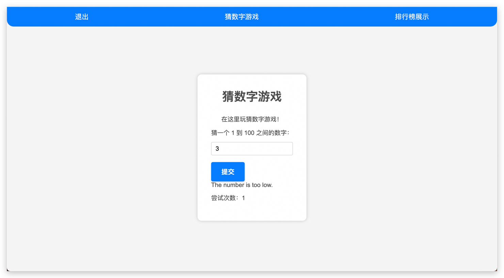
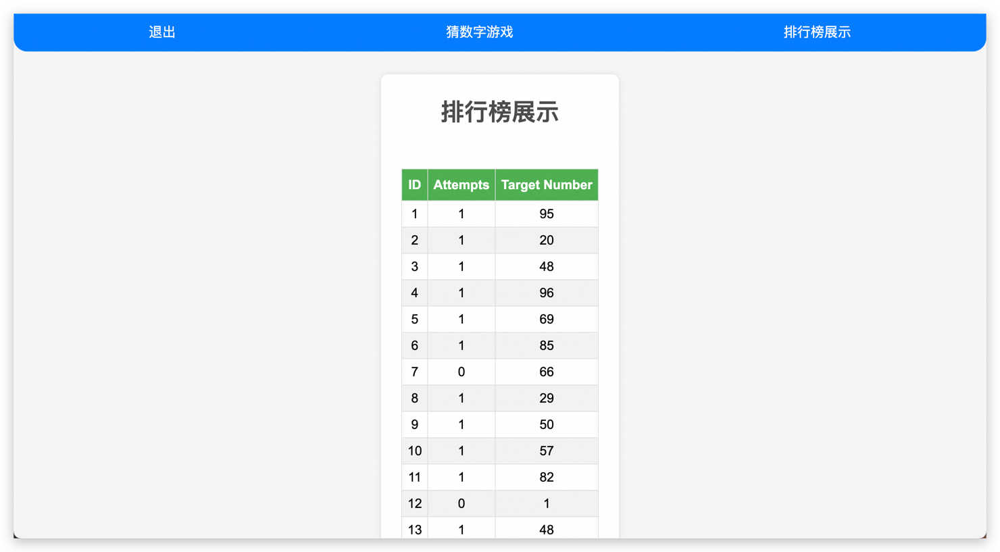

## Monolithic Application GO VUE 项目前后分离部署到 ACK 环境

### 1. 概述

本篇文章将介绍如何将一个基于 GO 和 VUE 的应用进行前后端分离，并部署到阿里云的 Kubernetes 服务（ACK）环境，以及选择部署前端资源到 OSS。整个流程将涵盖 Jenkins Pipeline 的使用，以及安全和质量检测工具如 Trivy 和 SonarQube 的集成。此外，我们还将涉及多架构构建的相关内容。

### 2. 环境准备

#### 2.1 工具和服务

- **Jenkins**：用于持续集成和持续部署（CI/CD）的自动化工具。
- **Trivy**：用于容器安全扫描的开源工具。
- **SonarQube**：用于代码质量和安全分析的平台。
- **kaniko**：用于构建和管理容器化应用。
- **Kubernetes (ACK)**：阿里云的托管 Kubernetes 服务，用于容器编排和管理。

#### 2.2 基本配置项合集说明

- 阿里云 ACK 集群集群令牌获取，获取方式登录容器服务 ACK，选择目标集群，连接信息，复制 Kubeconfig 令牌信息，用于部署应用到目标集群。
- 阿里云 ACR 账户信息获取，使用 Docker 登录镜像仓库后，将 `/root/.docker/config.json`配置信息配置为secret凭据，用于 kaniko 构建镜像使用。
- SonarQube Server 登录 Sonarqube，在account选项/security，创建Generate Tokens，用于配置 jenkins 扫描代码。
- 项目部署代码库地址： [FEBEseparation](https://github.com/Roliyal/CROlordCodelibrary/tree/main/Chapter2KubernetesApplicationBuild/Unit2CodeLibrary/FEBEseparation)
- 项目部署脚本库地址：[CROLordSharedLibraryCode](https://github.com/Roliyal/CROLordSharedLibraryCode)

##### 2.2.1 部署参数

以下是用于 Jenkins Pipeline 部署的参数配置说明，包括每个参数的用途和默认值：

1. **BRANCH**：
   - **描述**：初始默认分支
   - **默认值**：`main`
   - **类型**：字符串
   - **用途**：指定要构建的 Git 分支。

2. **PLATFORMS**：
   - **描述**：目标平台，初始值为 `linux/amd64,linux/arm64`
   - **默认值**：`linux/amd64,linux/arm64`
   - **类型**：选择列表
   - **用途**：指定要构建的目标平台架构。

3. **GIT_REPOSITORY**：
   - **描述**：Git 仓库 URL，默认值为 `https://github.com/Roliyal/CROlordCodelibrary.git`
   - **默认值**：`https://github.com/Roliyal/CROlordCodelibrary.git`
   - **类型**：字符串
   - **用途**：指定要克隆和构建的 Git 仓库地址。

4. **MAJOR_VERSION**：
   - **描述**：主版本号，默认值为 `1`
   - **默认值**：`1`
   - **类型**：字符串
   - **用途**：用于标识版本控制的主版本号。

5. **MINOR_VERSION**：
   - **描述**：次版本号，默认值为 `0`
   - **默认值**：`0`
   - **类型**：字符串
   - **用途**：用于标识版本控制的次版本号。

6. **BUILD_DIRECTORY**：
   - **描述**：构建目录路径，默认路径为 `Chapter2KubernetesApplicationBuild/Unit2CodeLibrary/Microservice/front-guess`
   - **默认值**：`Chapter2KubernetesApplicationBuild/Unit2CodeLibrary/Microservice/front-guess`
   - **类型**：字符串
   - **用途**：指定要构建的项目的目录路径。

7. **IMAGE_REGISTRY**：
   - **描述**：镜像仓库地址，默认值为 `crolord-uat-registry-vpc.cn-hongkong.cr.aliyuncs.com`
   - **默认值**：`crolord-uat-registry-vpc.cn-hongkong.cr.aliyuncs.com`
   - **类型**：字符串
   - **用途**：指定要推送镜像的阿里云容器镜像服务地址。

8. **IMAGE_NAMESPACE**：
   - **描述**：镜像命名空间，默认值为 `micro`
   - **默认值**：`micro`
   - **类型**：字符串
   - **用途**：指定镜像在仓库中的命名空间。

9. **SONARQUBE_DOMAIN**：
   - **描述**：SonarQube 域名，默认值为 `sonarqube.roliyal.com`
   - **默认值**：`sonarqube.roliyal.com`
   - **类型**：字符串
   - **用途**：指定 SonarQube 服务器的地址，用于代码质量分析。

### 3. 配置说明

#### 3.1 Jenkins 插件

确保安装以下 Jenkins 插件：
- Docker
- Pipeline
- Kubernetes
- Git
- Blue Ocean (可选)

#### 3.2 Jenkins 凭据配置

在 Jenkins 中添加以下凭据：
- **阿里云 ACR 凭据**：类型为 `Secret file`，内容为 `/root/.docker/config.json` 文件内容。
- **Kubernetes 凭据**：类型为 `Secret text`，内容为从 ACK 控制台复制的 Kubeconfig。
- **SonarQube Token**：类型为 `Secret text`，内容为 SonarQube 生成的 Token。

### 4. 项目结构

```plaintext
Microservice
├── DockerfileTOR
├── dynamic.yml
├── front-guess
│   ├── Dockerfile
│   ├── README.md
│   ├── Vue-front.yaml
│   ├── babel.config.js
│   ├── config.js
│   ├── jsconfig.json
│   ├── nginx.conf
│   ├── package-lock.json
│   ├── package.json
│   ├── public
│   │   ├── favicon.ico
│   │   └── index.html
│   ├── src
│   │   ├── App.vue
│   │   ├── assets
│   │   │   └── logo.png
│   │   ├── auth-api.js
│   │   ├── components
│   │   │   ├── GuessNumberComponent.vue
│   │   │   ├── LoginComponent.vue
│   │   │   ├── RegisterComponent.vue
│   │   │   └── ScoreboardComponent.vue
│   │   ├── config.js
│   │   ├── main.js
│   │   ├── router
│   │   │   └── index.js
│   │   ├── store.js
│   │   └── styles.css
│   └── vue.config.js
├── game-service
│   ├── Dockerfile
│   ├── database.go
│   ├── game.yaml
│   ├── go.mod
│   ├── go.sum
│   ├── main.go
│   └── nacos.go
├── kubernetes-traefik.yaml
├── login-service
│   ├── Dockerfile
│   ├── database.go
│   ├── go.mod
│   ├── go.sum
│   ├── login.yaml
│   ├── main.go
│   └── nacos.go
├── scoreboard-service
│   ├── Dockerfile
│   ├── database.go
│   ├── dingding
│   ├── go.mod
│   ├── go.sum
│   ├── main.go
│   ├── nacos.go
│   └── score.yaml
└── traefik.yml
```

### 5. Dockerfile 配置

#### Frontend (front-guess/Dockerfile)

```Dockerfile
# Build stage 
FROM node:latest AS build-stage

WORKDIR /app

# Install dependencies
COPY package*.json ./
RUN npm install --production && npm cache clean --force
RUN npm install axios

# Copy source files
COPY . .

# Build the application
RUN npm run build

# Production stage
FROM nginx:1.23.0-alpine

# Copy built files and nginx configuration
COPY --from=build-stage /app/dist /usr/share/nginx/html
COPY --from=build-stage /app/nginx.conf /etc/nginx/conf.d/default.conf


# Expose port 80
EXPOSE 80

# Start Nginx
CMD ["nginx", "-g", "daemon off;"]
```

#### Game Service (game-service/Dockerfile)

```Dockerfile
# Use the official Golang image as the base image
FROM golang:latest AS builder

# Set the working directory
WORKDIR /app

# Copy the go.mod, go.sum, and .env files to the working directory
COPY go.mod go.sum .env ./

# Download the dependencies
RUN go mod download

# Copy the source code to the working directory
COPY . .

# Compile the Go program
RUN CGO_ENABLED=0 GOOS=linux GOARCH=amd64 go build -o main .

# Use the official Alpine image as the base image
FROM alpine

# Add a non-root user
RUN addgroup -S appgroup && adduser -S appuser -G appgroup

# Set the working directory to /app
WORKDIR /app

# Copy the compiled Go binary and .env files
COPY --from=builder /app/main /app/main
COPY --from=builder /app/.env /app/.env

# Create the log directory and change its ownership to the non-root user
RUN mkdir -p /app/log && chown -R appuser:appgroup /app/log

# Change the ownership of the working directory to the non-root user
RUN chown -R appuser:appgroup /app

# Switch to the non-root user
USER appuser

# Expose the port, make sure it matches the port used by your application
EXPOSE 8084

# Add a health check
HEALTHCHECK --interval=60s --timeout=5s --start-period=5s --retries=3 CMD ["/app/main", "check"]

# Run the Go program
ENTRYPOINT ["/app/main"]
```

#### Login Service (login-service/Dockerfile)

```Dockerfile
# Use the official Golang image as the base image
FROM golang:latest AS builder

# Set the working directory
WORKDIR /app

# Copy the go.mod, go.sum, and .env files to the working directory
COPY go.mod go.sum .env ./

# Download the dependencies
RUN go mod download

# Copy the source code to the working directory
COPY . .

# Compile the Go program
RUN CGO_ENABLED=0 GOOS=linux GOARCH=amd64 go build -o main .

# Use the official Alpine image as the base image
FROM alpine

# Add a non-root user
RUN addgroup -S appgroup && adduser -S appuser -G appgroup

# Set the working directory to /app
WORKDIR /app

# Copy the compiled Go binary and .env files
COPY --from=builder /app/main /app/main
COPY --from=builder /app/.env /app/.env

# Create the log directory and change its ownership to the non-root user
RUN mkdir -p /app/log && chown -R appuser:appgroup /app/log

# Change the ownership of the working directory to the non-root user
RUN chown -R appuser:appgroup /app

# Switch to the non-root user
USER appuser

# Expose the port, make sure it matches the port used by your application
EXPOSE 8083

# Add a health check
HEALTHCHECK --interval=60s --timeout=5s --start-period=5s --retries=3 CMD ["/app/main", "check"]

# Run the Go program
ENTRYPOINT ["/app/main"]
```

#### Scoreboard Service (scoreboard-service/Dockerfile)

```Dockerfile
# Use the official Golang image as the base image
FROM golang:latest AS builder

# Set the working directory
WORKDIR /app

# Copy the go.mod, go.sum, and .env files to the working directory
COPY go.mod go.sum .env ./

# Download the dependencies
RUN go mod download

# Copy the source code to the working directory
COPY . .

# Compile the Go program
RUN CGO_ENABLED=0 GOOS=linux GOARCH=amd64 go build -o main .

# Use the official Alpine image as the base image
FROM alpine

# Add a non-root user
RUN addgroup -S appgroup && adduser -S appuser -G appgroup

# Set the working directory to /app
WORKDIR /app

# Copy the compiled Go binary and .env files
COPY --from=builder /app/main /app/main
COPY --from=builder /app/.env /app/.env

# Create the log directory and change its ownership to the non-root user
RUN mkdir -p /app/log && chown -R appuser:appgroup /app/log

# Change the ownership of the working directory to the non-root user
RUN chown -R appuser:appgroup /app

# Switch to the non-root user
USER appuser

# Expose the port, make sure it matches the port used by your application
EXPOSE 8085

# Add a health check
HEALTHCHECK --interval=60s --timeout=5s --start-period=5s --retries=3 CMD ["/app/main", "check"]

# Run the Go program
ENTRYPOINT ["/app/main"]
```

### 6. Jenkins Pipeline 配置

创建一个 `Jenkinsfile` 文件，并放置在项目根目录下。

```groovy
pipeline {
    // 定义使用的 Jenkins agent 类型
    agent { kubernetes { /* 配置省略 */ } }
    
    // 定义环境变量
    environment {
        GIT_BRANCH = 'main' // Git主分支的默认值
        MAJOR_VERSION = 'v1' // 主版本号
        MINOR_VERSION = '0'  // 次版本号
        PLATFORMS = 'linux/amd64,linux/arm64' // 构建目标平台
        MAJOR = "${params.MAJOR_VERSION ?: env.MAJOR_VERSION ?: '1'}" // 主版本号，允许通过参数覆盖
        MINOR = "${params.MINOR_VERSION ?: env.MINOR_VERSION ?: '0'}" // 次版本号，允许通过参数覆盖
        PATCH = "${env.BUILD_NUMBER}" // 构建号，用作修订版本号
        VERSION_TAG = "${MAJOR}.${MINOR}.${PATCH}" // 组合版本标签
        IMAGE_REGISTRY = "${params.IMAGE_REGISTRY}" // 镜像仓库地址
        IMAGE_NAMESPACE = "${params.IMAGE_NAMESPACE}" // 镜像命名空间
        IMAGE_ID = "${params.IMAGE_NAMESPACE}" // 镜像ID
        SONARQUBE_DOMAIN = "${params.SONARQUBE_DOMAINE}" // Sonarqube 域名配置
    }

    // 触发条件
    triggers { githubPush() }

    // 参数定义
    parameters {
        persistentString(name: 'BRANCH', defaultValue: 'main', description: 'Initial default branch: main')
        persistentChoice(name: 'PLATFORMS', choices: ['linux/amd64', 'linux/amd64,linux/arm64'], description: 'Target platforms, initial value: linux/amd64,linux/arm64')
        persistentString(name: 'GIT_REPOSITORY', defaultValue: 'https://github.com/Roliyal/CROlordCodelibrary.git', description: 'Git repository URL, default: https://github.com/Roliyal/CROlordCodelibrary.git')
        persistentString(name: 'MAJOR_VERSION', defaultValue: '1', description: 'Major version number, default: 1')
        persistentString(name: 'MINOR_VERSION', defaultValue: '0', description: 'Minor version number, default: 0')
        persistentString(name: 'BUILD_DIRECTORY', defaultValue: 'Chapter2KubernetesApplicationBuild/Unit2CodeLibrary/Microservice/front-guess', description: 'Build directory path, default path: Chapter2KubernetesApplicationBuild/Unit2CodeLibrary/FEBEseparation/go-guess-number')
        persistentString(name: 'IMAGE_REGISTRY', defaultValue: 'crolord-uat-registry-vpc.cn-hongkong.cr.aliyuncs.com', description: 'Image registry address, default: crolord-registry-registry-vpc.cn-hongkong.cr.aliyuncs.com')
        persistentString(name: 'IMAGE_NAMESPACE', defaultValue: 'micro', description: 'Image namespace, default: febe')
        persistentString(name: 'SONARQUBE_DOMAINE', defaultValue: 'sonarqube.roliyal.com', description: 'SonarQube domain, default: sonarqube.roliyal.com')

    }
    
        // 构建流程定义
        stages {
            // 设置版本信息
            stage('Version') {
                steps {
                    script {
                        env.PATCH_VERSION = env.BUILD_NUMBER
                        env.VERSION_NUMBER = "${env.MAJOR}.${env.MINOR}.${env.PATCH_VERSION}"
                        echo "Current Version: ${env.VERSION_NUMBER}"
                    }
                }
            }
            
        // 检出代码
        stage('Checkout') {
            steps {
                cleanWs() // 清理工作空间
                script {
                    env.GIT_BRANCH = params.BRANCH
                }
                // 检出Git仓库
                checkout scm: [
                    $class: 'GitSCM',
                    branches: [[name: "*/${env.GIT_BRANCH}"]],
                    userRemoteConfigs: [[url: params.GIT_REPOSITORY]],
                    extensions: [[$class: 'CloneOption', depth: 1, noTags: false, reference: '', shallow: true]]
                ]
                echo '代码检出完成'
            }
        }
        
        // 检查目录和Dockerfile
        stage('Check Directory') {
            steps {
                echo "Current working directory: ${pwd()}"
                sh 'ls -la'
                stash includes: '**', name: 'source-code' // 存储工作空间，包括Dockerfile和应用代码
            }
        }
        stage('SonarQube analysis') {
            agent { kubernetes { inheritFrom 'kanikoamd' } }
            steps {
                // 从之前的阶段恢复存储的源代码
                unstash 'source-code'
        
                // 指定在特定容器中执行
                container('kanikoamd') {
                    // 设置SonarQube环境
                    withSonarQubeEnv('sonar') {
                        script {
                            // 使用withCredentials从Jenkins凭据中获取SonarQube token
                            withCredentials([string(credentialsId: 'sonar', variable: 'SONAR_TOKEN')]) {
                                // 执行sonar-scanner命令
                                sh """
                                sonar-scanner \
                                  -Dsonar.projectKey=${JOB_NAME} \
                                  -Dsonar.projectName='${env.IMAGE_NAMESPACE}' \
                                  -Dsonar.projectVersion=${env.VERSION_TAG} \
                                  -Dsonar.sources=. \
                                  -Dsonar.exclusions='**/*_test.go,**/vendor/**' \
                                  -Dsonar.language=go \
                                  -Dsonar.host.url=http://${env.SONARQUBE_DOMAIN} \
                                  -Dsonar.login=${SONAR_TOKEN} \
                                  -Dsonar.projectBaseDir=${env.BUILD_DIRECTORY}
                                """
                            }
                            
                            // 使用script块处理HTTP请求和JSON解析
                            withCredentials([string(credentialsId: 'sonar', variable: 'SONAR_TOKEN')]) {
                                def authHeader = "Basic " + ("${SONAR_TOKEN}:".bytes.encodeBase64().toString())
                                def response = httpRequest(
                                    url: "http://${env.SONARQUBE_DOMAIN}/api/qualitygates/project_status?projectKey=${JOB_NAME}",
                                    customHeaders: [[name: 'Authorization', value: authHeader]],
                                    consoleLogResponseBody: true,
                                    acceptType: 'APPLICATION_JSON',
                                    contentType: 'APPLICATION_JSON'
                                )
                                def json = readJSON text: response.content
                                if (json.projectStatus.status != 'OK') {
                                    error "SonarQube quality gate failed: ${json.projectStatus.status}"
                                } else {
                                    echo "Quality gate passed successfully."
                                }
                            }
                        }
                    }
                }
            }
        }


        // 并行构建阶段
        stage('Parallel Build') {
            parallel {
                // 为 amd64 构建镜像
                stage('Build for amd64') {
                    agent { kubernetes { inheritFrom 'kanikoamd' } }
                    steps {
                        unstash 'source-code' // 恢复之前存储的代码
                        container('kanikoamd') {
                            sh """
                                kaniko \
                                  --context ${env.WORKSPACE}/${params.BUILD_DIRECTORY} \
                                  --dockerfile ${params.BUILD_DIRECTORY}/Dockerfile \
                                  --destination ${env.IMAGE_REGISTRY}/${env.IMAGE_NAMESPACE}/${env.JOB_NAME}:${VERSION_TAG}-amd64 \
                                  --cache=true \
                                  --cache-repo=${env.IMAGE_REGISTRY}/${env.IMAGE_NAMESPACE}/cache \
                                  --skip-tls-verify \
                                  --skip-unused-stages=true \
                                  --custom-platform=linux/amd64 \
                                  --build-arg BUILDKIT_INLINE_CACHE=1 \
                                  --snapshot-mode=redo \
                                  --log-format=text \
                                  --verbosity=info
                            """
                        }
                    }
                }
                // 为 arm64 构建镜像
                stage('Build for arm64') {
                    agent { kubernetes { inheritFrom 'kanikoarm' } }
                    steps {
                        unstash 'source-code'
                        container('kanikoarm') {
                            sh """
                            /kaniko/executor \
                              --context ${env.WORKSPACE}/${params.BUILD_DIRECTORY} \
                              --dockerfile ${params.BUILD_DIRECTORY}/Dockerfile \
                              --destination ${env.IMAGE_REGISTRY}/${env.IMAGE_NAMESPACE}/${env.JOB_NAME}:${VERSION_TAG}-arm64 \
                              --cache=true \
                              --cache-repo=${env.IMAGE_REGISTRY}/${env.IMAGE_NAMESPACE}/cache \
                              --skip-tls-verify \
                              --skip-unused-stages=true \
                              --custom-platform=linux/arm64 \
                              --build-arg BUILDKIT_INLINE_CACHE=1 \
                              --snapshot-mode=redo \
                              --log-format=text \
                              --verbosity=info
                            """
                        }
                    }
                }
            }
        }
        
        // 推送多架构镜像 Manifest-tools
        stage('Push Multi-Arch Manifest') {
            agent { kubernetes { inheritFrom 'kanikoamd' } }
            steps {
                container('kanikoamd') {
                    script {
                        sh "manifest-tool --version "
                        // 创建并推送多架构镜像的manifest
                        sh """
                            manifest-tool --insecure push from-args \\
                            --platforms '${env.PLATFORMS}' \\
                            --template '${env.IMAGE_REGISTRY}/${env.IMAGE_NAMESPACE}/${env.JOB_NAME}:${env.VERSION_TAG}-ARCHVARIANT' \\
                            --target '${env.IMAGE_REGISTRY}/${env.IMAGE_NAMESPACE}/${env.JOB_NAME}:${env.VERSION_TAG}'
                        """
                        //sh "trivy image --exit-code 1 --severity HIGH,CRITICAL --ignore-unfixed --no-progress --insecure --timeout 5m '${env.IMAGE_REGISTRY}/${env.IMAGE_NAMESPACE}/${env.JOB_NAME}:${env.VERSION_TAG}'"
                    }
                }
            }
        }
        // 部署到 Kubernetes 集群
        stage('Deploy to Kubernetes') {
            agent { kubernetes { inheritFrom 'kanikoamd' } } 
            steps {
                unstash 'source-code' // 恢复之前存储的代码
                container('kanikoamd') {
                    script {
                        withCredentials([file(credentialsId: 'k8s_token_uat', variable: 'KUBECONFIG')]) {
                            // 执行 kubectl 命令
                            sh "kaniko version" 
                            sh "kubectl get node"
                            env.FULL_IMAGE_URL = "${env.IMAGE_REGISTRY}/${env.IMAGE_NAMESPACE}/${env.JOB_NAME}:${env.VERSION_TAG}"
                            
                            sh """
                            cd ${env.WORKSPACE}/${params.BUILD_DIRECTORY}
                            cp *.yaml updated-deployment.yaml
                            sed -i 's|image:.*|image: ${env.FULL_IMAGE_URL}|' updated-deployment.yaml
                            kubectl apply -f updated-deployment.yaml
                            """
                        }
                    }
                }
            }
        }
    
    }
}
```

### 7. Kubernetes YAML 文件

#### Frontend Service (`Vue-front.yaml`)

```yaml
---
apiVersion: v1
kind: PersistentVolumeClaim
metadata:
  name: app-vue-front-pvc
spec:
  accessModes:
    - ReadWriteOnce
  storageClassName: crolord-cnfs-uat-nas # 使用初始化的配置CNFS文件系统
  resources:
    requests:
      storage: 20Gi
---
apiVersion: apps/v1
kind: Deployment
metadata:
  name: micro-vue-front
  labels:
    app: micro-vue-front
spec:
  replicas: 2
  strategy:
    type: RollingUpdate
    rollingUpdate:
      maxSurge: 1
      maxUnavailable: 0
  selector:
    matchLabels:
      app: micro-vue-front
  template:
    metadata:
      labels:
        app: micro-vue-front
    spec:
      containers:
        - name: micro-vue-front
          image: crolord-uat-registry-vpc.cn-hongkong.cr.aliyuncs.com/micro/micro-front-uat:1.0.17
          ports:
            - containerPort: 80
          resources:
            limits:
              cpu: 1
              memory: 512Mi
            requests:
              cpu: 500m
              memory: 256Mi
          lifecycle:
            postStart:
              exec:
                command: ["/bin/sh", "-c", "echo 'postStart hook executed' > /tmp/postStart.log"]
            preStop:
              exec:
                command: ["/bin/sh", "-c", "nginx -s quit; sleep 10"]
          securityContext:
            runAsUser: 0  # 以 root 用户运行
          volumeMounts:
            - name: nginx-config
              mountPath: /etc/nginx/conf.d
            - name: app-vue-front-storage
              mountPath: /usr/share/nginx/html/app-vue-front-storage
      volumes:
        - name: nginx-config
          configMap:
            name: micro-vue-front-nginx-config
        - name: app-vue-front-storage
          persistentVolumeClaim:
            claimName: app-vue-front-pvc
---
apiVersion: v1
kind: Service
metadata:
  name: micro-vue-front-service
spec:
  selector:
    app: micro-vue-front
  ports:
    - protocol: TCP
      port: 8080
      targetPort: 80
  type: ClusterIP
---
apiVersion: v1
kind: ConfigMap
metadata:
  name: micro-vue-front-nginx-config
data:
  default.conf: |
    server {
      listen 80;
      server_name _;
      root /usr/share/nginx/html;
      index index.html;
      location / {
        try_files $uri $uri/ /index.html;
      }
      location = /healthz {
        return 200 'ok';
        access_log off;
      }
    }
```

#### Game Service (`game.yaml`)

```yaml
apiVersion: apps/v1
kind: Deployment
metadata:
  name: micro-go-game
spec:
  replicas: 1
  selector:
    matchLabels:
      app: micro-go-game
  template:
    metadata:
      labels:
        app: micro-go-game
    spec:
      containers:
        - name: micro-go-game
          image: registry.cn-hongkong.aliyuncs.com/crolord_acr_personal/microservice_code_go:micro_gamev1
          ports:
            - containerPort: 8084
          env:
            - name: ENV_FILE
              value: "/app/.env"
          volumeMounts:
            - name: app-log
              mountPath: /app/log
      volumes:
        - name: app-log
          emptyDir: {}
---
apiVersion: v1
kind: Service
metadata:
  name: micro-go-game
spec:
  selector:
    app: micro-go-game
  ports:
    - protocol: TCP
      port: 8084
      targetPort: 8084
  type: ClusterIP

```

#### Login Service (`login.yaml`)

```yaml
apiVersion: apps/v1
kind: Deployment
metadata:
  name: micro-go-login
spec:
  replicas: 1
  selector:
    matchLabels:
      app: micro-go-login
  template:
    metadata:
      labels:
        app: micro-go-login
    spec:
      containers:
        - name: micro-go-login
          image: registry.cn-hongkong.aliyuncs.com/crolord_acr_personal/microservice_code_go:micro_loginv1
          ports:
            - containerPort: 8083
          env:
            - name: ENV_FILE
              value: "/app/.env"
          volumeMounts:
            - name: app-log
              mountPath: /app/log
      volumes:
        - name: app-log
          emptyDir: {}
---
apiVersion: v1
kind: Service
metadata:
  name: micro-go-login
spec:
  selector:
    app: micro-go-login
  ports:
    - protocol: TCP
      port: 8083
      targetPort: 8083
  type: ClusterIP

```

#### Scoreboard Service (`score.yaml`)

```yaml
apiVersion: apps/v1
kind: Deployment
metadata:
  name: micro-go-score
spec:
  replicas: 1
  selector:
    matchLabels:
      app: micro-go-score
  template:
    metadata:
      labels:
        app: micro-go-score
    spec:
      containers:
        - name: micro-go-score
          image: registry.cn-hongkong.aliyuncs.com/crolord_acr_personal/microservice_code_go:micro_scorev1
          ports:
            - containerPort: 8085
          env:
            - name: ENV_FILE
              value: "/app/.env"
          volumeMounts:
            - name: app-log
              mountPath: /app/log
      volumes:
        - name: app-log
          emptyDir: {}
---
apiVersion: v1
kind: Service
metadata:
  name: micro-go-score
spec:
  selector:
    app: micro-go-score
  ports:
    - protocol: TCP
      port: 8085
      targetPort: 8085
  type: ClusterIP

```

### 8. 结果验证

1. **检查 Jenkins 控制台输出**：
    - 确认所有阶段成功执行，无错误信息。
2. **检查 Kubernetes 资源**：
    - 确认所有 Pod、Service 和 Deployment 正常运行。

   ```bash
   kubectl get pods
   kubectl get services
   kubectl get deployments
   ```
    - 预期输出
   ```bash
   [root@CROLord ~]# kubectl get deployments -n cicd
   NAME              READY   UP-TO-DATE   AVAILABLE   AGE
   app-go-backend    2/2     2            2           6d
   app-vue-front     3/3     3            3           6d
   micro-go-game     1/1     1            1           16h
   micro-go-login    1/1     1            1           17h
   micro-go-score    1/1     1            1           16h
   micro-vue-front   2/2     2            2           17h
   traefik           1/1     1            1           16h
   [root@CROLord ~]# kubectl get deployments -n cicd |grep micro
   micro-go-game     1/1     1            1           16h
   micro-go-login    1/1     1            1           17h
   micro-go-score    1/1     1            1           16h
   micro-vue-front   2/2     2            2           17h
   [root@CROLord ~]# kubectl get services -n cicd  |grep micro
   micro-go-game                   ClusterIP      192.168.5.27      <none>          8084/TCP       16h
   micro-go-login                  ClusterIP      192.168.73.37     <none>          8083/TCP       17h
   micro-go-score                  ClusterIP      192.168.164.67    <none>          8085/TCP       16h
   micro-vue-front-service         ClusterIP      192.168.95.117    <none>          8080/TCP       19h
   [root@CROLord ~]# kubectl get deployments -n cicd   |grep micro
   micro-go-game     1/1     1            1           16h
   micro-go-login    1/1     1            1           17h
   micro-go-score    1/1     1            1           16h
   micro-vue-front   2/2     2            2           17h
   [root@CROLord ~]#
   ```
3. **访问前端服务**：
    - 通过 MSE 负载均衡器的 IP 地址访问前端应用，验证应用是否正常运行。


### 9. 总结

通过 Jenkins 配置持续集成和部署流水线，可以实现自动化构建、测试和部署微服务应用到阿里云 Kubernetes 集群。本文档详细介绍了从环境准备、工具选择到实际配置和验证的完整过程。根据具体需求，您可以进一步扩展和优化流水线配置，实现更复杂的 CI/CD 流程。