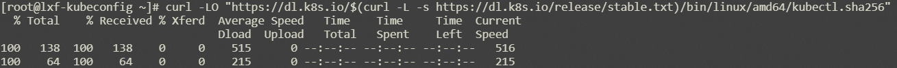

#配置通过Kubectl管理ACK集群

###环境准备
1，在本地机器上安装和配置 kubectl 命令行工具，以便连接到 ACK 集群。  
执行以下命令下载kubectl最新版本：
~~~shell
curl -LO "https://dl.k8s.io/release/$(curl -L -s https://dl.k8s.io/release/stable.txt)/bin/linux/amd64/kubectl"
~~~

>注：要下载特定版本，请将$(curl -L -s https://dl.k8s.io/release/stable.txt) 命令部分替换为特定版本。
> 例如，要在 Linux 上下载 v1.26.0 版本，请键入：
~~~shell
curl -LO https://dl.k8s.io/release/v1.26.0/bin/linux/amd64/kubectl
~~~
2，根据校验和文件验证 kubectl 二进制文件：  
下载 kubectl 校验和文件：
~~~shell
curl -LO "https://dl.k8s.io/$(curl -L -s https://dl.k8s.io/release/stable.txt)/bin/linux/amd64/kubectl.sha256"
~~~

根据校验和文件验证 kubectl 二进制文件：
~~~shell
echo "$(cat kubectl.sha256)  kubectl" | sha256sum --check
~~~

3，安装 kubectl：
~~~shell
sudo install -o root -g root -m 0755 kubectl /usr/local/bin/kubectl
~~~
4,测试安装的Kubectl：
~~~shell
kubectl version --client
~~~

5，配置kubectl config：
~~~shell
vi  $HOME/.kube/config
~~~
在ACK控制台集群连接信息中选择公网访问，将集群凭证复制到$HOME/.kube/config 文件下
>

6，安装helm
~~~shell
$ curl -fsSL -o get_helm.sh https://raw.githubusercontent.com/helm/helm/main/scripts/get-helm-3
$ chmod 700 get_helm.sh
$ ./get_helm.sh  
~~~
执行结果如下：
~~~shell
Downloading https://get.helm.sh/helm-v3.11.2-linux-amd64.tar.gz
Verifying checksum... Done.
Preparing to install helm into /usr/local/bin
helm installed into /usr/local/bin/helm
~~~

配置完成后即可通过kubectl管理ACK集群。

