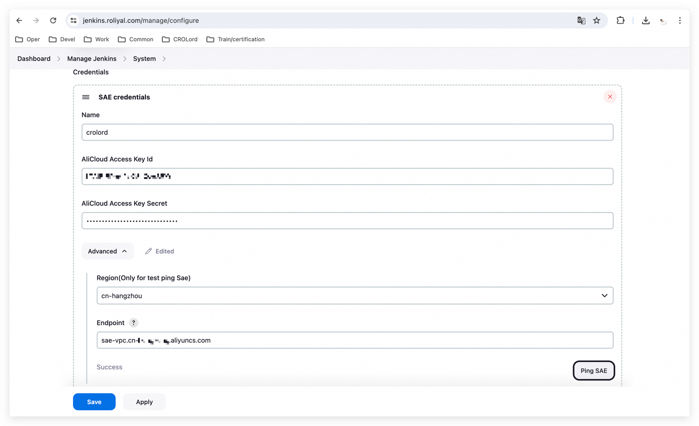
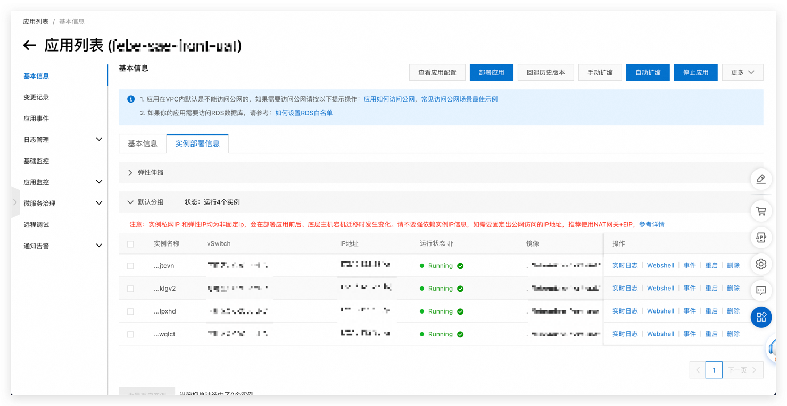

配置如何在 Jenkins 中配置`CD`步骤流水线，以便将 `Docker` 镜像部署到阿里云 SAE 服务中的详细步骤和示例脚本。

### 1. Jenkins 配置

#### 安装 SAE Jenkins 插件

1. 登录 Jenkins 首页，点击左侧导航栏的 "Manage Jenkins"。
2. 在 "Manage Jenkins" 页面，点击 "Manage Plugins"。
3. 在 `Advanced settings` 上传`hpi`文件，安装参考[安装sae-jenkins-plugin](https://help.aliyun.com/zh/sae/user-guide/use-an-sae-plug-in-in-jenkins-to-build-a-job-for-application-deployment)

#### 配置 SAE Jenkins 凭据

1. 在 Jenkins 首页，点击左侧导航栏的 "Manage Jenkins"。
2. 在 "Manage Jenkins" 页面，点击 "system"。
3. 选择Deploy to SAE ，然后点击 "Add "。
4. 输入阿里云 AccessKey ID 和 AccessKey Secret，保存凭据。
5. 预期结果如下，


### 2. 创建 Jenkins Pipeline 项目

1. 登录 Jenkins 首页，点击 "New Item"。
2. 在 "Enter an item name" 区域输入项目名称，选择 "Pipeline"，然后点击 "OK"。
3. 在 Pipeline 页签，点击 "Pipeline Syntax"。

### 3. 参考配置流水线片段

1. 在 "Snippet Generator" 页面，从 "Sample Step" 下拉列表选择 "saeClient: Deploy into SAE"。
2. 在 "Add" 下拉列表中选择 "SAE Application"。
3. 在 "SAE Application" 区域配置部署参数：
    - **SAE Credentials**：选择已配置的 AccessKey 的名称。
    - **SAE Namespace**：输入部署应用所在的命名空间 ID，格式为 `<RegionId>:<NamespaceId>`，例如 `cn-hangzhou:test`。
    - **Application Id**：输入部署应用的应用 ID。
    - **Target Object**：输入部署包或镜像的地址链接，例如 `registry-vpc.cn-hangzhou.aliyuncs.com/demo/consumer:1.0`。
    - **Whether target imageUrl**：如果 `Target Object` 为镜像地址，则需要选中该配置项。
 
4. 单击 "Generate Pipeline Script"，拷贝生成的流水线脚本，亦或者采用本文 `pipline script` 配置。

### 4. 配置 Jenkins Pipline script

1. 返回 Pipeline 配置页面，在 "Pipeline" 区域输入以下内容：

```groovy
pipeline {
    agent any

    parameters {
        persistentString(name: 'SAE_CREDENTIALS', defaultValue: 'corlord : LT***5Xr', description: 'SAE 凭据')
        persistentString(name: 'SAE_NAMESPACE', defaultValue: 'cn-hongkong:demo', description: 'SAE 应用命名空间（例如：cn-hangzhou）')
        persistentString(name: 'APPLICATION_ID', defaultValue: '0d930603-***a20642da1634', description: '请设置应用 ID')
        persistentString(name: 'TARGET_OBJECT', defaultValue: 'crolord-uat-registry-vpc.cn-hongkong.cr.aliyuncs.com/febe/micro-**-uat:1.0.5', description: '请设置目标对象（file|Url|imageUrl）')
        booleanParam(name: 'TARGET_IMAGE_URL', defaultValue: true, description: '目标是否为 imageUrl')
        persistentString(name: 'UPDATE_STRATEGY', defaultValue: '{"type":"GrayBatchUpdate","batchUpdate":{"batch":2,"releaseType":"auto","batchWaitTime":1},"grayUpdate":{"gray":1}}', description: '更新策略 JSON 配置')
        persistentString(name: 'MIN_READY_INSTANCES', defaultValue: '2', description: '部署时的最小就绪实例数（例如：2）')
        persistentString(name: 'MIN_READY_INSTANCE_RATIO', defaultValue: '50', description: '部署时的最小就绪实例比例（范围 [0,100] 例如：50）')
        booleanParam(name: 'AUTO_ENABLE_APPLICATION_SCALING_RULE', defaultValue: true, description: '自动启用应用扩展规则')
        booleanParam(name: 'ENABLE_GREY_TAG_ROUTE', defaultValue: false, description: '启用灰度标签路由（仅限 Spring Cloud 和 Dubbo）')
        persistentString(name: 'ACR_INSTANCE_ID', defaultValue: 'cri-dcvg4tjrhgptvs54', description: 'ACR EE 实例 ID（例如：cri-xxxxxx）')
        persistentString(name: 'ACR_ASSUME_ROLE_ARN', defaultValue: 'unchanging', description: '使用其他阿里云账户镜像时的 RAM 角色（例如：acs:ram::123456789012****:role/adminrole）')
        persistentString(name: 'IMAGE_PULL_SECRETS', defaultValue: 'unchanging', description: '与应用程序位于同一命名空间的 Secret ID（例如：123）')
        booleanParam(name: 'ENABLE_IMAGE_ACCL', defaultValue: true, description: '是否启用 ImageUrl 的镜像加速')
        persistentChoice(name: 'JDK_VERSION', choices: [ 'Open JDK 7', 'Open JDK 8', 'Dragonwell 8', 'Dragonwell 11', 'Dragonwell 17', 'openjdk-7u201-jdk-alpine3.9', 'openjdk-8u191-jdk-alpine3.9'], description: 'JDK 版本')
        persistentString(name: 'PACKAGE_VERSION', defaultValue: 'unchanging', description: '包版本（例如：1.0.0），设为空将使用 Unix 时间戳填充')
        persistentString(name: 'ENVIRONMENTS_JSON', defaultValue: '[ { "name": "sae-sys-configmap-all-configmapdemo", "valueFrom": { "configMapRef": { "configMapId": 6227, "key": "" } } },{ "name": "mysql_user", "value": "crolord" } ]', description: '环境变量的 jsonArray。（例如： [{"name":"testkey","value":"testValue"}]）设为空以清除设置，"unchanging" 表示无变化')
        persistentString(name: 'CUSTOM_HOST_ALIAS_JSON', defaultValue: 'unchanging', description: '容器中的主机设置。（例如： [{"hostName":"samplehost","ip":"127.0.0.1"}]）设为空以清除设置，"unchanging" 表示无变化')
        persistentString(name: 'TIMEZONE', defaultValue: 'Asia/Shanghai', description: '时区（例如：Asia/Shanghai）')
        persistentString(name: 'CONFIG_MAP_MOUNT_DESC', defaultValue: '[{"configMapId":6226,"key":"sae-sys-configmap-all","mountPath":"/opt"}]', description: '配置环境的 jsonArray。（例如： [{"configMapId":16,"key":"test","mountPath":"/tmp"}]）设为空以清除设置，"unchanging" 表示无变化')
        persistentChoice(name: 'EDAS_CONTAINER_VERSION', choices: [ '3.5.7', '3.5.3'], description: 'EDAS 容器版本。部署 HSF 包时需要')
        persistentChoice(name: 'WEB_CONTAINER', choices: [ 'apache-tomcat-8.5.42', 'apache-tomcat-7.0.91'], description: 'Tomcat 版本。部署 war 包时需要')
        persistentString(name: 'STARTUP_COMMAND', defaultValue: 'unchanging', description: '启动命令。设为空以清除设置，"unchanging" 表示无变化')
        persistentString(name: 'IMAGE_STARTUP_ARGS_JSON', defaultValue: 'unchanging', description: '命令参数的 JsonArray。（例如： ["xxx","xxxx"]）设为空以清除设置，"unchanging" 表示无变化')
        persistentString(name: 'JAR_START_OPTIONS', defaultValue: 'unchanging', description: 'Java 启动选项。 ($JAVA_HOME/bin/java $JarStartOptions -jar $CATALINA_OPTS "$package_path" $JarStartArgs) 设为空以清除设置，"unchanging" 表示无变化')
        persistentString(name: 'JAR_START_ARGS', defaultValue: 'unchanging', description: 'Java 启动参数。 ($JAVA_HOME/bin/java $JarStartOptions -jar $CATALINA_OPTS "$package_path" $JarStartArgs) 设为空以清除设置，"unchanging" 表示无变化')
        persistentString(name: 'WAR_START_OPTIONS', defaultValue: 'unchanging', description: 'War 启动选项。设为空以清除设置，"unchanging" 表示无变化')
        persistentString(name: 'TOMCAT_CONFIG_JSON', defaultValue: 'unchanging', description: 'Tomcat 配置的设置。（例如： {"port":8080,"contextPath":"/","maxThreads":400,"uriEncoding":"ISO-8859-1","useBodyEncodingForUri":true}）设为空以清除设置，"unchanging" 表示无变化')
        persistentString(name: 'NAS_ID', defaultValue: 'unchanging', description: 'Nas ID。（例如：10d3b4****）设为空以清除设置，"unchanging" 表示无变化')
        persistentString(name: 'NAS_MOUNT_HOST', defaultValue: 'unchanging', description: 'Nas 挂载主机。（例如：10d3b4bc9****.com）设为空以清除设置，"unchanging" 表示无变化')
        persistentString(name: 'NAS_MOUNT_DESC', defaultValue: 'unchanging', description: 'Nas 挂载描述。（例如： [{mountPath: "/tmp", nasPath: "/"}]）设为空以清除设置，"unchanging" 表示无变化')
        persistentString(name: 'OSS_MOUNT_DESC', defaultValue: 'unchanging', description: 'Oss 挂载描述。（例如： [{"bucketName": "oss-bucket", "bucketPath": "data/user.data", "mountPath": "/usr/data/user.data", "readOnly": true}]）设为空以清除设置，"unchanging" 表示无变化')
        persistentString(name: 'OSS_AK_ID', defaultValue: 'unchanging', description: '具有读/写权限的 Oss ak ID。设为空以清除设置，"unchanging" 表示无变化')
        persistentString(name: 'OSS_AK_SECRET', defaultValue: 'unchanging', description: '具有读/写权限的 Oss ak 密钥。设为空以清除设置，"unchanging" 表示无变化')
        persistentString(name: 'SLS_CONFIGS', defaultValue: '[{"projectName":"febe-uat-sae-app","logType":"stdout","logDir":"","logstoreName":"febe-front-uat","logtailName":""}]', description: 'SLS 配置。sae 创建 sls 资源：（例如： [{"logDir":"","logType":"stdout"}/{"logDir":"/tmp/a.log"}]）用户自有 sls 资源：（例如： [{"projectName":"test-sls","logType":"stdout","logDir":"","logstoreName":"sae","logtailName":""},{"projectName":"test","logDir":"/tmp/a.log","logstoreName":"sae","logtailName":"xx"}]）设为空以清除设置，"unchanging" 表示无变化')
        persistentString(name: 'KAFKA_CONFIGS', defaultValue: 'unchanging', description: '日志恢复到 Kafka 的配置。（例如： {"kafkaConfigs":"[{"logType":"file_log","logDir":"/tmp/a.log","kafkaTopic":"test2"},{"logType":"stdout","logDir":"","kafkaTopic":"test"}]","kafkaInstanceId":"alikafka_pre-cn-7pp2l8kr****","kafkaEndpoint":"10.0.X.XXX:XXXX,10.0.X.XXX:XXXX,10.0.X.XXX:XXXX"}）设为空以清除设置，"unchanging" 表示无变化')
        persistentString(name: 'POST_START_JSON', defaultValue: '{"exec":{"command":["sh","-c","echo hello > demo.txt"]}}', description: 'PostStart JSON（例如： {"exec":{"command":"cat","/etc/group"}}）。设为空以清除，"unchanging" 表示无变化')
        persistentString(name: 'PRE_STOP_JSON', defaultValue: '{"exec":{"command":["sh","-c","echo \'PreStop Hook: Process ending at $(date). Exit code: $? \' >> /var/log/prestop.log"]}}', description: 'PreStop JSON（例如： {"exec":{"command":"cat","/etc/group"}}）。设为空以清除，"unchanging" 表示无变化')
        persistentString(name: 'TERMINATION_GRACE_PERIOD_SECONDS', defaultValue: '10', description: '终止的限制时间（例如：30）设为空以清除设置，"unchanging" 表示无变化')
        persistentString(name: 'READINESS_JSON', defaultValue: '{"exec":{"command":["sh","-c","curl -f http://localhost:80/ || exit 1"]},"initialDelaySeconds":5,"timeoutSeconds":10}', description: 'Readiness JSON（例如： {"exec":{"command":["sh","-c","cat /home/admin/start.sh"]},"initialDelaySeconds":30,"periodSeconds":30,"timeoutSeconds":2}）设为空以清除设置，"unchanging" 表示无变化')
        persistentString(name: 'LIVENESS_JSON', defaultValue: '{"exec":{"command":["sh","-c","curl -f http://localhost:80/ || exit 1"]},"initialDelaySeconds":30,"periodSeconds":30,"timeoutSeconds":2}', description: 'Liveness JSON（例如： {"exec":{"command":["sh","-c","cat /home/admin/start.sh"]},"initialDelaySeconds":30,"periodSeconds":30,"timeoutSeconds":2}）设为空以清除设置，"unchanging" 表示无变化')
        booleanParam(name: 'ENABLE_AHAS', defaultValue: false, description: '是否启用 AHAS')
        booleanParam(name: 'ASSOCIATE_EIP', defaultValue: false, description: '是否关联 EIP')
    }

    stages {
        stage('Deploy SAE Application') {
            steps {
                script {
                    saeClient([
                        deploySAEApplication(
                            acrAssumeRoleArn: params.ACR_ASSUME_ROLE_ARN,
                            acrInstanceId: params.ACR_INSTANCE_ID,
                            appId: params.APPLICATION_ID,
                            args: params.ARGS,
                            associateEip: params.ASSOCIATE_EIP,
                            autoEnableApplicationScalingRule: params.AUTO_ENABLE_APPLICATION_SCALING_RULE,
                            configMapMountDesc: params.CONFIG_MAP_MOUNT_DESC,
                            credentialsString: params.SAE_CREDENTIALS,
                            customHostAlias: params.CUSTOM_HOST_ALIAS_JSON,
                            edasContainerVersion: params.EDAS_CONTAINER_VERSION,
                            enableAhas: params.ENABLE_AHAS,
                            enableGreyTagRoute: params.ENABLE_GREY_TAG_ROUTE,
                            enableImageAccl: params.ENABLE_IMAGE_ACCL,
                            envs: params.ENVIRONMENTS_JSON,
                            image: params.TARGET_IMAGE_URL,
                            imagePullSecrets: params.IMAGE_PULL_SECRETS,
                            jarStartArgs: params.JAR_START_ARGS,
                            jarStartOptions: params.JAR_START_OPTIONS,
                            jdk: params.JDK_VERSION,
                            kafkaConfigs: params.KAFKA_CONFIGS,
                            liveness: params.LIVENESS_JSON,
                            namespaceId: params.SAE_NAMESPACE,
                            nasId: params.NAS_ID,
                            nasMountDesc: params.NAS_MOUNT_DESC,
                            nasMountHost: params.NAS_MOUNT_HOST,
                            ossAkId: params.OSS_AK_ID,
                            ossAkSecret: params.OSS_AK_SECRET,
                            ossMountDesc: params.OSS_MOUNT_DESC,
                            postStart: params.POST_START_JSON,
                            preStop: params.PRE_STOP_JSON,
                            readiness: params.READINESS_JSON,
                            slsConfigs: params.SLS_CONFIGS,
                            startupCommand: params.STARTUP_COMMAND,
                            targetObject: params.TARGET_OBJECT,
                            timezone: params.TIMEZONE,
                            tomcatConfig: params.TOMCAT_CONFIG_JSON,
                            updateStrategy: params.UPDATE_STRATEGY,
                            warStartOptions: params.WAR_START_OPTIONS,
                            webContainer: params.WEB_CONTAINER,
                            minReadyInstances: params.MIN_READY_INSTANCES == '' ? 0 : params.MIN_READY_INSTANCES.toInteger(),
                            minReadyInstanceRatio: params.MIN_READY_INSTANCE_RATIO == '' ? 0 : params.MIN_READY_INSTANCE_RATIO.toInteger(),
                            terminationGracePeriodSeconds: params.TERMINATION_GRACE_PERIOD_SECONDS == 'unchanging' ? 0 : params.TERMINATION_GRACE_PERIOD_SECONDS.toInteger()
                        )
                    ])
                }
            }
        }
    }
}

```
### 5. 部署参数详细说明

在 Jenkins Pipeline 中使用以下部署参数，可以灵活地配置和管理部署到阿里云 SAE 服务的应用。详细参数可以参考官网示例[DeployApplication](https://help.aliyun.com/zh/sae/developer-reference/api-sae-2019-05-06-deployapplication)以下是每个参数的详细说明：

1. **SAE_CREDENTIALS**：
    - **描述**：SAE 凭据
    - **默认值**：`CROlord : LTA*****5Xr`
    - **类型**：字符串
    - **用途**：用于访问 SAE 服务的凭据，获取路径`Dashboard>Manage Jenkins>System` Deploy to SAE 字段下Name和AliCloud Access Key Id拼接而成。

2. **SAE_NAMESPACE**：
    - **描述**：SAE 应用命名空间（例如：cn-hangzhou）
    - **默认值**：`cn-hongkong:demo`
    - **类型**：字符串
    - **用途**：指定 SAE 部署的命名空间，格式为 `<RegionId>:<NamespaceId>`。

3. **APPLICATION_ID**：
    - **描述**：请设置应用 ID
    - **默认值**：`0d930603-f647-480c-94e7-a20642da1634`
    - **类型**：字符串
    - **用途**：指定要部署的 SAE 应用 ID。

4. **TARGET_OBJECT**：
    - **描述**：请设置目标对象（file|Url|imageUrl）
    - **默认值**：`crolord-uat-registry-vpc.cn-hongkong.cr.aliyuncs.com/febe/micro-***at:1.0.5`
    - **类型**：字符串
    - **用途**：指定要部署的目标对象，支持文件、URL或imageUrl，本文为演示填写完整的路径，实际建议使用变量获取。

5. **TARGET_IMAGE_URL**：
    - **描述**：目标是否为 imageUrl
    - **默认值**：`true`
    - **类型**：布尔值
    - **用途**：标识目标是否为 imageUrl。

6. **UPDATE_STRATEGY**：
    - **描述**：更新策略 JSON 配置
    - **默认值**：`{"type":"GrayBatchUpdate","batchUpdate":{"batch":2,"releaseType":"auto","batchWaitTime":1},"grayUpdate":{"gray":1}}`
    - **类型**：字符串
    - **用途**：定义更新策略的 JSON 配置。

7. **MIN_READY_INSTANCES**：
    - **描述**：部署时的最小就绪实例数（例如：2）
    - **默认值**：`2`
    - **类型**：字符串
    - **用途**：指定部署时的最小就绪实例数。

8. **MIN_READY_INSTANCE_RATIO**：
    - **描述**：部署时的最小就绪实例比例（范围 [0,100] 例如：50）
    - **默认值**：`50`
    - **类型**：字符串
    - **用途**：指定部署时的最小就绪实例比例。

9. **AUTO_ENABLE_APPLICATION_SCALING_RULE**：
    - **描述**：自动启用应用扩展规则
    - **默认值**：`true`
    - **类型**：布尔值
    - **用途**：标识是否自动启用应用扩展规则。

10. **ENABLE_GREY_TAG_ROUTE**：
    - **描述**：启用灰度标签路由（仅限 Spring Cloud 和 Dubbo）
    - **默认值**：`false`
    - **类型**：布尔值
    - **用途**：标识是否启用灰度标签路由。

11. **ACR_INSTANCE_ID**：
    - **描述**：ACR EE 实例 ID（例如：cri-xxxxxx）
    - **默认值**：`cri-***vs54`
    - **类型**：字符串
    - **用途**：指定 ACR EE 实例 ID。

12. **ACR_ASSUME_ROLE_ARN**：
    - **描述**：使用其他阿里云账户镜像时的 RAM 角色（例如：acs:ram::123456789012****:role/adminrole）
    - **默认值**：`unchanging`
    - **类型**：字符串
    - **用途**：指定使用其他阿里云账户镜像时的 RAM 角色。

13. **IMAGE_PULL_SECRETS**：
    - **描述**：与应用程序位于同一命名空间的 Secret ID（例如：123）
    - **默认值**：`unchanging`
    - **类型**：字符串
    - **用途**：指定拉取镜像时使用的 Secret ID。

14. **ENABLE_IMAGE_ACCL**：
    - **描述**：是否启用 ImageUrl 的镜像加速
    - **默认值**：`true`
    - **类型**：布尔值
    - **用途**：标识是否启用 ImageUrl 的镜像加速。

15. **JDK_VERSION**：
    - **描述**：JDK 版本
    - **默认值**：`Open JDK 7`
    - **类型**：选择列表
    - **用途**：指定 JDK 的版本。

16. **PACKAGE_VERSION**：
    - **描述**：包版本（例如：1.0.0），设为空将使用 Unix 时间戳填充
    - **默认值**：`unchanging`
    - **类型**：字符串
    - **用途**：指定包的版本号。

17. **ENVIRONMENTS_JSON**：
    - **描述**：环境变量的 jsonArray。（例如： [{"name":"testkey","value":"testValue"}]）设为空以清除设置，"unchanging" 表示无变化
    - **默认值**：`[ { "name": "sae-sys-configmap-all-configmapdemo", "valueFrom": { "configMapRef": { "configMapId": 6227, "key": "" } } },{ "name": "mysql_user", "value": "crolord" } ]`
    - **类型**：字符串
    - **用途**：定义环境变量的 JSON 数组。

18. **CUSTOM_HOST_ALIAS_JSON**：
    - **描述**：容器中的主机设置。（例如： [{"hostName":"samplehost","ip":"127.0.0.1"}]）设为空以清除设置，"unchanging" 表示无变化
    - **默认值**：`unchanging`
    - **类型**：字符串
    - **用途**：定义容器中的主机别名设置。

19. **TIMEZONE**：
    - **描述**：时区（例如：Asia/Shanghai）
    - **默认值**：`Asia/Shanghai`
    - **类型**：字符串
    - **用途**：指定应用运行时使用的时区。

20. **CONFIG_MAP_MOUNT_DESC**：
    - **描述**：配置环境的 jsonArray。（例如： [{"configMapId":16,"key":"test","mountPath":"/tmp"}]）设为空以清除设置，"unchanging" 表示无变化
    - **默认值**：`[{"configMapId":6226,"key":"sae-sys-configmap-all","mountPath":"/opt"}]`
    - **类型**：字符串
    - **用途**：指定配置映射的挂载描述。

21. **EDAS_CONTAINER_VERSION**：
    - **描述**：EDAS 容器版本。部署 HSF 包时需要
    - **默认值**：`3.5.7`
    - **类型**：选择列表
    - **用途**：指定 EDAS 容器版本。

22. **WEB_CONTAINER**：
    - **描述**：Tomcat 版本。部署 war 包时需要
    - **默认值**：`apache-tomcat-8.5.42`
    - **类型**：选择列表
    - **用途**：指定 Tomcat 版本。

23. **STARTUP_COMMAND**：
    - **描述**：启动命令。设为空以清除设置，"unchanging" 表示无变化
    - **默认值**：`unchanging`
    - **类型**：字符串
    - **用途**：指定应用启动时使用的命令。

24. **IMAGE_STARTUP_ARGS_JSON**：
    - **描述**：命令参数的 JsonArray。（例如： ["xxx","xxxx"]）设为空以清除设置，"unchanging" 表示无变化
    - **默认值**：`unchanging`
    - **类型**：字符串
    - **用途**：指定启动命令的参数。

25. **JAR_START_OPTIONS**：
    - **描述**：Java 启动选项。 ($JAVA_HOME/bin/java $JarStartOptions -jar $CATALINA_OPTS "$package_path" $JarStartArgs) 设为空以清除设置，"unchanging" 表示无变化
    - **默认值**：`unchanging`
    - **类型**：字符串
    - **用途**：指定 Java 启动选项。

26. **JAR_START_ARGS**：
    - **描述**：Java 启动参数。 ($JAVA_HOME/bin/java $JarStartOptions -jar $CATALINA_OPTS "$package_path" $JarStartArgs) 设为空以清除设置，"unchanging" 表示无变化
    - **默认值**：`unchanging`
    - **类型**：字符串
    - **用途**：指定 Java 启动参数。

27. **WAR_START_OPTIONS**：
    - **描述**：War 启动选项。设为空以清除设置，"unchanging" 表示无变化
    - **默认值**：`unchanging`
    - **类型**：字符串
    - **用途**：指定 War 包的启动选项。

28. **TOMCAT_CONFIG_JSON**：
    - **描述**：Tomcat 配置的设置。（例如： {"port":8080,"contextPath":"/","maxThreads":400,"uriEncoding":"ISO-8859-1","useBodyEncodingForUri":true}）设为空以清除设置，"unchanging" 表示无变化
    - **默认值**：`unchanging`
    - **类型**：字符串
    - **用途**：指定 Tomcat 配置的 JSON 字符串。

29. **NAS_ID**：
    - **描述**：Nas ID。（例如：10d3b4****）设为空以清除设置，"unchanging" 表示无变化
    - **默认值**：`unchanging`
    - **类型**：字符串
    - **用途**：指定 NAS ID。

30. **NAS_MOUNT_HOST**：
    - **描述**：Nas 挂载主机。（例如：10d3b4bc9****.com）设为空以清除设置，"unchanging" 表示无变化
    - **默认值**：`unchanging`
    - **类型**：字符串
    - **用途**：指定 NAS 挂载主机。

31. **NAS_MOUNT_DESC**：
    - **描述**：Nas 挂载描述。（例如： [{mountPath: "/tmp", nasPath: "/"}]）设为空以清除设置，"unchanging" 表示无变化
    - **默认值**：`unchanging`
    - **类型**：字符串
    - **用途**：指定 NAS 挂载描述。

32. **OSS_MOUNT_DESC**：
    - **描述**：Oss 挂载描述。（例如： [{"bucketName": "oss-bucket", "bucketPath": "data/user.data", "mountPath": "/usr/data/user.data", "readOnly": true}]）设为空以清除设置，"unchanging" 表示无变化
    - **默认值**：`unchanging`
    - **类型**：字符串
    - **用途**：指定 OSS 挂载描述。

33. **OSS_AK_ID**：
    - **描述**：具有读/写权限的 Oss ak ID。设为空以清除设置，"unchanging" 表示无变化
    - **默认值**：`unchanging`
    - **类型**：字符串
    - **用途**：指定 OSS 的 AK ID。

34. **OSS_AK_SECRET**：
    - **描述**：具有读/写权限的 Oss ak 密钥。设为空以清除设置，"unchanging" 表示无变化
    - **默认值**：`unchanging`
    - **类型**：字符串
    - **用途**：指定 OSS 的 AK 密钥。

35. **SLS_CONFIGS**：
    - **描述**：SLS 配置。sae 创建 sls 资源：（例如： [{"logDir":"","logType":"stdout"}/{"logDir":"/tmp/a.log"}]）用户自有 sls 资源：（例如： [{"projectName":"test-sls","logType":"stdout","logDir":"","logstoreName":"sae","logtailName":""},{"projectName":"test","logDir":"/tmp/a.log","logstoreName":"sae","logtailName":"xx"}]）设为空以清除设置，"unchanging" 表示无变化
    - **默认值**：`[{"projectName":"febe-uat-sae-app","logType":"stdout","logDir":"","logstoreName":"febe-front-uat","logtailName":""}]`
    - **类型**：字符串
    - **用途**：指定 SLS 的配置 JSON 字符串。

36. **KAFKA_CONFIGS**：
    - **描述**：日志恢复到 Kafka 的配置。（例如： {"kafkaConfigs":"[{"logType":"file_log","logDir":"/tmp/a.log","kafkaTopic":"test2"},{"logType":"stdout","logDir":"","kafkaTopic":"test"}]","kafkaInstanceId":"alikafka_pre-cn-7pp2l8kr****","kafkaEndpoint":"10.0.X.XXX:XXXX,10.0.X.XXX:XXXX,10.0.X.XXX:XXXX"}）设为空以清除设置，"unchanging" 表示无变化
    - **默认值**：`unchanging`
    - **类型**：字符串
    - **用途**：指定 Kafka 配置的 JSON 字符串。

37. **POST_START_JSON**：
    - **描述**：PostStart JSON（例如： {"exec":{"command":"cat","/etc/group"}}）。设为空以清除，"unchanging" 表示无变化
    - **默认值**：`{"exec":{"command":["sh","-c","echo hello > demo.txt"]}}`
    - **类型**：字符串
    - **用途**：指定应用启动后执行的命令。

38. **PRE_STOP_JSON**：
    - **描述**：PreStop JSON（例如： {"exec":{"command":"cat","/etc/group"}}）。设为空以清除，"unchanging" 表示无变化
    - **默认值**：`{"exec":{"command":["sh","-c","echo 'PreStop Hook: Process ending at $(date). Exit code: $? ' >> /var/log/prestop.log"]}}`
    - **类型**：字符串
    - **用途**：指定应用停止前执行的命令。

39. **TERMINATION_GRACE_PERIOD_SECONDS**：
    - **描述**：终止的限制时间（例如：30）设为空以清除设置，"unchanging" 表示无变化
    - **默认值**：`10`
    - **类型**：字符串
    - **用途**：指定应用终止的宽限时间。

40. **READINESS_JSON**：
    - **描述**：Readiness JSON（例如： {"exec":{"command":["sh","-c","cat /home/admin/start.sh"]},"initialDelaySeconds":30,"periodSeconds":30,"timeoutSeconds":2}）设为空以清除设置，"unchanging" 表示无变化
    - **默认值**：`{"exec":{"command":["sh","-c","curl -f http://localhost:80/ || exit 1"]},"initialDelaySeconds":5,"timeoutSeconds":10}`
    - **类型**：字符串
    - **用途**：指定应用就绪探针的 JSON 配置。

41. **LIVENESS_JSON**：
    - **描述**：Liveness JSON（例如： {"exec":{"command":["sh","-c","cat /home/admin/start.sh"]},"initialDelaySeconds":30,"periodSeconds":30,"timeoutSeconds":2}）设为空以清除设置，"unchanging" 表示无变化
    - **默认值**：`{"exec":{"command":["sh","-c","curl -f http://localhost:80/ || exit 1"]},"initialDelaySeconds":30,"periodSeconds":30,"timeoutSeconds":2}`
    - **类型**：字符串
    - **用途**：指定应用存活探针的 JSON 配置。

42. **ENABLE_AHAS**：
    - **描述**：是否启用 AHAS
    - **默认值**：`false`
    - **类型**：布尔值
    - **用途**：标识是否启用 AHAS。

43. **ASSOCIATE_EIP**：
    - **描述**：是否关联 EIP
    - **默认值**：`false`
    - **类型**：布尔值
    - **用途**：标识是否关联 EIP。
    
### 5. 保存并运行任务

1. 在 Pipeline 配置页面，点击 "Save"。
2. 在工程任务页面的左侧导航栏，点击 "Build Now" 运行任务。
3. 在 "Build History" 区域查看构建记录，如果本次记录显示成功图标，表示部署成功。

### 6. 验证部署

1. 登录 SAE 控制台，在目标应用的变更记录页面，查看本次的变更操作并确认变更状态是否显示`手动等待确认`。
   

2. 通过 SAE 应用的实例信息页面，验证应用是否正常运行。
   


### 总结

通过 Jenkins 配置 SAE CD部分持续部署流水线，可以实现自动化构建、测试和部署微服务应用到阿里云 SAE 服务。本文档详细介绍了从环境准备、工具选择到实际配置和验证的完整过程。根据具体需求，您可以进一步扩展和优化流水线配置，实现更复杂的 CI/CD 流程，接下来我们将进入实际环境中部署项目，如需要`jar,war,php`部署包部署SAE教程可以提 issue 咨询，如果在部署过程中遇见问题建议您添加钉钉群咨询（CROLord 开源项目交流01群 DingTalk Group Number: 83210005055）。