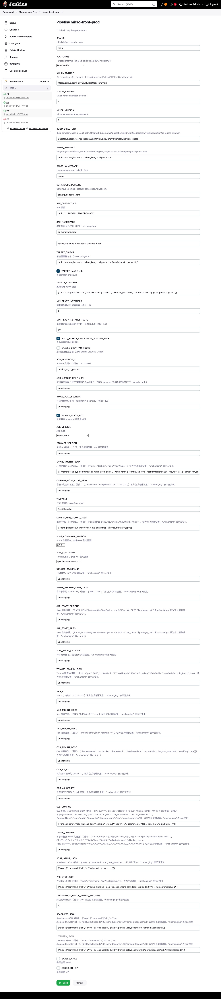
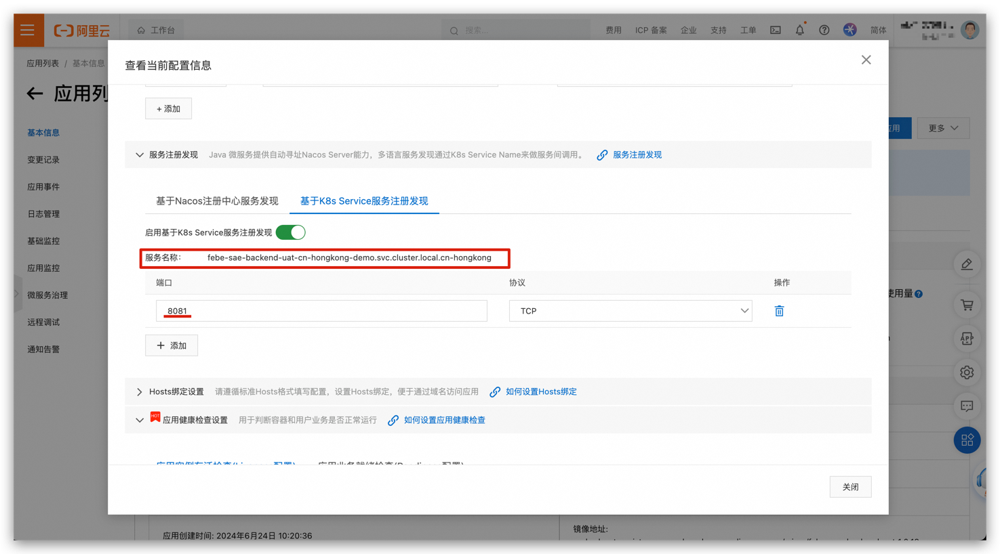
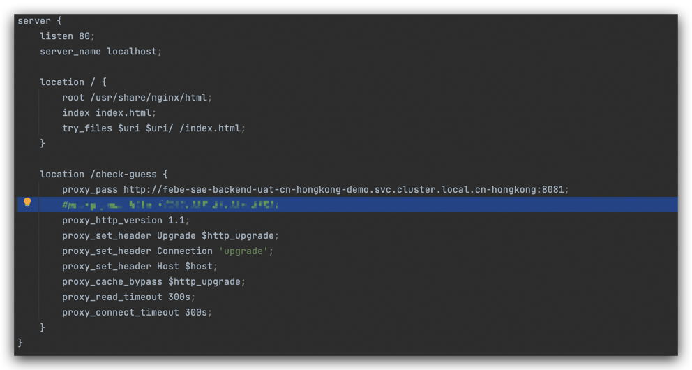
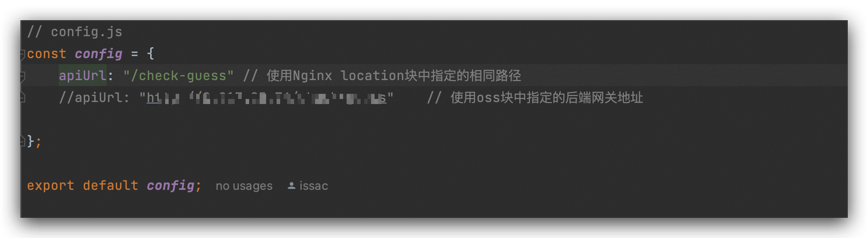
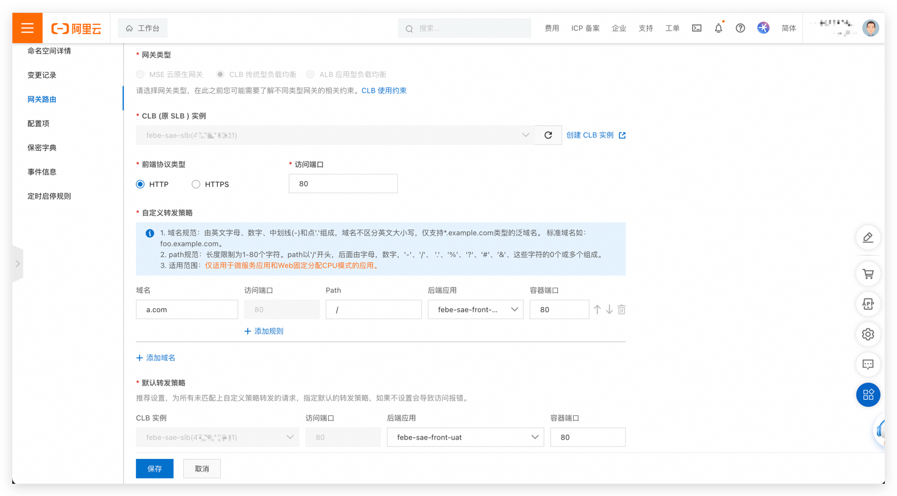
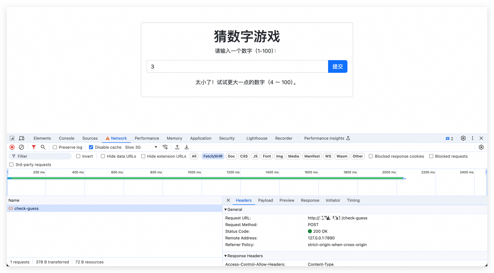

## Monolithic Application GO VUE项目前后分离部署到 Serverless应用引擎SAE 环境

### 1. 概述

本篇文章将介绍如何将一个基于 GO 和 VUE 的应用进行前后端分离，并部署到阿里云的 Serverless应用引擎SAE 环境，以及选择部署前端资源到 oss 。整个流程将涵盖 Jenkins Pipeline 的使用，以及安全和质量检测工具如 Trivy 和 SonarQube 的集成。此外，我们还将涉及多架构构建的相关内容。

### 2. 环境准备

#### 2.1 工具和服务

- **Jenkins**：用于持续集成和持续部署（CI/CD）的自动化工具。
- **Trivy**：用于容器安全扫描的开源工具。
- **SonarQube**：用于代码质量和安全分析的平台。
- **kaniko**：用于构建和管理容器化应用。
- **Serverless应用引擎SAE**：阿里云的托管 serverless 服务。

#### 2.2 基本配置项合集说明

- 阿里云 ACK 集群集群令牌获取，获取方式登录容器服务 ACK，选择目标集群，连接信息，复制 Kubeconfig 令牌信息，用于部署应用到目标集群。
- 阿里云 ACR 账户信息获取，使用 Docker 登录镜像仓库后，将 `/root/.docker/config.json`配置信息配置为secret凭据，用于 kaniko 构建镜像使用。
- SonarQube Server 登录 Sonarqube，在account选项/security，创建Generate Tokens，用于配置 jenkins 扫描代码。
- 项目部署代码库地址： [FEBEseparation](https://github.com/Roliyal/CROlordCodelibrary/tree/main/Chapter2KubernetesApplicationBuild/Unit2CodeLibrary/FEBEseparation)
- 项目部署脚本库地址：[CROLordSharedLibraryCode](https://github.com/Roliyal/CROLordSharedLibraryCode)

##### 2.2.1 部署参数

以下是用于 Jenkins Pipeline 部署的参数配置说明，包括每个参数的用途和默认值：

1. **BRANCH**：
   - **描述**：初始默认分支
   - **默认值**：`main`
   - **类型**：字符串
   - **用途**：指定要构建的 Git 分支。

2. **PLATFORMS**：
   - **描述**：目标平台，初始值为 `linux/amd64,linux/arm64`
   - **默认值**：`linux/amd64,linux/arm64`
   - **类型**：选择列表
   - **用途**：指定要构建的目标平台架构。

3. **GIT_REPOSITORY**：
   - **描述**：Git 仓库 URL，默认值为 `https://github.com/Roliyal/CROlordCodelibrary.git`
   - **默认值**：`https://github.com/Roliyal/CROlordCodelibrary.git`
   - **类型**：字符串
   - **用途**：指定要克隆和构建的 Git 仓库地址。

4. **MAJOR_VERSION**：
   - **描述**：主版本号，默认值为 `1`
   - **默认值**：`1`
   - **类型**：字符串
   - **用途**：用于标识版本控制的主版本号。

5. **MINOR_VERSION**：
   - **描述**：次版本号，默认值为 `0`
   - **默认值**：`0`
   - **类型**：字符串
   - **用途**：用于标识版本控制的次版本号。

6. **BUILD_DIRECTORY**：
   - **描述**：构建目录路径，默认路径为 `Chapter2KubernetesApplicationBuild/Unit2CodeLibrary/Microservice/front-guess`
   - **默认值**：`Chapter2KubernetesApplicationBuild/Unit2CodeLibrary/Microservice/front-guess`
   - **类型**：字符串
   - **用途**：指定要构建的项目的目录路径。

7. **IMAGE_REGISTRY**：
   - **描述**：镜像仓库地址，默认值为 `crolord-uat-registry-vpc.cn-hongkong.cr.aliyuncs.com`
   - **默认值**：`crolord-uat-registry-vpc.cn-hongkong.cr.aliyuncs.com`
   - **类型**：字符串
   - **用途**：指定要推送镜像的阿里云容器镜像服务地址。

8. **IMAGE_NAMESPACE**：
   - **描述**：镜像命名空间，默认值为 `micro`
   - **默认值**：`micro`
   - **类型**：字符串
   - **用途**：指定镜像在仓库中的命名空间。

9. **SONARQUBE_DOMAIN**：
   - **描述**：SonarQube 域名，默认值为 `sonarqube.roliyal.com`
   - **默认值**：`sonarqube.roliyal.com`
   - **类型**：字符串
   - **用途**：指定 SonarQube 服务器的地址，用于代码质量分析。
10. SAE 部署参数参考第三章第一节配置说明[第1节 配置 SAE Jenkins 环境.md](%E7%AC%AC1%E8%8A%82%20%E9%85%8D%E7%BD%AE%20SAE%20Jenkins%20%E7%8E%AF%E5%A2%83.md)

### 3. 项目结构

```plaintext
.
├── go-guess-number
│   ├── Dockerfile
│   ├── go-guess-number.yaml
│   ├── go.mod
│   ├── go.sum
│   ├── jenkinsfile
│   └── main.go
└── vue-go-guess-number
    ├── Dockerfile
    ├── README.md
    ├── babel.config.js
    ├── default.conf
    ├── jsconfig.json
    ├── localhost.xml
    ├── package-lock.json
    ├── package.json
    ├── public
    │   ├── favicon.ico
    │   └── index.html
    ├── src
    │   ├── App.vue
    │   ├── GuessGame.vue
    │   ├── LogInGame.vue
    │   ├── assets
    │   │   └── logo.png
    │   ├── components
    │   │   └── HelloWorld.vue
    │   ├── config.js
    │   ├── main.js
    │   └── vue.config.js
    └── vue-go-guess-number.yaml

7 directories, 25 files

```

#### 4. Jenkins Pipeline 各个Stage分析与功能描述


#### 4.1 Pipeline 全局配置

- **agent**：指定使用 Kubernetes 作为 Jenkins agent，并且配置了相关的 Kubernetes 环境（本文涉及多阶段多个agent，故设置none）。
- **environment**：定义了一系列环境变量，包括 Git 分支、版本号、构建目标平台、镜像仓库地址、SonarQube 域名、OSS 部署路径等。
- **triggers**：设置了 GitHub Push 触发器，当有新的代码推送到 GitHub 仓库时触发构建（可选择注释）。
- **parameters**：定义了一些参数，允许用户在构建时提供输入，如 Git 分支、构建目录、镜像仓库地址、SonarQube 域名、OSS 部署路径等。

### Stage部署分析

#### `前端部署 SAE Jenkinsfile`

这个Jenkins Pipeline脚本包含了多个阶段（stages），每个阶段执行特定的任务来完成持续集成和部署流程。让我们逐个阶段进行详细解释：
### 0. 整体变量声明
```groovy
    agent any

    // 定义环境变量
    environment {
        GIT_BRANCH = 'main' // Git主分支的默认值
        MAJOR_VERSION = 'v1' // 主版本号
        MINOR_VERSION = '0'  // 次版本号
        PLATFORMS = 'linux/amd64,linux/arm64' // 构建目标平台
        MAJOR = "${params.MAJOR_VERSION ?: env.MAJOR_VERSION ?: '1'}" // 主版本号，允许通过参数覆盖
        MINOR = "${params.MINOR_VERSION ?: env.MINOR_VERSION ?: '0'}" // 次版本号，允许通过参数覆盖
        PATCH = "${env.BUILD_NUMBER}" // 构建号，用作修订版本号
        VERSION_TAG = "${MAJOR}.${MINOR}.${PATCH}" // 组合版本标签
        IMAGE_REGISTRY = "${params.IMAGE_REGISTRY}" // 镜像仓库地址
        IMAGE_NAMESPACE = "${params.IMAGE_NAMESPACE}" // 镜像命名空间
        IMAGE_ID = "${params.IMAGE_NAMESPACE}" // 镜像ID
        SONARQUBE_DOMAIN = "${params.SONARQUBE_DOMAINE}" // Sonarqube 域名配置
    }

    // 触发条件
    triggers { githubPush() }

    // 参数定义
    parameters {
        persistentString(name: 'BRANCH', defaultValue: 'main', description: 'Initial default branch: main')
        persistentChoice(name: 'PLATFORMS', choices: ['linux/amd64', 'linux/amd64,linux/arm64'], description: 'Target platforms, initial value: linux/amd64,linux/arm64')
        persistentString(name: 'GIT_REPOSITORY', defaultValue: 'https://github.com/Roliyal/CROlordCodelibrary.git', description: 'Git repository URL, default: https://github.com/Roliyal/CROlordCodelibrary.git')
        persistentString(name: 'MAJOR_VERSION', defaultValue: '1', description: 'Major version number, default: 1')
        persistentString(name: 'MINOR_VERSION', defaultValue: '0', description: 'Minor version number, default: 0')
        persistentString(name: 'BUILD_DIRECTORY', defaultValue: 'docekerfile path', description: 'Build directory path, default path: Chapter2KubernetesApplicationBuild/Unit2CodeLibrary/FEBEseparation/go-guess-number')
        persistentString(name: 'IMAGE_REGISTRY', defaultValue: 'crolord-uat-registry-vpc.cn-hongkong.cr.aliyuncs.com', description: 'Image registry address, default: crolord-registry-registry-vpc.cn-hongkong.cr.aliyuncs.com')
        persistentString(name: 'IMAGE_NAMESPACE', defaultValue: 'micro', description: 'Image namespace, default: febe')
        persistentString(name: 'SONARQUBE_DOMAINE', defaultValue: 'sonarqube.roliyal.com', description: 'SonarQube domain, default: sonarqube.roliyal.com')
        persistentString(name: 'SAE_CREDENTIALS', defaultValue: 'SAE : LTAI*****885Xr', description: 'SAE 凭据')
        persistentString(name: 'SAE_NAMESPACE', defaultValue: 'cn-hongkong:uat', description: 'SAE 应用命名空间（例如：cn-hangzhou）')
        persistentString(name: 'APPLICATION_ID', defaultValue: '0d93******a1634', description: '请设置应用 ID')
        persistentString(name: 'TARGET_OBJECT', defaultValue: 'crolord-uat-registry-vpc.cn-hongkong.cr.aliyuncs.com/febe/micro-front-uat:1.0.5', description: '请设置目标对象（file|Url|imageUrl）')
        booleanParam(name: 'TARGET_IMAGE_URL', defaultValue: true, description: '目标是否为 imageUrl')
        persistentString(name: 'UPDATE_STRATEGY', defaultValue: '{"type":"GrayBatchUpdate","batchUpdate":{"batch":2,"releaseType":"auto","batchWaitTime":1},"grayUpdate":{"gray":1}}', description: '更新策略 JSON 配置')
        persistentString(name: 'MIN_READY_INSTANCES', defaultValue: '2', description: '部署时的最小就绪实例数（例如：2）')
        persistentString(name: 'MIN_READY_INSTANCE_RATIO', defaultValue: '50', description: '部署时的最小就绪实例比例（范围 [0,100] 例如：50）')
        booleanParam(name: 'AUTO_ENABLE_APPLICATION_SCALING_RULE', defaultValue: true, description: '自动启用应用扩展规则')
        booleanParam(name: 'ENABLE_GREY_TAG_ROUTE', defaultValue: false, description: '启用灰度标签路由（仅限 Spring Cloud 和 Dubbo）')
        persistentString(name: 'ACR_INSTANCE_ID', defaultValue: 'cri-dcvg4tjrhgptvs54', description: 'ACR EE 实例 ID（例如：cri-xxxxxx）')
        persistentString(name: 'ACR_ASSUME_ROLE_ARN', defaultValue: 'unchanging', description: '使用其他阿里云账户镜像时的 RAM 角色（例如：acs:ram::123456789012****:role/adminrole）')
        persistentString(name: 'IMAGE_PULL_SECRETS', defaultValue: 'unchanging', description: '与应用程序位于同一命名空间的 Secret ID（例如：123）')
        booleanParam(name: 'ENABLE_IMAGE_ACCL', defaultValue: true, description: '是否启用 ImageUrl 的镜像加速')
        persistentChoice(name: 'JDK_VERSION', choices: [ 'Open JDK 7', 'Open JDK 8', 'Dragonwell 8', 'Dragonwell 11', 'Dragonwell 17', 'openjdk-7u201-jdk-alpine3.9', 'openjdk-8u191-jdk-alpine3.9'], description: 'JDK 版本')
        persistentString(name: 'PACKAGE_VERSION', defaultValue: 'unchanging', description: '包版本（例如：1.0.0），设为空将使用 Unix 时间戳填充')
        persistentString(name: 'ENVIRONMENTS_JSON', defaultValue: '[ { "name": "sae-sys-configmap-all-configmapdemo", "valueFrom": { "configMapRef": { "configMapId": 6227, "key": "" } } },{ "name": "mysql_user", "value": "crolord" } ]', description: '环境变量的 jsonArray。（例如： [{"name":"testkey","value":"testValue"}]）设为空以清除设置，"unchanging" 表示无变化')
        persistentString(name: 'CUSTOM_HOST_ALIAS_JSON', defaultValue: 'unchanging', description: '容器中的主机设置。（例如： [{"hostName":"samplehost","ip":"127.0.0.1"}]）设为空以清除设置，"unchanging" 表示无变化')
        persistentString(name: 'TIMEZONE', defaultValue: 'Asia/Shanghai', description: '时区（例如：Asia/Shanghai）')
        persistentString(name: 'CONFIG_MAP_MOUNT_DESC', defaultValue: '[{"configMapId":6226,"key":"sae-sys-configmap-all","mountPath":"/opt"}]', description: '配置环境的 jsonArray。（例如： [{"configMapId":16,"key":"test","mountPath":"/tmp"}]）设为空以清除设置，"unchanging" 表示无变化')
        persistentChoice(name: 'EDAS_CONTAINER_VERSION', choices: [ '3.5.7', '3.5.3'], description: 'EDAS 容器版本。部署 HSF 包时需要')
        persistentChoice(name: 'WEB_CONTAINER', choices: [ 'apache-tomcat-8.5.42', 'apache-tomcat-7.0.91'], description: 'Tomcat 版本。部署 war 包时需要')
        persistentString(name: 'STARTUP_COMMAND', defaultValue: 'unchanging', description: '启动命令。设为空以清除设置，"unchanging" 表示无变化')
        persistentString(name: 'IMAGE_STARTUP_ARGS_JSON', defaultValue: 'unchanging', description: '命令参数的 JsonArray。（例如： ["xxx","xxxx"]）设为空以清除设置，"unchanging" 表示无变化')
        persistentString(name: 'JAR_START_OPTIONS', defaultValue: 'unchanging', description: 'Java 启动选项。 ($JAVA_HOME/bin/java $JarStartOptions -jar $CATALINA_OPTS "$package_path" $JarStartArgs) 设为空以清除设置，"unchanging" 表示无变化')
        persistentString(name: 'JAR_START_ARGS', defaultValue: 'unchanging', description: 'Java 启动参数。 ($JAVA_HOME/bin/java $JarStartOptions -jar $CATALINA_OPTS "$package_path" $JarStartArgs) 设为空以清除设置，"unchanging" 表示无变化')
        persistentString(name: 'WAR_START_OPTIONS', defaultValue: 'unchanging', description: 'War 启动选项。设为空以清除设置，"unchanging" 表示无变化')
        persistentString(name: 'TOMCAT_CONFIG_JSON', defaultValue: 'unchanging', description: 'Tomcat 配置的设置。（例如： {"port":8080,"contextPath":"/","maxThreads":400,"uriEncoding":"ISO-8859-1","useBodyEncodingForUri":true}）设为空以清除设置，"unchanging" 表示无变化')
        persistentString(name: 'NAS_ID', defaultValue: 'unchanging', description: 'Nas ID。（例如：10d3b4****）设为空以清除设置，"unchanging" 表示无变化')
        persistentString(name: 'NAS_MOUNT_HOST', defaultValue: 'unchanging', description: 'Nas 挂载主机。（例如：10d3b4bc9****.com）设为空以清除设置，"unchanging" 表示无变化')
        persistentString(name: 'NAS_MOUNT_DESC', defaultValue: 'unchanging', description: 'Nas 挂载描述。（例如： [{mountPath: "/tmp", nasPath: "/"}]）设为空以清除设置，"unchanging" 表示无变化')
        persistentString(name: 'OSS_MOUNT_DESC', defaultValue: 'unchanging', description: 'Oss 挂载描述。（例如： [{"bucketName": "oss-bucket", "bucketPath": "data/user.data", "mountPath": "/usr/data/user.data", "readOnly": true}]）设为空以清除设置，"unchanging" 表示无变化')
        persistentString(name: 'OSS_AK_ID', defaultValue: 'unchanging', description: '具有读/写权限的 Oss ak ID。设为空以清除设置，"unchanging" 表示无变化')
        persistentString(name: 'OSS_AK_SECRET', defaultValue: 'unchanging', description: '具有读/写权限的 Oss ak 密钥。设为空以清除设置，"unchanging" 表示无变化')
        persistentString(name: 'SLS_CONFIGS', defaultValue: '[{"projectName":"febe-uat-sae-app","logType":"stdout","logDir":"","logstoreName":"febe-front-uat","logtailName":""}]', description: 'SLS 配置。sae 创建 sls 资源：（例如： [{"logDir":"","logType":"stdout"}/{"logDir":"/tmp/a.log"}]）用户自有 sls 资源：（例如： [{"projectName":"test-sls","logType":"stdout","logDir":"","logstoreName":"sae","logtailName":""},{"projectName":"test","logDir":"/tmp/a.log","logstoreName":"sae","logtailName":"xx"}]）设为空以清除设置，"unchanging" 表示无变化')
        persistentString(name: 'KAFKA_CONFIGS', defaultValue: 'unchanging', description: '日志恢复到 Kafka 的配置。（例如： {"kafkaConfigs":"[{"logType":"file_log","logDir":"/tmp/a.log","kafkaTopic":"test2"},{"logType":"stdout","logDir":"","kafkaTopic":"test"}]","kafkaInstanceId":"alikafka_pre-cn-7pp2l8kr****","kafkaEndpoint":"10.0.X.XXX:XXXX,10.0.X.XXX:XXXX,10.0.X.XXX:XXXX"}）设为空以清除设置，"unchanging" 表示无变化')
        persistentString(name: 'POST_START_JSON', defaultValue: '{"exec":{"command":["sh","-c","echo hello > demo.txt"]}}', description: 'PostStart JSON（例如： {"exec":{"command":"cat","/etc/group"}}）。设为空以清除，"unchanging" 表示无变化')
        persistentString(name: 'PRE_STOP_JSON', defaultValue: '{"exec":{"command":["sh","-c","echo \'PreStop Hook: Process ending at $(date). Exit code: $? \' >> /var/log/prestop.log"]}}', description: 'PreStop JSON（例如： {"exec":{"command":"cat","/etc/group"}}）。设为空以清除，"unchanging" 表示无变化')
        persistentString(name: 'TERMINATION_GRACE_PERIOD_SECONDS', defaultValue: '10', description: '终止的限制时间（例如：30）设为空以清除设置，"unchanging" 表示无变化')
        persistentString(name: 'READINESS_JSON', defaultValue: '{"exec":{"command":["sh","-c","nc -zv localhost 80 || exit 1"]},"initialDelaySeconds":5,"timeoutSeconds":10}', description: 'Readiness JSON（例如： {"exec":{"command":["sh","-c","cat /home/admin/start.sh"]},"initialDelaySeconds":30,"periodSeconds":30,"timeoutSeconds":2}）设为空以清除设置，"unchanging" 表示无变化')
        persistentString(name: 'LIVENESS_JSON', defaultValue: '{"exec":{"command":["sh","-c","nc -zv localhost 80 || exit 1"]},"initialDelaySeconds":30,"periodSeconds":30,"timeoutSeconds":2}', description: 'Liveness JSON（例如： {"exec":{"command":["sh","-c","cat /home/admin/start.sh"]},"initialDelaySeconds":30,"periodSeconds":30,"timeoutSeconds":2}）设为空以清除设置，"unchanging" 表示无变化')
        booleanParam(name: 'ENABLE_AHAS', defaultValue: false, description: '是否启用 AHAS')
        booleanParam(name: 'ASSOCIATE_EIP', defaultValue: false, description: '是否关联 EIP')
    }
```

### 1. Version 阶段

```groovy
stage('Version') {
    steps {
        script {
            env.PATCH_VERSION = env.BUILD_NUMBER
            env.VERSION_NUMBER = "${env.MAJOR}.${env.MINOR}.${env.PATCH_VERSION}"
            echo "Current Version: ${env.VERSION_NUMBER}"
        }
    }
}
```

- **描述：** 这个阶段设置了版本信息。
- **步骤：**
   - 使用当前的构建号（`BUILD_NUMBER`）作为修订版本号（`PATCH_VERSION`）。
   - 将主版本号（`MAJOR`）、次版本号（`MINOR`）和修订版本号组合成完整的版本号（`VERSION_NUMBER`）。
   - 打印当前版本号到控制台。

### 2. Checkout 阶段

```groovy
stage('Checkout') {
    steps {
        cleanWs() // 清理工作空间
        script {
            env.GIT_BRANCH = params.BRANCH
        }
        // 检出Git仓库
        checkout scm: [
            $class: 'GitSCM',
            branches: [[name: "*/${env.GIT_BRANCH}"]],
            userRemoteConfigs: [[url: params.GIT_REPOSITORY]],
            extensions: [[$class: 'CloneOption', depth: 1, noTags: false, reference: '', shallow: true]]
        ]
        echo '代码检出完成'
    }
}
```

- **描述：** 这个阶段负责从指定的Git仓库检出代码。
- **步骤：**
   - `cleanWs()`：清理工作空间，确保干净的构建环境。
   - 设置`env.GIT_BRANCH`为指定的Git分支，参数由用户或默认值指定。
   - 使用`GitSCM`插件检出指定分支的代码，并配置一些检出选项。
   - 打印检出完成的信息到控制台。

### 3. Check Directory 阶段

```groovy
stage('Check Directory') {
    steps {
        echo "Current working directory: ${pwd()}"
        sh 'ls -la'
        stash includes: '**', name: 'source-code' // 存储工作空间，包括Dockerfile和应用代码
    }
}
```

- **描述：** 这个阶段用于检查当前工作目录和存储工作空间的内容。
- **步骤：**
   - 打印当前工作目录的路径。
   - 执行`ls -la`命令列出当前目录下的所有文件和文件夹的详细信息。
   - 使用`stash`命令存储工作空间（包括Dockerfile和应用代码），以便后续阶段可以恢复和使用这些文件。

### 4. Parallel Build 阶段

```groovy
stage('Parallel Build') {
    parallel {
        // 为 amd64 构建镜像
        stage('Build for amd64') {
            agent { kubernetes { inheritFrom 'kanikoamd' } }
            steps {
                unstash 'source-code' // 恢复之前存储的代码
                container('kanikoamd') {
                    sh """
                        kaniko \
                          --context ${env.WORKSPACE}/${params.BUILD_DIRECTORY} \
                          --dockerfile ${params.BUILD_DIRECTORY}/Dockerfile \
                          --destination ${env.IMAGE_REGISTRY}/${env.IMAGE_NAMESPACE}/${env.JOB_NAME}:${VERSION_TAG}-amd64 \
                          --cache=true \
                          --cache-repo=${env.IMAGE_REGISTRY}/${env.IMAGE_NAMESPACE}/cache \
                          --skip-tls-verify \
                          --skip-unused-stages=true \
                          --custom-platform=linux/amd64 \
                          --build-arg BUILDKIT_INLINE_CACHE=1 \
                          --snapshot-mode=redo \
                          --log-format=text \
                          --verbosity=info
                    """
                }
            }
        }
        // 为 arm64 构建镜像
        stage('Build for arm64') {
            agent { kubernetes { inheritFrom 'kanikoarm' } }
            steps {
                unstash 'source-code'
                container('kanikoarm') {
                    sh """
                    /kaniko/executor \
                      --context ${env.WORKSPACE}/${params.BUILD_DIRECTORY} \
                      --dockerfile ${params.BUILD_DIRECTORY}/Dockerfile \
                      --destination ${env.IMAGE_REGISTRY}/${env.IMAGE_NAMESPACE}/${env.JOB_NAME}:${VERSION_TAG}-arm64 \
                      --cache=true \
                      --cache-repo=${env.IMAGE_REGISTRY}/${env.IMAGE_NAMESPACE}/cache \
                      --skip-tls-verify \
                      --skip-unused-stages=true \
                      --custom-platform=linux/arm64 \
                      --build-arg BUILDKIT_INLINE_CACHE=1 \
                      --snapshot-mode=redo \
                      --log-format=text \
                      --verbosity=info
                    """
                }
            }
        }
    }
}
```

- **描述：** 这个阶段并行构建两个架构的Docker镜像（amd64和arm64）。
- **步骤：**
   - 使用`kaniko`工具在Kubernetes Pod中构建镜像。
   - `kaniko`是一个无需特权的容器，可以在Kubernetes中执行Docker镜像构建，支持多架构构建。
   - 为每个架构（amd64和arm64）设置不同的Kubernetes代理（`kanikoamd`和`kanikoarm`）。
   - 使用`unstash`命令恢复之前存储的工作空间（`source-code`），包括Dockerfile和应用代码。
   - 在每个代理容器中执行`kaniko`命令来构建指定架构的镜像。

### 5. Push Multi-Arch Manifest 阶段

```groovy
stage('Push Multi-Arch Manifest') {
    agent { kubernetes { inheritFrom 'kanikoamd' } }
    steps {
        container('kanikoamd') {
            script {
                sh "manifest-tool --version "
                // 创建并推送多架构镜像的manifest
                sh """
                    manifest-tool --insecure push from-args \\
                    --platforms '${env.PLATFORMS}' \\
                    --template '${env.IMAGE_REGISTRY}/${env.IMAGE_NAMESPACE}/${env.JOB_NAME}:${env.VERSION_TAG}-ARCHVARIANT' \\
                    --target '${env.IMAGE_REGISTRY}/${env.IMAGE_NAMESPACE}/${env.JOB_NAME}:${env.VERSION_TAG}'
                """
                //sh "trivy image --exit-code 1 --severity HIGH,CRITICAL --ignore-unfixed --no-progress --insecure --timeout 5m '${env.IMAGE_REGISTRY}/${env.IMAGE_NAMESPACE}/${env.JOB_NAME}:${env.VERSION_TAG}'" //是否开启安全Trivy扫描

            }
        }
    }
}
```

- **描述：** 这个阶段负责创建和推送多架构镜像的manifest。
- **步骤：**
   - 在`kanikoamd`代理中执行命令。
   - 使用`manifest-tool`工具推送多架构的镜像manifest。
   - `--platforms`指定目标平台（`linux/amd64,linux/arm64`）。
   - `--template`指定镜像标签模板。
   - `--target`指定最终推送的镜像名称和标签。

### 6. Deploy SAE Application 阶段

```groovy
stage('Deploy SAE Application') {
   steps {
       script {
           saeClient([
               deploySAEApplication(
                   acrAssumeRoleArn: params.ACR_ASSUME_ROLE_ARN,
                   acrInstanceId: params.ACR_INSTANCE_ID,
                   appId: params.APPLICATION_ID,
                   args: params.ARGS,
                   associateEip: params.ASSOCIATE_EIP,
                   autoEnableApplicationScalingRule: params.AUTO_ENABLE_APPLICATION_SCALING_RULE,
                   configMapMountDesc: params.CONFIG_MAP_MOUNT_DESC,
                   credentialsString: params.SAE_CREDENTIALS,
                   customHostAlias: params.CUSTOM_HOST_ALIAS_JSON,
                   edasContainerVersion: params.EDAS_CONTAINER_VERSION,
                   enableAhas: params.ENABLE_AHAS,
                   enableGreyTagRoute: params.ENABLE_GREY_TAG_ROUTE,
                   enableImageAccl: params.ENABLE_IMAGE_ACCL,
                   envs: params.ENVIRONMENTS_JSON,
                   image: params.TARGET_IMAGE_URL,
                   imagePullSecrets: params.IMAGE_PULL_SECRETS,
                   jarStartArgs: params.JAR_START_ARGS,
                   jarStartOptions: params.JAR_START_OPTIONS,
                   jdk: params.JDK_VERSION,
                   kafkaConfigs: params.KAFKA_CONFIGS,
                   liveness: params.LIVENESS_JSON,
                   namespaceId: params.SAE_NAMESPACE,
                   nasId: params.NAS_ID,
                   nasMountDesc: params.NAS_MOUNT_DESC,
                   nasMountHost: params.NAS_MOUNT_HOST,
                   ossAkId: params.OSS_AK_ID,
                   ossAkSecret: params.OSS_AK_SECRET,
                   ossMountDesc: params.OSS_MOUNT_DESC,
                   postStart: params.POST_START_JSON,
                   preStop: params.PRE_STOP_JSON,
                   readiness: params.READINESS_JSON,
                   slsConfigs: params.SLS_CONFIGS,
                   startupCommand: params.STARTUP_COMMAND,
                   targetObject: "${env.IMAGE_REGISTRY}/${env.IMAGE_NAMESPACE}/${env.JOB_NAME}:${env.VERSION_TAG}",
                   timezone: params.TIMEZONE,
                   tomcatConfig: params.TOMCAT_CONFIG_JSON,
                   updateStrategy: params.UPDATE_STRATEGY,
                   warStartOptions: params.WAR_START_OPTIONS,
                   webContainer: params.WEB_CONTAINER,
                   minReadyInstances: params.MIN_READY_INSTANCES == '' ? 0 : params.MIN_READY_INSTANCES.toInteger(),
                   minReadyInstanceRatio: params.MIN_READY_INSTANCE_RATIO == '' ? 0 : params.MIN_READY_INSTANCE_RATIO.toInteger(),
                   terminationGracePeriodSeconds: params.TERMINATION_GRACE_PERIOD_SECONDS == 'unchanging' ? 0 : params.TERMINATION_GRACE_PERIOD_SECONDS.toInteger()
               )
           ])
       }
   }
```

- **描述：** 这个阶段负责将应用程序部署到SAE服务。
- **步骤：**
   - 使用自定义的`saeClient`方法调用`deploySAEApplication`函数，部署配置通过一系列的参数传递给这个函数。
   - 这些参数包括部署所需的各种配置信息，如镜像地址、环境变量、部署策略、健康检查、就绪策略等。
   - 如图所示


### 实际部署前后端项目分离项目SAE环境中

#### 0. 创建前端流水线配置
1. 创建 Jenkins Pipeline 项目
   登录 Jenkins 首页，点击 "New Item"。
   在 "Enter an item name" 区域输入项目名称，选择 "Pipeline"，然后点击 "OK"。
   在 Pipeline 页签，点击 "Pipeline Syntax"。
2. 配置 Jenkins Pipeline Script
   在 "Snippet Generator" 页面，生成并拷贝以下流水线脚本：
```groovy
pipeline {
    // 定义使用的 Jenkins agent 类型
    //agent { kubernetes { /* 配置省略 */ } }
    agent any

    // 定义环境变量
    environment {
        GIT_BRANCH = 'main' // Git主分支的默认值
        MAJOR_VERSION = 'v1' // 主版本号
        MINOR_VERSION = '0'  // 次版本号
        PLATFORMS = 'linux/amd64,linux/arm64' // 构建目标平台
        MAJOR = "${params.MAJOR_VERSION ?: env.MAJOR_VERSION ?: '1'}" // 主版本号，允许通过参数覆盖
        MINOR = "${params.MINOR_VERSION ?: env.MINOR_VERSION ?: '0'}" // 次版本号，允许通过参数覆盖
        PATCH = "${env.BUILD_NUMBER}" // 构建号，用作修订版本号
        VERSION_TAG = "${MAJOR}.${MINOR}.${PATCH}" // 组合版本标签
        IMAGE_REGISTRY = "${params.IMAGE_REGISTRY}" // 镜像仓库地址
        IMAGE_NAMESPACE = "${params.IMAGE_NAMESPACE}" // 镜像命名空间
        IMAGE_ID = "${params.IMAGE_NAMESPACE}" // 镜像ID
        SONARQUBE_DOMAIN = "${params.SONARQUBE_DOMAINE}" // Sonarqube 域名配置
    }

    // 触发条件
    triggers { githubPush() }

    // 参数定义
    parameters {
        persistentString(name: 'BRANCH', defaultValue: 'main', description: 'Initial default branch: main')
        persistentChoice(name: 'PLATFORMS', choices: ['linux/amd64', 'linux/amd64,linux/arm64'], description: 'Target platforms, initial value: linux/amd64,linux/arm64')
        persistentString(name: 'GIT_REPOSITORY', defaultValue: 'https://github.com/Roliyal/CROlordCodelibrary.git', description: 'Git repository URL, default: https://github.com/Roliyal/CROlordCodelibrary.git')
        persistentString(name: 'MAJOR_VERSION', defaultValue: '1', description: 'Major version number, default: 1')
        persistentString(name: 'MINOR_VERSION', defaultValue: '0', description: 'Minor version number, default: 0')
        persistentString(name: 'BUILD_DIRECTORY', defaultValue: 'Chapter2KubernetesApplicationBuild/Unit2CodeLibrary/FEBEseparation/vue-go-guess-number', description: 'Build directory path, default path: Chapter2KubernetesApplicationBuild/Unit2CodeLibrary/FEBEseparation/go-guess-number')
        persistentString(name: 'IMAGE_REGISTRY', defaultValue: 'crolord-uat-registry-vpc.cn-hongkong.cr.aliyuncs.com', description: 'Image registry address, default: crolord-registry-registry-vpc.cn-hongkong.cr.aliyuncs.com')
        persistentString(name: 'IMAGE_NAMESPACE', defaultValue: 'micro', description: 'Image namespace, default: febe')
        persistentString(name: 'SONARQUBE_DOMAINE', defaultValue: 'sonarqube.roliyal.com', description: 'SonarQube domain, default: sonarqube.roliyal.com')
        persistentString(name: 'SAE_CREDENTIALS', defaultValue: 'LTAI5t8Rcqi2xKi5kQzd85Xr', description: 'SAE 凭据')
        persistentString(name: 'SAE_NAMESPACE', defaultValue: 'cn-hongkong:demo', description: 'SAE 应用命名空间（例如：cn-hangzhou）')
        persistentString(name: 'APPLICATION_ID', defaultValue: '0d930603-f647-480c-94e7-a20642da1634', description: '请设置应用 ID')
        persistentString(name: 'TARGET_OBJECT', defaultValue: 'crolord-uat-registry-vpc.cn-hongkong.cr.aliyuncs.com/febe/micro-front-uat:1.0.5', description: '请设置目标对象（file|Url|imageUrl）')
        booleanParam(name: 'TARGET_IMAGE_URL', defaultValue: true, description: '目标是否为 imageUrl')
        persistentString(name: 'UPDATE_STRATEGY', defaultValue: '{"type":"GrayBatchUpdate","batchUpdate":{"batch":2,"releaseType":"auto","batchWaitTime":1},"grayUpdate":{"gray":1}}', description: '更新策略 JSON 配置')
        persistentString(name: 'MIN_READY_INSTANCES', defaultValue: '2', description: '部署时的最小就绪实例数（例如：2）')
        persistentString(name: 'MIN_READY_INSTANCE_RATIO', defaultValue: '50', description: '部署时的最小就绪实例比例（范围 [0,100] 例如：50）')
        booleanParam(name: 'AUTO_ENABLE_APPLICATION_SCALING_RULE', defaultValue: true, description: '自动启用应用扩展规则')
        booleanParam(name: 'ENABLE_GREY_TAG_ROUTE', defaultValue: false, description: '启用灰度标签路由（仅限 Spring Cloud 和 Dubbo）')
        persistentString(name: 'ACR_INSTANCE_ID', defaultValue: 'cri-dcvg4tjrhgptvs54', description: 'ACR EE 实例 ID（例如：cri-xxxxxx）')
        persistentString(name: 'ACR_ASSUME_ROLE_ARN', defaultValue: 'unchanging', description: '使用其他阿里云账户镜像时的 RAM 角色（例如：acs:ram::123456789012****:role/adminrole）')
        persistentString(name: 'IMAGE_PULL_SECRETS', defaultValue: 'unchanging', description: '与应用程序位于同一命名空间的 Secret ID（例如：123）')
        booleanParam(name: 'ENABLE_IMAGE_ACCL', defaultValue: true, description: '是否启用 ImageUrl 的镜像加速')
        persistentChoice(name: 'JDK_VERSION', choices: [ 'Open JDK 7', 'Open JDK 8', 'Dragonwell 8', 'Dragonwell 11', 'Dragonwell 17', 'openjdk-7u201-jdk-alpine3.9', 'openjdk-8u191-jdk-alpine3.9'], description: 'JDK 版本')
        persistentString(name: 'PACKAGE_VERSION', defaultValue: 'unchanging', description: '包版本（例如：1.0.0），设为空将使用 Unix 时间戳填充')
        persistentString(name: 'ENVIRONMENTS_JSON', defaultValue: '[ { "name": "sae-sys-configmap-all-configmapdemo", "valueFrom": { "configMapRef": { "configMapId": 6227, "key": "" } } },{ "name": "mysql_user", "value": "crolord" } ]', description: '环境变量的 jsonArray。（例如： [{"name":"testkey","value":"testValue"}]）设为空以清除设置，"unchanging" 表示无变化')
        persistentString(name: 'CUSTOM_HOST_ALIAS_JSON', defaultValue: 'unchanging', description: '容器中的主机设置。（例如： [{"hostName":"samplehost","ip":"127.0.0.1"}]）设为空以清除设置，"unchanging" 表示无变化')
        persistentString(name: 'TIMEZONE', defaultValue: 'Asia/Shanghai', description: '时区（例如：Asia/Shanghai）')
        persistentString(name: 'CONFIG_MAP_MOUNT_DESC', defaultValue: '[{"configMapId":6226,"key":"sae-sys-configmap-all","mountPath":"/opt"}]', description: '配置环境的 jsonArray。（例如： [{"configMapId":16,"key":"test","mountPath":"/tmp"}]）设为空以清除设置，"unchanging" 表示无变化')
        persistentChoice(name: 'EDAS_CONTAINER_VERSION', choices: [ '3.5.7', '3.5.3'], description: 'EDAS 容器版本。部署 HSF 包时需要')
        persistentChoice(name: 'WEB_CONTAINER', choices: [ 'apache-tomcat-8.5.42', 'apache-tomcat-7.0.91'], description: 'Tomcat 版本。部署 war 包时需要')
        persistentString(name: 'STARTUP_COMMAND', defaultValue: 'unchanging', description: '启动命令。设为空以清除设置，"unchanging" 表示无变化')
        persistentString(name: 'IMAGE_STARTUP_ARGS_JSON', defaultValue: 'unchanging', description: '命令参数的 JsonArray。（例如： ["xxx","xxxx"]）设为空以清除设置，"unchanging" 表示无变化')
        persistentString(name: 'JAR_START_OPTIONS', defaultValue: 'unchanging', description: 'Java 启动选项。 ($JAVA_HOME/bin/java $JarStartOptions -jar $CATALINA_OPTS "$package_path" $JarStartArgs) 设为空以清除设置，"unchanging" 表示无变化')
        persistentString(name: 'JAR_START_ARGS', defaultValue: 'unchanging', description: 'Java 启动参数。 ($JAVA_HOME/bin/java $JarStartOptions -jar $CATALINA_OPTS "$package_path" $JarStartArgs) 设为空以清除设置，"unchanging" 表示无变化')
        persistentString(name: 'WAR_START_OPTIONS', defaultValue: 'unchanging', description: 'War 启动选项。设为空以清除设置，"unchanging" 表示无变化')
        persistentString(name: 'TOMCAT_CONFIG_JSON', defaultValue: 'unchanging', description: 'Tomcat 配置的设置。（例如： {"port":8080,"contextPath":"/","maxThreads":400,"uriEncoding":"ISO-8859-1","useBodyEncodingForUri":true}）设为空以清除设置，"unchanging" 表示无变化')
        persistentString(name: 'NAS_ID', defaultValue: 'unchanging', description: 'Nas ID。（例如：10d3b4****）设为空以清除设置，"unchanging" 表示无变化')
        persistentString(name: 'NAS_MOUNT_HOST', defaultValue: 'unchanging', description: 'Nas 挂载主机。（例如：10d3b4bc9****.com）设为空以清除设置，"unchanging" 表示无变化')
        persistentString(name: 'NAS_MOUNT_DESC', defaultValue: 'unchanging', description: 'Nas 挂载描述。（例如： [{mountPath: "/tmp", nasPath: "/"}]）设为空以清除设置，"unchanging" 表示无变化')
        persistentString(name: 'OSS_MOUNT_DESC', defaultValue: 'unchanging', description: 'Oss 挂载描述。（例如： [{"bucketName": "oss-bucket", "bucketPath": "data/user.data", "mountPath": "/usr/data/user.data", "readOnly": true}]）设为空以清除设置，"unchanging" 表示无变化')
        persistentString(name: 'OSS_AK_ID', defaultValue: 'unchanging', description: '具有读/写权限的 Oss ak ID。设为空以清除设置，"unchanging" 表示无变化')
        persistentString(name: 'OSS_AK_SECRET', defaultValue: 'unchanging', description: '具有读/写权限的 Oss ak 密钥。设为空以清除设置，"unchanging" 表示无变化')
        persistentString(name: 'SLS_CONFIGS', defaultValue: '[{"projectName":"febe-uat-sae-app","logType":"stdout","logDir":"","logstoreName":"febe-front-uat","logtailName":""}]', description: 'SLS 配置。sae 创建 sls 资源：（例如： [{"logDir":"","logType":"stdout"}/{"logDir":"/tmp/a.log"}]）用户自有 sls 资源：（例如： [{"projectName":"test-sls","logType":"stdout","logDir":"","logstoreName":"sae","logtailName":""},{"projectName":"test","logDir":"/tmp/a.log","logstoreName":"sae","logtailName":"xx"}]）设为空以清除设置，"unchanging" 表示无变化')
        persistentString(name: 'KAFKA_CONFIGS', defaultValue: 'unchanging', description: '日志恢复到 Kafka 的配置。（例如： {"kafkaConfigs":"[{"logType":"file_log","logDir":"/tmp/a.log","kafkaTopic":"test2"},{"logType":"stdout","logDir":"","kafkaTopic":"test"}]","kafkaInstanceId":"alikafka_pre-cn-7pp2l8kr****","kafkaEndpoint":"10.0.X.XXX:XXXX,10.0.X.XXX:XXXX,10.0.X.XXX:XXXX"}）设为空以清除设置，"unchanging" 表示无变化')
        persistentString(name: 'POST_START_JSON', defaultValue: '{"exec":{"command":["sh","-c","echo hello > demo.txt"]}}', description: 'PostStart JSON（例如： {"exec":{"command":"cat","/etc/group"}}）。设为空以清除，"unchanging" 表示无变化')
        persistentString(name: 'PRE_STOP_JSON', defaultValue: '{"exec":{"command":["sh","-c","echo \'PreStop Hook: Process ending at $(date). Exit code: $? \' >> /var/log/prestop.log"]}}', description: 'PreStop JSON（例如： {"exec":{"command":"cat","/etc/group"}}）。设为空以清除，"unchanging" 表示无变化')
        persistentString(name: 'TERMINATION_GRACE_PERIOD_SECONDS', defaultValue: '10', description: '终止的限制时间（例如：30）设为空以清除设置，"unchanging" 表示无变化')
        persistentString(name: 'READINESS_JSON', defaultValue: '{"exec":{"command":["sh","-c","nc -zv localhost 80 || exit 1"]},"initialDelaySeconds":5,"timeoutSeconds":10}', description: 'Readiness JSON（例如： {"exec":{"command":["sh","-c","cat /home/admin/start.sh"]},"initialDelaySeconds":30,"periodSeconds":30,"timeoutSeconds":2}）设为空以清除设置，"unchanging" 表示无变化')
        persistentString(name: 'LIVENESS_JSON', defaultValue: '{"exec":{"command":["sh","-c","nc -zv localhost 80 || exit 1"]},"initialDelaySeconds":30,"periodSeconds":30,"timeoutSeconds":2}', description: 'Liveness JSON（例如： {"exec":{"command":["sh","-c","cat /home/admin/start.sh"]},"initialDelaySeconds":30,"periodSeconds":30,"timeoutSeconds":2}）设为空以清除设置，"unchanging" 表示无变化')
        booleanParam(name: 'ENABLE_AHAS', defaultValue: false, description: '是否启用 AHAS')
        booleanParam(name: 'ASSOCIATE_EIP', defaultValue: false, description: '是否关联 EIP')
    }

    // 构建流程定义
    stages {
        // 设置版本信息
        stage('Version') {
            steps {
                script {
                    env.PATCH_VERSION = env.BUILD_NUMBER
                    env.VERSION_NUMBER = "${env.MAJOR}.${env.MINOR}.${env.PATCH_VERSION}"
                    echo "Current Version: ${env.VERSION_NUMBER}"
                }
            }
        }

        // 检出代码
        stage('Checkout') {
            steps {
                cleanWs() // 清理工作空间
                script {
                    env.GIT_BRANCH = params.BRANCH
                }
                // 检出Git仓库
                checkout scm: [
                    $class: 'GitSCM',
                    branches: [[name: "*/${env.GIT_BRANCH}"]],
                    userRemoteConfigs: [[url: params.GIT_REPOSITORY]],
                    extensions: [[$class: 'CloneOption', depth: 1, noTags: false, reference: '', shallow: true]]
                ]
                echo '代码检出完成'
            }
        }

        // 检查目录和Dockerfile
        stage('Check Directory') {
            steps {
                echo "Current working directory: ${pwd()}"
                sh 'ls -la'
                stash includes: '**', name: 'source-code' // 存储工作空间，包括Dockerfile和应用代码
            }
        }

        // 并行构建阶段
        stage('Parallel Build') {
            parallel {
                // 为 amd64 构建镜像
                stage('Build for amd64') {
                    agent { kubernetes { inheritFrom 'kanikoamd' } }
                    steps {
                        unstash 'source-code' // 恢复之前存储的代码
                        container('kanikoamd') {
                            sh """
                                kaniko \
                                  --context ${env.WORKSPACE}/${params.BUILD_DIRECTORY} \
                                  --dockerfile ${params.BUILD_DIRECTORY}/Dockerfile \
                                  --destination ${env.IMAGE_REGISTRY}/${env.IMAGE_NAMESPACE}/${env.JOB_NAME}:${VERSION_TAG}-amd64 \
                                  --cache=true \
                                  --cache-repo=${env.IMAGE_REGISTRY}/${env.IMAGE_NAMESPACE}/cache \
                                  --skip-tls-verify \
                                  --skip-unused-stages=true \
                                  --custom-platform=linux/amd64 \
                                  --build-arg BUILDKIT_INLINE_CACHE=1 \
                                  --snapshot-mode=redo \
                                  --log-format=text \
                                  --verbosity=info
                            """
                        }
                    }
                }
                // 为 arm64 构建镜像
                stage('Build for arm64') {
                    agent { kubernetes { inheritFrom 'kanikoarm' } }
                    steps {
                        unstash 'source-code'
                        container('kanikoarm') {
                            sh """
                            /kaniko/executor \
                              --context ${env.WORKSPACE}/${params.BUILD_DIRECTORY} \
                              --dockerfile ${params.BUILD_DIRECTORY}/Dockerfile \
                              --destination ${env.IMAGE_REGISTRY}/${env.IMAGE_NAMESPACE}/${env.JOB_NAME}:${VERSION_TAG}-arm64 \
                              --cache=true \
                              --cache-repo=${env.IMAGE_REGISTRY}/${env.IMAGE_NAMESPACE}/cache \
                              --skip-tls-verify \
                              --skip-unused-stages=true \
                              --custom-platform=linux/arm64 \
                              --build-arg BUILDKIT_INLINE_CACHE=1 \
                              --snapshot-mode=redo \
                              --log-format=text \
                              --verbosity=info
                            """
                        }
                    }
                }
            }
        }

        // 推送多架构镜像 Manifest-tools
        stage('Push Multi-Arch Manifest') {
            agent { kubernetes { inheritFrom 'kanikoamd' } }
            steps {
                container('kanikoamd') {
                    script {
                        sh "manifest-tool --version "
                        // 创建并推送多架构镜像的manifest
                        sh """
                            manifest-tool --insecure push from-args \\
                            --platforms '${env.PLATFORMS}' \\
                            --template '${env.IMAGE_REGISTRY}/${env.IMAGE_NAMESPACE}/${env.JOB_NAME}:${env.VERSION_TAG}-ARCHVARIANT' \\
                            --target '${env.IMAGE_REGISTRY}/${env.IMAGE_NAMESPACE}/${env.JOB_NAME}:${env.VERSION_TAG}'
                        """
                        //sh "trivy image --exit-code 1 --severity HIGH,CRITICAL --ignore-unfixed --no-progress --insecure --timeout 5m '${env.IMAGE_REGISTRY}/${env.IMAGE_NAMESPACE}/${env.JOB_NAME}:${env.VERSION_TAG}'"
                    }
                }
            }
        }

        // 部署到 SAE 服务
        stage('Deploy SAE Application') {
            steps {
                script {
                    saeClient([
                        deploySAEApplication(
                            acrAssumeRoleArn: params.ACR_ASSUME_ROLE_ARN,
                            acrInstanceId: params.ACR_INSTANCE_ID,
                            appId: params.APPLICATION_ID,
                            args: params.ARGS,
                            associateEip: params.ASSOCIATE_EIP,
                            autoEnableApplicationScalingRule: params.AUTO_ENABLE_APPLICATION_SCALING_RULE,
                            configMapMountDesc: params.CONFIG_MAP_MOUNT_DESC,
                            credentialsString: params.SAE_CREDENTIALS,
                            customHostAlias: params.CUSTOM_HOST_ALIAS_JSON,
                            edasContainerVersion: params.EDAS_CONTAINER_VERSION,
                            enableAhas: params.ENABLE_AHAS,
                            enableGreyTagRoute: params.ENABLE_GREY_TAG_ROUTE,
                            enableImageAccl: params.ENABLE_IMAGE_ACCL,
                            envs: params.ENVIRONMENTS_JSON,
                            image: params.TARGET_IMAGE_URL,
                            imagePullSecrets: params.IMAGE_PULL_SECRETS,
                            jarStartArgs: params.JAR_START_ARGS,
                            jarStartOptions: params.JAR_START_OPTIONS,
                            jdk: params.JDK_VERSION,
                            kafkaConfigs: params.KAFKA_CONFIGS,
                            liveness: params.LIVENESS_JSON,
                            namespaceId: params.SAE_NAMESPACE,
                            nasId: params.NAS_ID,
                            nasMountDesc: params.NAS_MOUNT_DESC,
                            nasMountHost: params.NAS_MOUNT_HOST,
                            ossAkId: params.OSS_AK_ID,
                            ossAkSecret: params.OSS_AK_SECRET,
                            ossMountDesc: params.OSS_MOUNT_DESC,
                            postStart: params.POST_START_JSON,
                            preStop: params.PRE_STOP_JSON,
                            readiness: params.READINESS_JSON,
                            slsConfigs: params.SLS_CONFIGS,
                            startupCommand: params.STARTUP_COMMAND,
                            targetObject: "${env.IMAGE_REGISTRY}/${env.IMAGE_NAMESPACE}/${env.JOB_NAME}:${env.VERSION_TAG}",
                            timezone: params.TIMEZONE,
                            tomcatConfig: params.TOMCAT_CONFIG_JSON,
                            updateStrategy: params.UPDATE_STRATEGY,
                            warStartOptions: params.WAR_START_OPTIONS,
                            webContainer: params.WEB_CONTAINER,
                            minReadyInstances: params.MIN_READY_INSTANCES == '' ? 0 : params.MIN_READY_INSTANCES.toInteger(),
                            minReadyInstanceRatio: params.MIN_READY_INSTANCE_RATIO == '' ? 0 : params.MIN_READY_INSTANCE_RATIO.toInteger(),
                            terminationGracePeriodSeconds: params.TERMINATION_GRACE_PERIOD_SECONDS == 'unchanging' ? 0 : params.TERMINATION_GRACE_PERIOD_SECONDS.toInteger()
                        )
                    ])
                }
            }
        }
    }
}

```
3. 填写对应参数后，点击构建。
#### 1. 创建后端流水线配置
1. 创建 Jenkins Pipeline 项目
   登录 Jenkins 首页，点击 "New Item"。
   在 "Enter an item name" 区域输入项目名称，选择 "Pipeline"，然后点击 "OK"。
   在 Pipeline 页签，点击 "Pipeline Syntax"。
2. 配置 Jenkins Pipeline Script
   在 "Snippet Generator" 页面，生成并拷贝以下流水线脚本：
```groovy
流水线配置基本内容一致请根据实际部署参数修改。
```
3. 填写对应参数后，点击构建。

### SAE环境中后端地址修改说明

1. 使用 ServiceName 注意事项
- **使用 SVC 能力访问后端服务：** 在前后端分离场景中，需要后端地址，可以通过 SVC 地址访问后端应用。参考文档[基于K8s ServiceName配置应用服务访问](https://help.aliyun.com/zh/sae/user-guide/configure-application-access-based-on-kubernetes-services)
- **部署sae时，开启 SVC 能力，并获取地址**
- **部署sae时，修改前端 `nginx` 中后端地址**
- **部署sae时，检查后端路径是否需要修改**

2. 添加负载均衡完成部署访问
- **前端应用添加网关路由 SLB 即可** : 如果需要不用nginx完成转发可以通过 `LB`路由进行转发，如需要具体配置建议您添加钉钉群咨询（CROLord 开源项目交流01群 DingTalk Group Number: 83210005055）。

- **结果验证**

#### 

### 总结

通过本文的步骤，我们实现了一个基于 GO 和 VUE 的单体应用的前后端分离，并利用 Jenkins Pipeline 自动化部署到阿里云的 SAE环境以及前端分别部署容器环境。我们还集成了 Trivy 和 SonarQube 进行安全和质量检测，并配置了多架构构建。希望这些内容能帮助你在实际项目中实现类似的部署流程，如果在部署过程中遇见问题建议您添加钉钉群咨询（CROLord 开源项目交流01群 DingTalk Group Number: 83210005055）。
