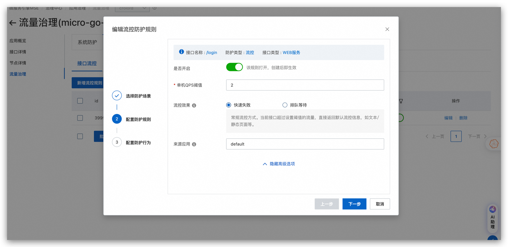
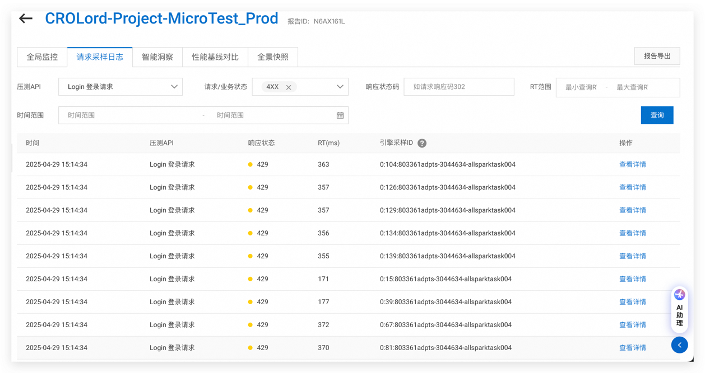
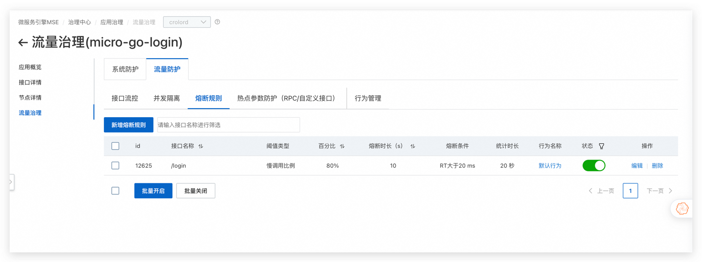

## 目录
- [1. 基本概念](#1-基本概念)
- [2. 设计理念和功能简介](#2-设计理念和功能简介)
- [3. 不确定的入口流量（服务端防护）](#3-不确定的入口流量服务端防护)
- [4. 不稳定的出口流量（客户端防护）](#4-不稳定的出口流量客户端防护)
- [5. 配置流量防护](#5-配置流量防护)
- [6. 熔断与限流配置](#6-熔断与限流配置)
- [7. 配置热点参数防护](#7-配置热点参数防护)
- [8. 常见问题](#8-常见问题)

## 1. 基本概念

### 资源
在 MSE 流量防护中，**资源**是限流生效的基本对象。资源可以是 Java 应用程序中的任何服务，MSE 会为常见框架自动定义资源，用户也可以通过编写代码的方式自定义资源。后续mse 下线了go和python能力，请参考服务网格 istio 实现。

### 规则
**规则**是针对资源设定的实时控制策略，包括接口流控、并发隔离、熔断规则、热点参数防护以及系统防护。所有规则都可以动态调整。

## 2. 设计理念和功能简介

现代系统架构往往复杂，流量的不可预测性增加了系统的不稳定性风险。MSE 流量防护旨在应对流量突增和不稳定的流量，通过多种限流和降级策略来保证系统的稳定性和高可用性。

### 入口流量与出口流量

1. **入口流量**：指其他应用或用户发起的请求。大规模流量的突发可能超出应用承载能力，影响整体可用性。

2. **出口流量**：指本应用调用其他服务或第三方服务的请求。由于服务的不稳定，可能出现慢请求或异常，影响本应用的稳定性。

MSE 流量防护通过对这两种流量的治理，提供了多层次的防护措施。

## 3. 不确定的入口流量（服务端防护）

不确定的入口流量可能导致系统承载能力超负荷，触发系统崩溃。MSE 提供了以下防护功能：

### 3.1 配置系统防护

系统防护通过限制请求的数量来确保系统能够在负载过高时保持稳定，避免过载。

1. **自适应过载保护**：根据CPU的使用率自适应调整流量限流比例，适用于 CPU 相关的高负载场景。

2. **总 QPS 限流**：控制每秒的总请求数，防止超过系统承载能力。

3. **总并发限流**：控制同时处理的请求数，防止线程池、内存等资源耗尽。

#### 配置示例：

在 MSE 中，接口流量配置阈值可以根据业务场景进行灵活配置，以适应不同的场景。例如这里配置单机的 QPS 阈值为 2，并发数为 2，那么在实际的场景下，当 QPS 超过 2 时，系统会自动进行限流。

### 3.2 流量防护策略

- **接口流控**：根据接口的 QPS 阈值进行限流。
- **并发隔离**：限制接口并发数，确保系统资源不会被过度占用。

## 4. 不稳定的出口流量（客户端防护）

出口流量不稳定主要源于对第三方服务的调用，可能导致慢请求或异常。MSE 通过以下策略保护应用：

### 4.1 熔断规则

当依赖的服务出现问题时，通过熔断器及时切断对外的请求，避免系统被拖垮。

1. **慢调用熔断**：当慢调用比例超过一定阈值时，启动熔断。
2. **异常调用熔断**：当异常调用比例超过阈值时，启动熔断。

#### 配置示例：

## 5. 配置流量防护

MSE 支持为每个接口单独配置流量防护，确保在面对高并发和突发流量时能正确响应。

### 5.1 配置接口流控与并发隔离

为接口配置具体的限流规则和并发隔离，确保系统在高负载下能够稳定运行。

## 6. 熔断与限流配置

### 6.1 熔断配置

熔断配置用于在外部服务出现问题时切断请求，防止影响主业务流程。MSE 支持两种熔断类型：

1. **慢调用熔断**：如果外部服务的调用响应时间过长，将自动触发熔断。
2. **异常调用熔断**：如果外部服务发生异常，立即触发熔断。

### 6.2 限流与排队

MSE 支持两种流量控制策略：

1. **快速失败**：请求超出阈值时立即拒绝。
2. **排队等待**：请求超出阈值时排队等待，直到有空闲的资源。

## 7. 配置热点参数防护

### 7.1 热点参数防护（HTTP）

通过指定请求的特定参数（如 `X-Forwarded-For`、`Host` 等），MSE 可以基于热点参数进行限流。这样可以在特定参数的流量过高时进行精细化的流量控制。

## 8. 常见问题

### 8.1 没有到阈值就发生限流

这可能是因为 **流量不均**，MSE 的限流是基于节点的，如果某个节点流量超出阈值，可能会触发限流。建议在配置时确保流量均衡，并根据流量模型进行合理配置。

### 8.2 流量不均导致的限流

MSE 会使用 **滑动窗口算法** 来避免某个时刻突发的流量导致系统崩溃，虽然通过的 QPS 在统计时看不到限流，但实际上这是为保障系统稳定性采取的策略。

## 总结

MSE 的流量防护通过丰富的限流、熔断、并发隔离和热点参数防护功能，确保在高并发和突发流量的情况下，系统依然能够稳定运行。通过合理的配置流量防护规则，可以帮助您的应用有效抵御不稳定流量的冲击，保证业务的可用性。

