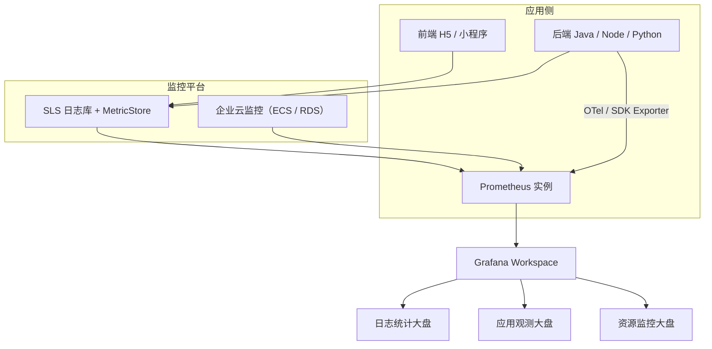

# ☁️ 基于阿里云 Prometheus、SLS 与云监控构建多数据源 Grafana 监控大盘（应用+云监控+日志）

## 📑 目录
1. 项目背景与目标
2. 整体架构设计（Mermaid 图）
3. 前置准备（账号 / 权限 / 网络 / 环境）
4. 数据接入详解  
   4.1 应用数据接入（Otel SDK）  
   4.2 云监控数据接入（ECS / RDS / SLB 等）  
   4.3 SLS 日志数据转指标接入
5. Grafana 可视化配置  
   5.1 内置大盘效果  
   5.2 自定义仪表盘设计（PromQL 示例）
6. 验证步骤与截图示例
7. 效果展示示例
8. 参考链接与资料

---

## 1️⃣ 项目背景与目标

统一基于阿里云云上产品（应用 → Prometheus → Grafana）实现：
- 多数据源观测（应用、云服务、日志）
- 异常统一告警，快速可视化定位
- 降低 O&M 成本，提升稳定性与可观测性能力

---

## 2️⃣ 整体架构设计（Mermaid）



---

## 3️⃣ 前置准备（账号 / 权限 / 网络 / 环境）

| 项目            | 要求                                  |
| ------------- | ----------------------------------- |
| 账号权限          | RAM 子账号，ARMS / 云监控 / SLS 权限开通       |
| Prometheus 实例 | 已开通阿里云可观测监控 Prometheus 版            |
| 企业云监控 / SLS   | 均已开通，日志库具备 MetricStore 能力           |
| 网络安全组         | 放通 9100 / 9256 端口供 node-exporter 使用 |
| Grafana       | 默认共享版，无需单独部署，已开通 Workspace          |
| 监控场景明确        | 应用 → 指标 / 日志 / 云产品状态全链路             |

---

## 4️⃣ 数据接入详解

### 4.1 应用数据接入（OTel SDK 示例：Java）

**引入 SDK**

```xml
<dependency>
  <groupId>io.opentelemetry</groupId>
  <artifactId>opentelemetry-exporter-prometheus</artifactId>
</dependency>
```

**埋点示例**

```java
PrometheusCollector.builder()
  .setPort(9464)
  .setEndpoint("/metrics")
  .buildAndStart();
```

**验证**

```bash
curl http://localhost:9464/metrics
```

---

### 4.2 云监控数据接入（ECS / RDS）

* ARMS 控制台 → 接入中心 → 选择对应云产品（ECS、RDS…）
* 自动化接入企业云监控 → 创建 Prometheus 实例
* 核心指标：

    * `AliyunEcs_cpu_total`
    * `AliyunRds_MemoryUsage`
    * `AliyunSlb_connections`

---

### 4.3 SLS 日志数据转指标（如访问量 / 错误率）

**操作流程**

1. SLS Logstore → MetricStore 启用
2. 编写转指标规则（正则匹配、聚合字段 Tag 化）
3. 指标样例：

```json
{
  "metricName": "nginx_5xx_count",
  "tags": {"app": "gateway"},
  "value": 3
}
```

4. Prometheus 数据源自动接入（prom-${InstanceID}）

---

## 5️⃣ Grafana 可视化配置

### 5.1 内置官方大盘效果

| 场景   | 默认大盘名称                    |
| ---- | ------------------------- |
| ECS  | ECS Overview / ECS Detail |
| GPU  | GPU Overview / GPU Detail |
| Node | Node Process              |

---

### 5.2 自定义仪表盘设计（PromQL 示例）

**ECS 主机总览（CPU / Memory / Connection）**

```sql
avg(AliyunEcs_cpu_total{}) by (regionId,instanceId,instanceName)
avg(AliyunEcs_memory_usedutilization{}) by (regionId,instanceId,instanceName)
avg(AliyunEcs_net_tcpconnection{state="ESTABLISHED"}) by (regionId,instanceId,instanceName)
```

**RDS 数据库健康**

```sql
avg(AliyunRds_CpuUsage{engine="MySQL"}) by (regionId,instanceId)
avg(AliyunRds_MemoryUsage{engine="MySQL"}) by (regionId,instanceId)
avg(AliyunRds_DiskUsage{engine="MySQL"}) by (regionId,instanceId)
```

**前端访问日志（5xx 错误统计）**

```sql
sum_over_time(nginx_5xx_count[5m])
```

**仪表盘样例效果：**

```md


```

---

## 6️⃣ 验证步骤与截图占位

| 验证目标    | 操作方式           | 预期效果            |
| ------- | -------------- | --------------- |
| 应用指标    | curl /metrics  | Prometheus 成功采集 |
| 云监控数据   | 控制台接入检查        | Prometheus 成功采集 |
| SLS 指标  | MetricStore 确认 | Prometheus 成功采集 |
| Grafana | 可视化检查          | 多数据源大盘可见        |

```md


```

---

## 7️⃣ 效果展示示例

* 统一入口 Grafana
* 按业务线 / 服务视角拆分
* 应用 / 主机 / 数据库 / 日志 各有专属 Panel
* 报表导出、告警联动飞书 / 钉钉

**整体效果预期图示**（请根据实际效果补充截图）：

```md

```

---

## 8️⃣ 参考链接与资料

| 名称            | 地址                                                                                                          |
| ------------- | ----------------------------------------------------------------------------------------------------------- |
| 阿里云 ARMS 官方文档 | [https://help.aliyun.com/document_detail/275849.html](https://help.aliyun.com/document_detail/275849.html) |
| OpenTelemetry | [https://opentelemetry.io/](https://opentelemetry.io/)                                                      |
| Grafana 官方文档  | [https://grafana.com/docs/grafana/latest/](https://grafana.com/docs/grafana/latest/)                        |
| SLS 官方文档      | [https://help.aliyun.com/document_detail/29060.html](https://help.aliyun.com/document_detail/29060.html)   |

---
