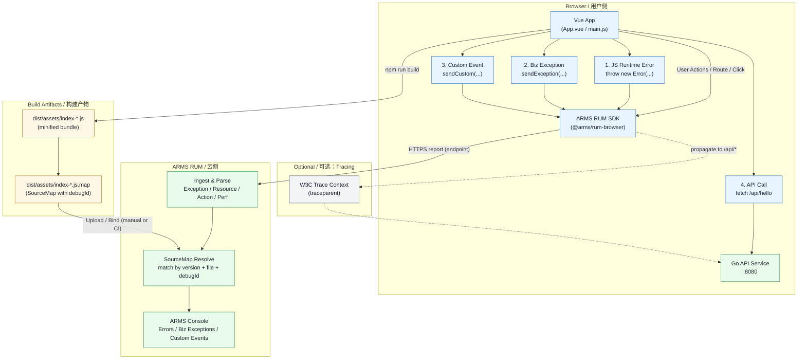
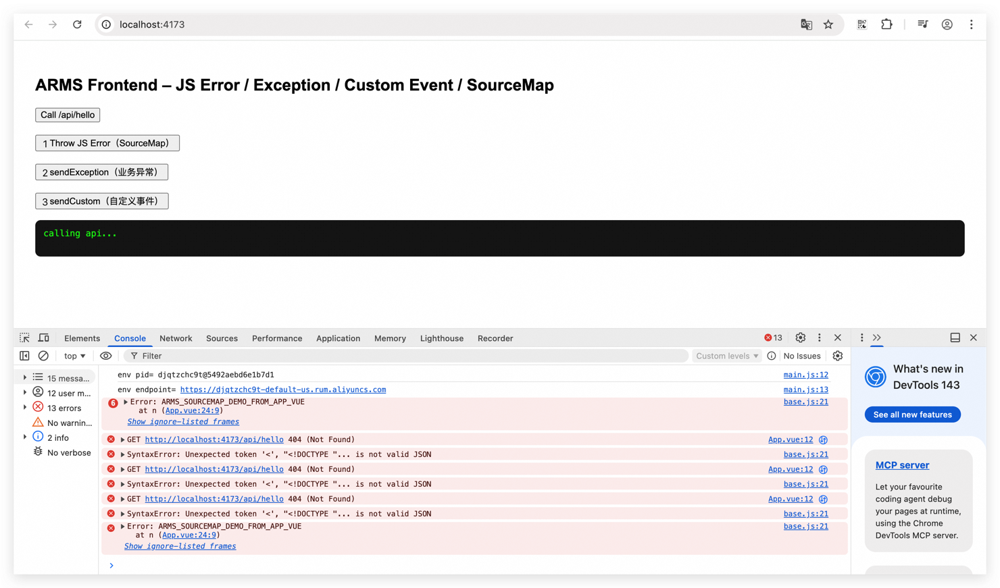
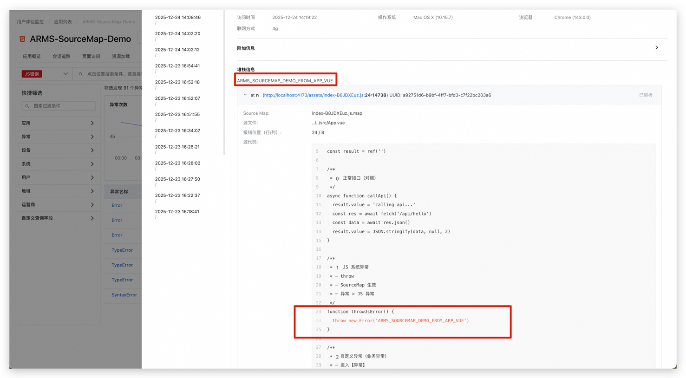
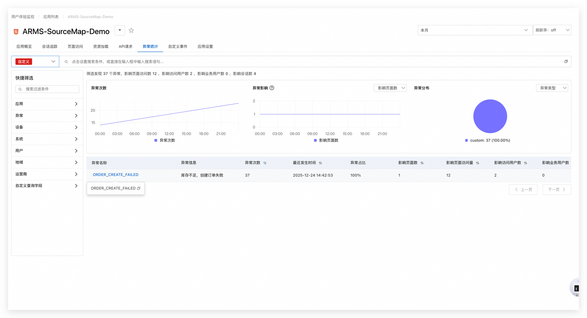
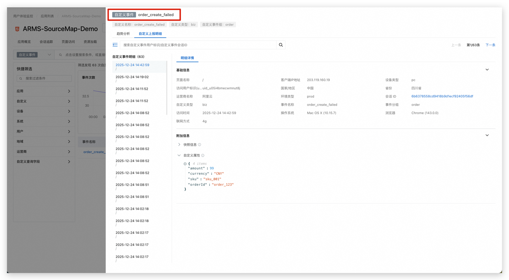

## ARMS Frontend – JS Error / Exception / Custom Event / SourceMap 实战示例

## 目录

* [背景与目标](#背景与目标)
* [整体架构说明](#整体架构说明)
* [前端实现（Vue + ARMS RUM）](#前端实现vue--arms)

  * [1. ARMS SDK 初始化](#1-arms-sdk-初始化)
  * [2. 三类监控示例说明](#2-三类监控示例说明)
  * [3. 前端完整代码](#3-前端完整代码)
* [SourceMap 构建与关联](#sourcemap-构建与关联)

  * [1. Vite 构建配置](#1-vite-构建配置)
  * [2. SourceMap 关键参数说明](#2-sourcemap-关键参数说明)
* [后端实现（Go API 示例）](#后端实现go-api-示例)
* [运行与验证流程](#运行与验证流程)

  * [1. 本地运行](#1-本地运行)
  * [2. ARMS 控制台验证结果](#2-arms-控制台验证结果)
* [为什么 SourceMap 需要上传到 ARMS](#为什么-sourcemap-需要上传到-arms)
* [常见问题说明](#常见问题说明)
* [参考链接](#参考链接)

## 背景与目标

本示例用于演示：

* 如何在 **Vue 前端应用**中接入 **阿里云 ARMS 用户体验监控（RUM）**
* 如何区分并上报：

  * JS 系统异常
  * 自定义业务异常
  * 自定义业务事件
* SourceMap 在 **生产环境错误还原** 中的作用和意义
* 如何与一个简单的 **Go 后端 API** 进行联调

---

## 整体架构说明



* 前端：Vue 3 + Vite
* 监控：ARMS 用户体验监控（Web & H5）
* 后端：Go（net/http）
* SourceMap：Vite 构建生成 + ARMS 解析

---

## 前端实现（Vue + ARMS RUM）

### 1. ARMS SDK 初始化

在 `src/main.js` 中初始化 ARMS SDK：

```js
globalThis.global ||= globalThis
import { createApp } from 'vue'
import App from './App.vue'
import armsRum from '@arms/rum-browser'

const pid = import.meta.env.VITE_ARMS_RUM_PID
const endpoint = import.meta.env.VITE_ARMS_RUM_ENDPOINT

console.log('env pid=', pid)
console.log('env endpoint=', endpoint)

armsRum.init({
  pid,
  endpoint,

  env: 'prod',
  spaMode: 'history',
  appVersion: import.meta.env.VITE_APP_VERSION || 'dev',

  collectors: {
    perf: true,
    webVitals: true,
    api: true,
    staticResource: true,
    jsError: true,
    consoleError: true,
    action: true,
  },

  tracing: {
    enable: true,
    sample: 100,
    allowedUrls: [
      { match: '/api/', propagatorTypes: ['tracecontext'] },
    ],
  },
})

createApp(App).mount('#app')
```

#### 关键参数说明


| 参数               | 说明                             |
| ------------------ | -------------------------------- |
| pid                | ARMS 应用 ID                     |
| endpoint           | ARMS 上报地址                    |
| env                | 应用环境（prod / gray / pre 等） |
| collectors.jsError | 是否采集 JS 异常                 |
| collectors.action  | 是否采集用户行为                 |

---

### 2. 三类监控示例说明


| 类型           | API                 | ARMS 控制台位置    |
| -------------- | ------------------- | ------------------ |
| JS 系统异常    | `throw new Error()` | 异常 → JS 异常    |
| 自定义业务异常 | `sendException()`   | 异常 → 自定义异常 |
| 自定义业务事件 | `sendCustom()`      | 自定义事件         |

---

### 3. 前端完整代码

`src/App.vue`：

```vue
<script setup>
import { ref } from 'vue'
import ArmsRum from '@arms/rum-browser'

const result = ref('')

/**
 * 0️正常接口（对照）
 */
async function callApi() {
  result.value = 'calling api...'
  const res = await fetch('/api/hello')
  const data = await res.json()
  result.value = JSON.stringify(data, null, 2)
}

/**
 * 1️JS 系统异常
 */
function throwJsError() {
  throw new Error('ARMS_SOURCEMAP_DEMO_FROM_APP_VUE')
}

/**
 * 2️自定义业务异常
 */
function sendBizException() {
  ArmsRum.sendException({
    name: 'ORDER_CREATE_FAILED',
    message: '库存不足，创建订单失败',
    properties: {
      orderId: 'order_123',
      sku: 'sku_001',
      reason: 'out_of_stock',
    },
  })
  result.value = 'sendException called'
}

/**
 * 3️ 自定义业务事件
 */
function sendBizCustomEvent() {
  ArmsRum.sendCustom({
    type: 'biz',
    name: 'order_create_failed',
    group: 'order',
    value: 1,
    properties: {
      orderId: 'order_123',
      sku: 'sku_001',
      amount: 99,
      currency: 'CNY',
    },
  })
  result.value = 'sendCustom called'
}
</script>

<template>
  <div style="padding:24px;font-family:Arial;">
    <h2>ARMS Frontend – JS Error / Exception / Custom Event / SourceMap</h2>

    <button @click="callApi">Call /api/hello</button><br /><br />
    <button @click="throwJsError">1️⃣ Throw JS Error</button><br /><br />
    <button @click="sendBizException">2️⃣ sendException</button><br /><br />
    <button @click="sendBizCustomEvent">3️⃣ sendCustom</button>

    <pre style="margin-top:16px;background:#111;color:#0f0;padding:12px;">
{{ result }}
    </pre>
  </div>
</template>
```

---

## SourceMap 构建与关联

### 1. Vite 构建配置

`vite.config.js`：

```js
import { defineConfig } from 'vite'
import vue from '@vitejs/plugin-vue'
import { rumVitePlugin } from '@arms/rum-vite-plugin'

export default defineConfig({
  plugins: [
    vue(),
    rumVitePlugin({
      pid: process.env.ARMS_RUM_PID || '',
      region: process.env.ARMS_RUM_REGION || 'us',
      version: process.env.APP_VERSION || '1.0.0',
    }),
  ],
  build: {
    sourcemap: true,
  },
  server: {
    proxy: {
      '/api': {
        target: 'http://localhost:8080',
        changeOrigin: true,
      },
    },
  },
})
```

### 2. SourceMap 关键参数说明


| 参数            | 作用                          |
| --------------- | ----------------------------- |
| build.sourcemap | 生成`.map` 文件               |
| rumVitePlugin   | 注入`debugId`，用于 ARMS 关联 |
| version         | SourceMap 的版本标识          |

---

## 后端实现（Go API 示例）

```go
package main

import (
	"encoding/json"
	"log"
	"net/http"
	"time"
)

func main() {
	mux := http.NewServeMux()

	mux.HandleFunc("/api/hello", func(w http.ResponseWriter, r *http.Request) {
		log.Printf("hello called, ua=%s", r.UserAgent())
		w.Header().Set("Content-Type", "application/json")
		_ = json.NewEncoder(w).Encode(map[string]any{
			"message": "hello from go",
			"time":    time.Now().Format(time.RFC3339),
		})
	})

	mux.HandleFunc("/healthz", func(w http.ResponseWriter, r *http.Request) {
		w.WriteHeader(200)
		w.Write([]byte("ok"))
	})

	log.Println("listening on :8080")
	log.Fatal(http.ListenAndServe(":8080", mux))
}
```

---

## 运行与验证流程

### 1. 本地运行

```bash
# 后端
go run main.go

# 前端
npm run build
npx serve dist -l 4173
```

访问：
`http://localhost:4173`

---

### 2. ARMS 控制台验证结果


| 操作           | 控制台位置         |
| -------------- | ------------------ |
| Throw JS Error | 异常 → JS 异常    |
| sendException  | 异常 → 自定义异常 |
| sendCustom     | 自定义事件         |

SourceMap 生效后，异常堆栈会从：

```
assets/index-xxx.js:1:xxxxx
```

还原为：

```
src/App.vue:24:9
```

示例图



---------------------------------------------

## 为什么 SourceMap 需要上传到 ARMS

* 浏览器控制台：**只对当前用户、当前会话有效**
* ARMS + SourceMap：

  * 聚合所有用户错误
  * 历史可追溯
  * 支持搜索、告警、统计
  * 生产环境仍能还原源码

**SourceMap 本质是：**

> 给 ARMS 用的“压缩代码 → 源码字典”

---

## 常见问题说明

* **本地 dev 模式不需要 SourceMap**
* **只有生产构建（dist/assets）才验证 SourceMap**
* **`sendCustom` 不会进入异常，这是设计行为**

---

## 参考链接

* CROLord 代码示例
  [https://github.com/Roliyal/CROlordCodelibrary/](https://github.com/Roliyal/CROlordCodelibrary/tree/main/Chapter6Custom/ARMS-SourceMap-Demo)
* ARMS 用户体验监控 Web SDK 文档
  [https://help.aliyun.com/zh/arms/user-experience-monitoring/web-h5-sdk-configuration-reference](https://help.aliyun.com/zh/arms/user-experience-monitoring/web-h5-sdk-configuration-reference)
* ARMS SourceMap 说明
  [https://help.aliyun.com/zh/arms/user-experience-monitoring/sourcemap](https://help.aliyun.com/zh/arms/user-experience-monitoring/use-cases/automatic-parsing-of-web-h5-sourcemap)
* Vite SourceMap
  [https://vitejs.dev/config/build-options.html#build-sourcemap](https://vitejs.dev/config/build-options.html#build-sourcemap)

---
