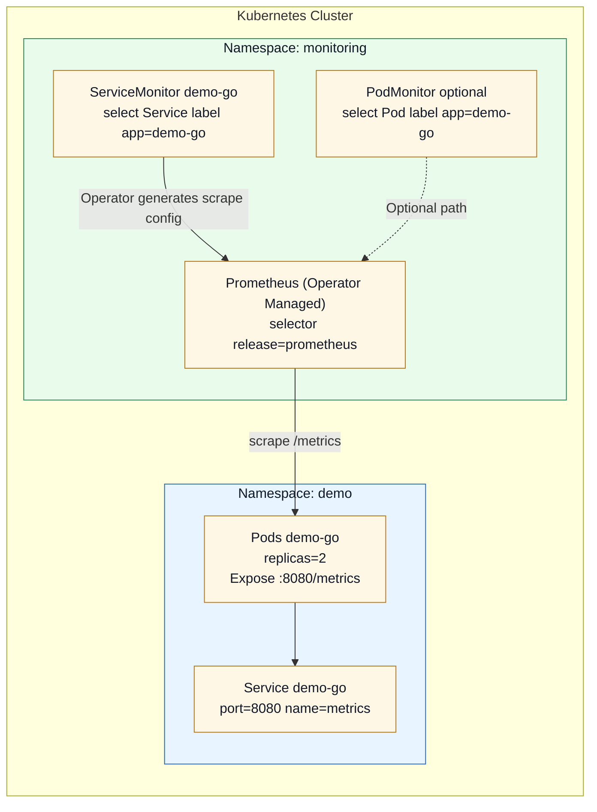
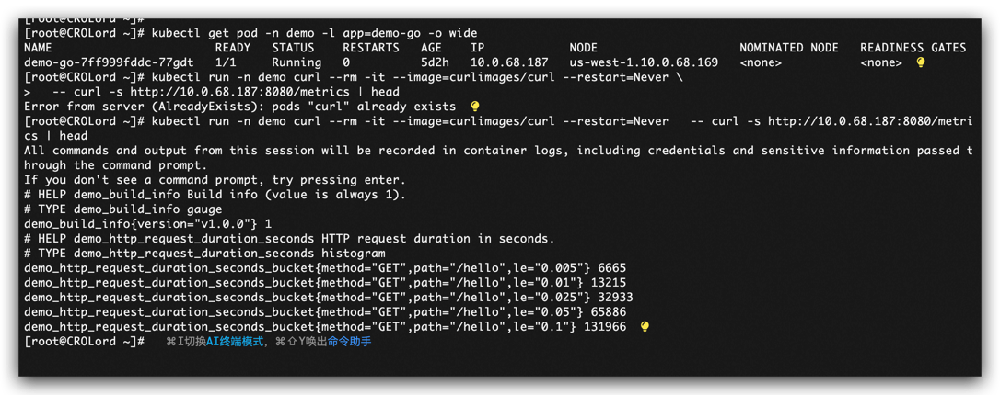
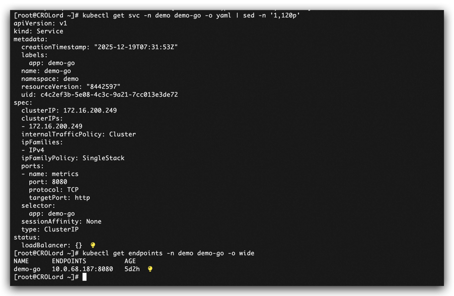
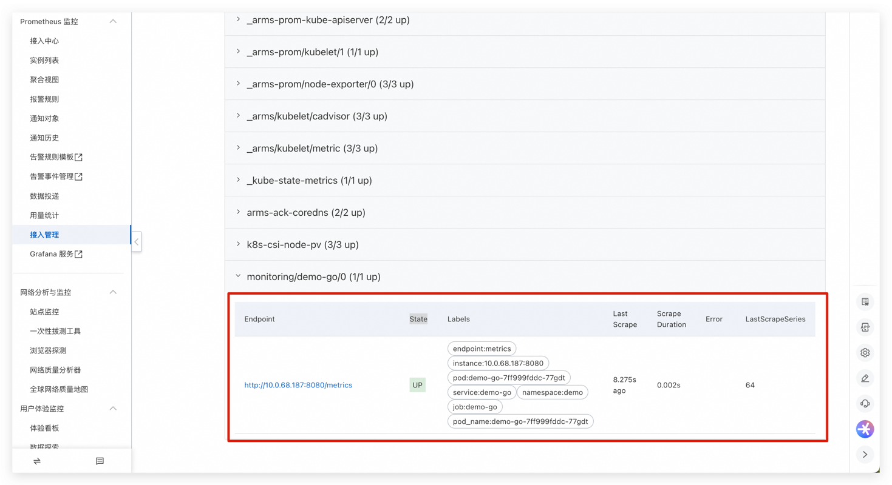
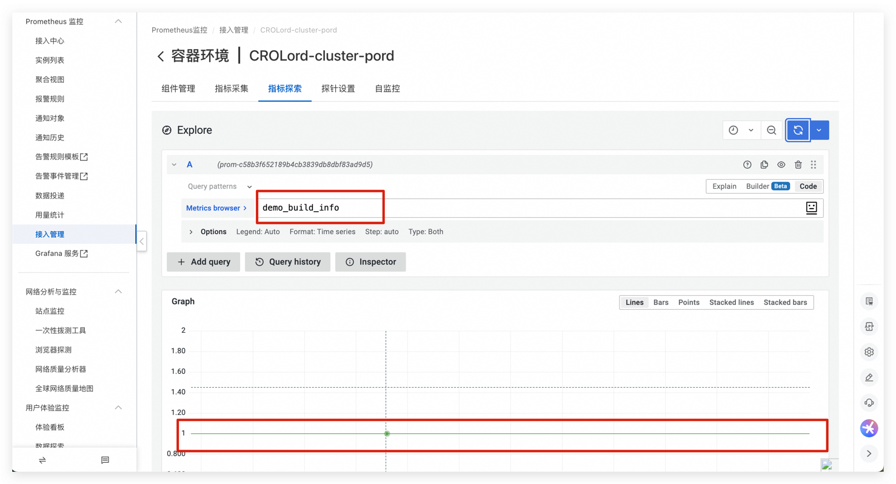
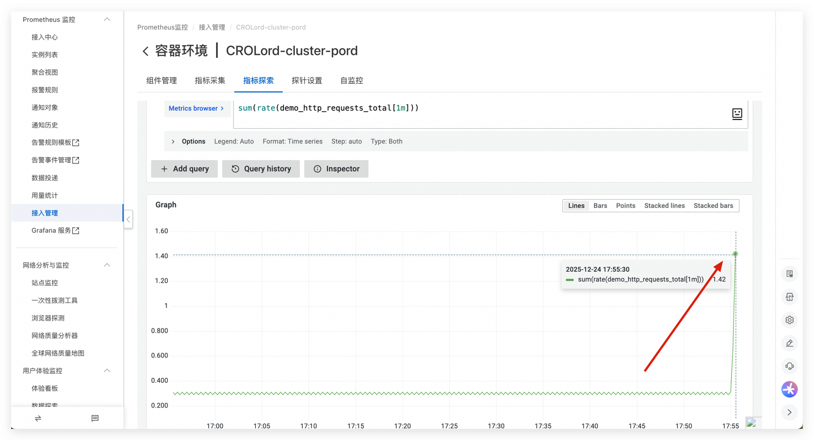
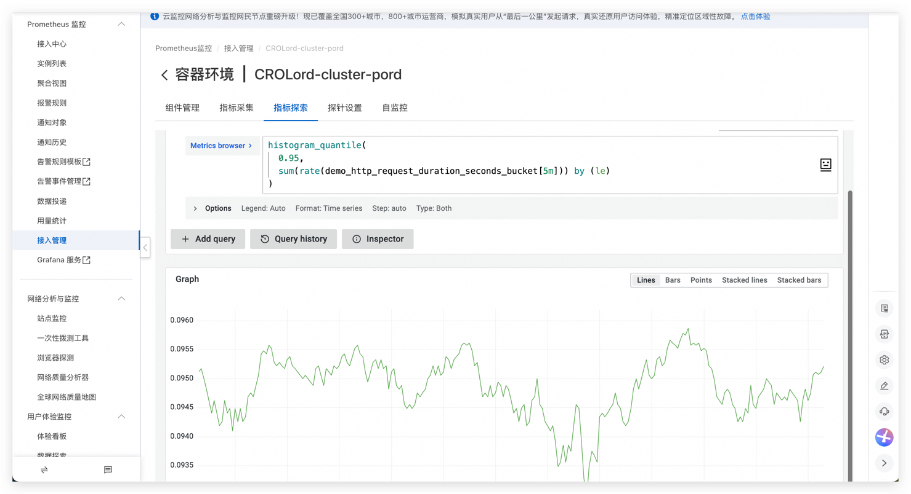

## 目录

1. 背景与目标
2. 组件与概念速览
3. 架构与整体流程（架构图）
4. PodMonitor vs ServiceMonitor：什么时候用谁
5. Demo：Go 暴露 /metrics（代码 + Dockerfile）
6. Demo：K8s 部署清单（Namespace/Deployment/Service/ServiceMonitor）
7. （可选）改为 PodMonitor 的写法
8. Prometheus 选择规则（Selector）与环境的关键点
9. 验证与排查（从 Pod → Target → PromQL）
10. 常见错误与排障手册
11. 参考链接

## 1. 背景与目标

在 Prometheus Operator 体系下，**Prometheus 不再靠手写 `scrape_configs`**，而是通过 CRD 资源（`ServiceMonitor` / `PodMonitor` / `Probe`）来声明“要抓谁、怎么抓”。

本文目标：

* 用一个 **Go 应用**暴露 Prometheus 指标（`/metrics`）
* 在 K8s 中通过 **ServiceMonitor 或 PodMonitor**让 Prometheus 自动发现并采集
* 完整示例 **部署 YAML**、**参数解释**、**验证步骤**与 **PromQL 示例**
* 取舍：**PodMonitor vs ServiceMonitor** 的使用场景

---

## 2. 组件与概念速览

* **Prometheus Operator**：控制器，负责把 `ServiceMonitor/PodMonitor` 这些 CRD 翻译成 Prometheus 的抓取配置
* **Prometheus CR（monitoring.coreos.com/v1）**：声明一个 Prometheus 实例及其选择器（Selector）
* **ServiceMonitor**：面向 **Service** 的采集声明（更稳定、推荐）
* **PodMonitor**：面向 **Pod** 的采集声明（更灵活、适合无 Service 或采集 sidecar）
* **Targets**：Prometheus 实际抓取目标列表（UI 里可看到 up/down）
* **Scrape Interval**：抓取间隔（决定采样粒度上限）

---

## 3. 架构与整体流程（架构图）

### 3.1 Mermaid 架构图



### 3.2 文字版流程（便于记忆）

1. Go 应用在 Pod 内暴露 `http://<podIP>:8080/metrics`
2. Service 把 Pod 选择起来，并给端口命名 `metrics`
3. ServiceMonitor 选择 Service，并声明 endpoint：`port: metrics + path: /metrics`
4. Operator 观察到 ServiceMonitor，生成 Prometheus 抓取配置
5. Prometheus Targets 出现并开始抓取，`up==1` 表示成功

---

## 4. PodMonitor vs ServiceMonitor：什么时候用谁

### 4.1 推荐结论（生产经验）

* **默认优先用 ServiceMonitor** 

  * Service 提供稳定的发现入口
  * 与服务治理/负载均衡/端口治理更一致
  * 适合大多数业务服务
* **PodMonitor 在这些场景更合适** 

  * 没有 Service（短任务、临时 Pod、或不希望暴露 Service）
  * 需要抓 **Pod 的特定端口/sidecar**（比如一个 Pod 内多个容器、多个 metrics 端口）
  * 需要更细粒度按 Pod 维度抓取（不经 Service）

### 4.2 二者差异对比表


| 维度       | ServiceMonitor                                                       | PodMonitor                                                                     |
| ---------- | -------------------------------------------------------------------- | ------------------------------------------------------------------------------ |
| 发现对象   | Service（再映射到 Endpoint/Pod）                                     | Pod                                                                            |
| 适用范围   | 绝大多数业务服务（推荐）                                             | 无 Service / sidecar / 多端口特殊情况                                          |
| 变更稳定性 | 稳（Service 抽象稳定）                                               | 更灵活但更“直接”                                                             |
| 配置关键点 | `spec.selector` 选 Service 标签 + `endpoints.port` 选 Service 端口名 | `spec.selector` 选 Pod 标签 + `podMetricsEndpoints.targetPort` 选容器端口名/号 |

---

## 5. Demo：Go 暴露 /metrics（代码 + Dockerfile）

### 5.1 Go 代码（main.go）

> 抓取后能用 PromQL 立刻验证是否进来了。

```go
package main

import (
	"log"
	"math/rand"
	"net/http"
	"time"

	"github.com/prometheus/client_golang/prometheus"
	"github.com/prometheus/client_golang/prometheus/promhttp"
)

var (
	httpRequests = prometheus.NewCounterVec(
		prometheus.CounterOpts{
			Name: "demo_http_requests_total",
			Help: "Total HTTP requests.",
		},
		[]string{"path", "method", "code"},
	)

	httpLatency = prometheus.NewHistogramVec(
		prometheus.HistogramOpts{
			Name:    "demo_http_request_duration_seconds",
			Help:    "HTTP request duration in seconds.",
			Buckets: prometheus.DefBuckets,
		},
		[]string{"path", "method"},
	)

	buildInfo = prometheus.NewGaugeVec(
		prometheus.GaugeOpts{
			Name: "demo_build_info",
			Help: "Build info (value is always 1).",
		},
		[]string{"version"},
	)
)

func main() {
	rand.Seed(time.Now().UnixNano())

	prometheus.MustRegister(httpRequests, httpLatency, buildInfo)
	buildInfo.WithLabelValues("v1.0.0").Set(1)

	mux := http.NewServeMux()

	mux.HandleFunc("/hello", func(w http.ResponseWriter, r *http.Request) {
		start := time.Now()
		time.Sleep(time.Duration(rand.Intn(100)) * time.Millisecond)

		httpRequests.WithLabelValues("/hello", r.Method, "200").Inc()
		httpLatency.WithLabelValues("/hello", r.Method).Observe(time.Since(start).Seconds())

		w.WriteHeader(http.StatusOK)
		_, _ = w.Write([]byte("hello\n"))
	})

	mux.Handle("/metrics", promhttp.Handler())

	addr := ":8080"
	log.Printf("listening on %s", addr)
	log.Fatal(http.ListenAndServe(addr, mux))
}
```

### 5.2 Dockerfile（你提供的版本）

```dockerfile
FROM golang:1.24 AS build
WORKDIR /src

COPY go.mod ./
COPY go.sum ./
RUN go mod download
COPY . .
RUN CGO_ENABLED=0 go build -o /out/app ./main.go

FROM gcr.io/distroless/static-debian12:nonroot
WORKDIR /
COPY --from=build /out/app /app
EXPOSE 8080
USER nonroot:nonroot
ENTRYPOINT ["/app"]
```

---

## 6. Demo：K8s 部署清单（ServiceMonitor 版本，推荐）

> 基础环境**生产方向的基础模板**（含探针/资源/端口命名）。

```yaml
apiVersion: v1
kind: Namespace
metadata:
  name: demo
---
apiVersion: apps/v1
kind: Deployment
metadata:
  name: demo-go
  namespace: demo
  labels:
    app: demo-go
spec:
  replicas: 2
  selector:
    matchLabels:
      app: demo-go
  template:
    metadata:
      labels:
        app: demo-go
    spec:
      containers:
        - name: demo-go
          image: <your-registry>/demo-go-metrics:1.0.0
          imagePullPolicy: IfNotPresent
          ports:
            - name: http
              containerPort: 8080
          resources:
            requests:
              cpu: 50m
              memory: 64Mi
            limits:
              cpu: 500m
              memory: 256Mi
          readinessProbe:
            httpGet:
              path: /hello
              port: http
            initialDelaySeconds: 2
            periodSeconds: 5
          livenessProbe:
            httpGet:
              path: /hello
              port: http
            initialDelaySeconds: 5
            periodSeconds: 10
---
apiVersion: v1
kind: Service
metadata:
  name: demo-go
  namespace: demo
  labels:
    app: demo-go
spec:
  selector:
    app: demo-go
  ports:
    - name: metrics        # 关键：给 Service 端口命名
      port: 8080
      targetPort: http     # 指向容器端口名 http（也可写 8080）
---
apiVersion: monitoring.coreos.com/v1
kind: ServiceMonitor
metadata:
  name: demo-go
  namespace: monitoring
  labels:
    release: prometheus    # 关键：必须匹配 Prometheus 的 serviceMonitorSelector
spec:
  namespaceSelector:
    matchNames:
      - demo
  selector:
    matchLabels:
      app: demo-go
  endpoints:
    - port: metrics
      path: /metrics
      interval: 15s
```

---

## 7. （可选）改为 PodMonitor 的写法

当你不想创建 Service（或要抓 Pod 内不同端口）时，用 PodMonitor。

> 注意：PodMonitor 选择的是 **Pod labels**，并且 endpoint 用 `targetPort`（容器端口名或数字）

```yaml
apiVersion: monitoring.coreos.com/v1
kind: PodMonitor
metadata:
  name: demo-go
  namespace: monitoring
  labels:
    release: prometheus
spec:
  namespaceSelector:
    matchNames:
      - demo
  selector:
    matchLabels:
      app: demo-go
  podMetricsEndpoints:
    - path: /metrics
      interval: 15s
      targetPort: http     # 这里写容器端口名（Deployment 里 ports.name=http），实际上在 promethues 官网CRD中 废弃了targetPort写法，这里只需要apply crd资源即可。
      # 也可以写 targetPort: 8080
```

---

## 8. Prometheus 选择规则（Selector）与你环境的关键点

输出过 Prometheus CR（节选）：

* `podMonitorSelector.matchLabels.release=prometheus`
  -（通常也会有）`serviceMonitorSelector.matchLabels.release=prometheus`

这意味着：

创建的 PodMonitor / ServiceMonitor **必须带标签**：

```yaml
metadata:
  labels:
    release: prometheus
```

否则 Prometheus **不会选中它**，Targets 不会出现。

---

## 9. 验证与排查（从 Pod → Target → PromQL）

“闭环验证流程”：**先确认应用暴露 → 再确认对象被选中 → 再确认 Prometheus 抓到 → 最后 PromQL 验证数据**

### 9.1 验证 1：Pod 内 metrics 是否可访问

```bash
kubectl get pod -n demo -l app=demo-go -o wide
```

任选一个 PodIP，跑个临时 curl：

```bash
kubectl run -n demo curl --rm -it --image=curlimages/curl --restart=Never \
  -- curl -s http://<POD_IP>:8080/metrics | head
```

看到 `# HELP` / `# TYPE` 以及 `demo_build_info` 等，就说明应用 OK。

---



### 9.2 验证 2：Service 是否正确指向 Pod（ServiceMonitor 路线）

```bash
kubectl get svc -n demo demo-go -o yaml | sed -n '1,120p'
kubectl get endpoints -n demo demo-go -o wide
```

* endpoints 里能看到 Pod IP:8080 说明 Service 选中了 Pod
  

---

### 9.3 验证 3：确认 ServiceMonitor / PodMonitor 被 Prometheus 选中

```bash
kubectl get servicemonitor -n monitoring --show-labels
kubectl get podmonitor -n monitoring --show-labels
kubectl get prometheus -n monitoring -o yaml | grep -nE "serviceMonitorSelector|podMonitorSelector|NamespaceSelector" -A6
```

要点：

* monitor 资源必须有 `release=prometheus`
* Prometheus CR 的 selector 要能匹配上

---

### 9.4 验证 4：Prometheus Targets 页面看抓取状态

进入 Prometheus UI：

* **Status → Targets**
* 找到 job 对应条目：

  * Prometheus监控/接入管理/「选择目标集群」`/自监控..
  * ServiceMonitor 一般 job 类似：`serviceMonitor/<ns>/<name>/...`
  * PodMonitor 一般 job 类似：`podMonitor/<ns>/<name>/...`

关键看：

* `State` 是否为 `up`
* Last Scrape 是否更新
* Scrape error 是否为空

---



### 9.5 验证 5：PromQL 验证指标是否进来

#### 1）最简单：看 up

> ServiceMonitor 常用筛法（按 namespace / service）：

```promql
up{namespace="demo"}
```

> 你也可以用 job 模糊匹配（适用于你知道 job 命名）：

```promql
up{job=~".*demo-go.*"}
```

#### 2）验证 build_info 是否出现

```promql
demo_build_info
```



#### 3）验证请求计数（先压测 /hello）

先在集群里跑一次请求：

```bash
kubectl run -n demo curl2 --rm -it --image=curlimages/curl --restart=Never \
  -- sh -c 'for i in $(seq 1 50); do curl -s http://demo-go.demo.svc:8080/hello >/dev/null; done'
```

然后 PromQL：

```promql
sum(rate(demo_http_requests_total[1m]))
```



#### 4）验证延迟直方图（P95 示例）

```promql
histogram_quantile(
  0.95,
  sum(rate(demo_http_request_duration_seconds_bucket[5m])) by (le)
)
```


----------------------------------------------------

## 10. 常见坑与排障手册

### 10.1 “Monitor 删了但 up 还能查到”为什么？

如遇到：PodMonitor 删除后，`up{job=~".*demo.*"}` 还查得到。

常见原因：

1. **Prometheus TSDB 有历史数据**

   * 删除采集配置后，历史时间序列不会立刻消失
   * 查询窗口包含过去时间，就能查到
2. PromQL 没限制时间范围

   * 在 Graph UI 里如果选了较长时间范围，会看到历史

排查建议：

* 将查询时间范围缩短到最近 5~10 分钟
* 或加上 `offset` 对比

---

### 10.2 `port: metrics` vs `targetPort: 9100` 到底是什么？

关于端口说明：

* **ServiceMonitor.endpoints.port**：指的是 **Service 的端口名**（例如 `ports[].name: metrics`）
* **PodMonitor.podMetricsEndpoints.targetPort**：指的是 **Pod 容器端口（name 或 number）**

在 Service YAML 里：

```yaml
ports:
  - name: metrics
    port: 8080         # Service 暴露的端口
    targetPort: http   # 转发到容器端口名 http（等价于 8080）
```

解释：

* `port`：Service 对外的端口（ClusterIP:port）
* `targetPort`：真正发到 Pod 容器的端口（容器的 port name/number）

所以：

* ServiceMonitor 用 `port: metrics`（找 Service 的端口名）
* PodMonitor 用 `targetPort: http` 或 `targetPort: 8080`（直连 Pod 容器）

---

### 10.3 “Targets 不出现 / up=0”快速定位顺序

1. Pod 内 `/metrics` 是否可访问（最关键）
2. label 选择器是否匹配（Deployment/Service/Monitor 三处都要对）
3. Prometheus CR selector 是否选中了 Monitor（例如 release=prometheus）
4. NetworkPolicy / RBAC / namespaceSelector 是否限制跨命名空间
5. path/port 是否写错（/metrics、端口名）

---

## 11. 参考链接

* CROLord 代码示例
  [https://github.com/Roliyal/CROlordCodelibrary/](https://github.com/Roliyal/CROlordCodelibrary/tree/main/Chapter5MicroserviceObservability/Unit5CodeLibrary/PromethuesMonitor)
* Prometheus Operator（kube-prometheus-stack）相关 CRD：ServiceMonitor / PodMonitor
  [https://github.com/prometheus-operator/prometheus-operator](https://github.com/prometheus-operator/prometheus-operator)
* Prometheus client_golang（Go 指标库）
  [https://github.com/prometheus/client_golang](https://github.com/prometheus/client_golang)
* Prometheus 查询语言 PromQL
  [https://prometheus.io/docs/prometheus/latest/querying/basics/](https://prometheus.io/docs/prometheus/latest/querying/basics/)
* Histogram & quantile 计算（histogram_quantile）
  [https://prometheus.io/docs/practices/histograms/](https://prometheus.io/docs/practices/histograms/)

---
