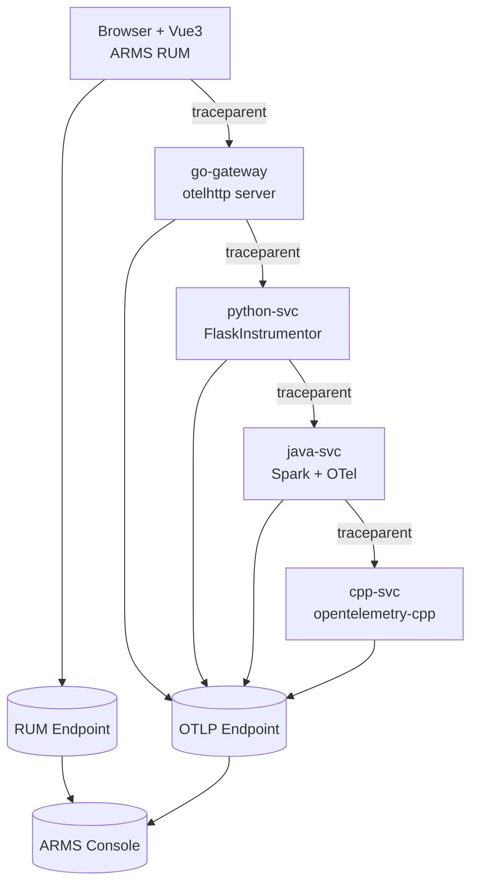

> 目标：完成 **前端 RUM** 与 **多语言后端 OTel Trace** 的上下文透传与统一检索；实现 **Metrics / Logs / Traces 三件套** 互相跳转定位；Trace 协议：默认采用 **W3C TraceContext（traceparent / tracestate）**。([OpenTelemetry 中文文档](https://opentelemetry.opendocs.io/docs/concepts/signals/traces/?utm_source=chatgpt.com))
>

---

## 目录
+ [1. 仓库结构与组件职责](#1-仓库结构与组件职责)
+ [2. 总体架构与调用链](#2-总体架构与调用链)
+ [3. 统一术语表（必读）](#3-统一术语表必读)
+ [4. 全局接入规范](#4-全局接入规范)
    - [4.1 统一 Header 与字段约定](#41-统一-header-与字段约定)
    - [4.2 OTLP 端点规范](#42-otlp-端点规范)
    - [4.3 CORS 注意事项（RUM 透传）](#43-cors-注意事项rum-透传)
+ [5. 前端（Vite + Vue3）RUM + TraceContext](#5-前端vite--vue3rum--tracecontext)
    - [5.1 RUM 初始化（src/main.js / src/rum.js）](#51-rum-初始化srcmainjs--srcrumjs)
    - [5.2 业务事件/异常与后端 Trace 绑定（src/api.js）](#52-业务事件异常与后端-trace-绑定srcapijs)
    - [5.3 页面示例（src/App.vue）](#53-页面示例srcappvue)
    - [5.4 Vite 代理与 Sourcemap](#54-vite-代理与-sourcemap)
    - [5.5 验证（Network / RUM / Trace 联动）](#55-验证network--rum--trace-联动)
+ [6. Go 网关（go-gateway）OTel + OTLP + 透传](#6-go-网关go-gatewayotel--otlp--透传)
    - [6.1 关键点（Server span / Client span / 显式注入）](#61-关键点server-span--client-span--显式注入)
    - [6.2 完整代码（go-gateway/main.go）](#62-完整代码go-gatewaymaingo)
    - [6.3 验证与日志观测](#63-验证与日志观测)
+ [7. Python 服务（python-svc）Flask + OTel + OTLP + 透传](#7-python-服务python-svcflask--otel--otlp--透传)
    - [7.1 完整代码（python-svc/app.py）](#71-完整代码python-svcapppy)
    - [7.2 依赖（python-svc/requirements.txt）](#72-依赖python-svcrequirementstxt)
    - [7.3 验证](#73-验证)
+ [8. Java 服务（java-svc）Spark + OTel Autoconfigure + 透传 + 日志 MDC](#8-java-服务java-svcspark--otel-autoconfigure--透传--日志-mdc)
    - [8.1 完整代码（App.java）](#81-完整代码appjava)
    - [8.2 Logback JSON Pattern（logback.xml）](#82-logback-json-patternlogbackxml)
    - [8.3 Maven（pom.xml）](#83-mavenpomxml)
    - [8.4 验证](#84-验证)
+ [9. C++ 服务（cpp-svc）httplib + opentelemetry-cpp + OTLP/HTTP + 透传](#9-c-服务cpp-svchttplib--opentelemetry-cpp--otlphttp--透传)
    - [9.1 CMakeLists.txt](#91-cmakeliststxt)
    - [9.2 完整代码（cpp-svc/main.cpp）](#92-完整代码cpp-svcmaincpp)
    - [9.3 验证](#93-验证)
+ [10. 三件套联动：指标/日志/Trace 如何互相跳转定位](#10-三件套联动指标日志trace-如何互相跳转定位)
+ [11. 常见问题与排障清单](#11-常见问题与排障清单)
+ [12. 参考链接](#12-参考链接)

---

## 1. 仓库结构与组件职责
### 1.1 `tree -L `（代码结构）
```latex
.
├── README.md
├── cpp-svc
│   ├── CMakeLists.txt
│   ├── build
│   │   ├── CMakeCache.txt
│   │   ├── CMakeFiles
│   │   ├── build.ninja
│   │   ├── cmake_install.cmake
│   │   ├── cpp-svc
│   │   ├── vcpkg-manifest-install.log
│   │   └── vcpkg_installed
│   ├── main.cpp
│   ├── vcpkg
│   │   ├── CONTRIBUTING.md
│   │   ├── CONTRIBUTING_pt.md
│   │   ├── CONTRIBUTING_zh.md
│   │   ├── CodeQL.yml
│   │   ├── LICENSE.txt
│   │   ├── NOTICE.txt
│   │   ├── NOTICE_pt.txt
│   │   ├── README.md
│   │   ├── SECURITY.md
│   │   ├── bootstrap-vcpkg.bat
│   │   ├── bootstrap-vcpkg.sh
│   │   ├── buildtrees
│   │   ├── docs
│   │   ├── downloads
│   │   ├── packages
│   │   ├── ports
│   │   ├── scripts
│   │   ├── shell.nix
│   │   ├── toolsrc
│   │   ├── triplets
│   │   ├── vcpkg
│   │   └── versions
│   └── vcpkg.json
├── frontend
│   ├── index.html
│   ├── node_modules
│   │   ├── @arms
│   │   ├── @babel
│   │   ├── @esbuild
│   │   ├── @jridgewell
│   │   ├── @rollup
│   │   ├── @types
│   │   ├── @vitejs
│   │   ├── @vue
│   │   ├── csstype
│   │   ├── entities
│   │   ├── esbuild
│   │   ├── estree-walker
│   │   ├── fsevents
│   │   ├── magic-string
│   │   ├── nanoid
│   │   ├── picocolors
│   │   ├── postcss
│   │   ├── rollup
│   │   ├── source-map-js
│   │   ├── vite
│   │   ├── vue
│   │   └── web-vitals
│   ├── package-lock.json
│   ├── package.json
│   ├── src
│   │   ├── App.vue
│   │   ├── api.js
│   │   ├── main.js
│   │   └── rum.js
│   └── vite.config.js
├── go-gateway
│   ├── go.mod
│   ├── go.sum
│   └── main.go
├── java-svc
│   ├── mvnw
│   ├── pom.xml
│   ├── src
│   │   └── main
│   └── target
│       ├── classes
│       ├── generated-sources
│       └── maven-status
└── python-svc
    ├── app.py
    └── requirements.txt
```

### 1.2 各模块职责
+ **frontend**：RUM 采集（性能/错误/资源/API）+ TraceContext 注入（`traceparent`），并将后端返回的 `trace_id/span_id` 写入自定义事件/异常，形成端到端检索闭环。([阿里云帮助中心](https://help.aliyun.com/zh/arms/user-experience-monitoring/use-cases/trace-associated-with-rum-monitoring))
+ **go-gateway**：入口服务，负责接收来自前端的 `traceparent`，创建 Server Span，并对下游 Python 发起 Client 请求时透传上下文（自动 + 显式注入双保险）。
+ **python-svc**：Flask 自动提取上下文（instrumentation），向 Java 下游透传。
+ **java-svc**：Spark 手动 extract / inject + OTel Autoconfigure；同时通过 Logback MDC 将 `trace_id/span_id` 打入日志。
+ **cpp-svc**：opentelemetry-cpp 手动 extract parent 创建 server span；OTLP/HTTP exporter 上报。

---

## 2. 总体架构与调用链
### 2.1 架构图（Mermaid）




### 2.2 关键链路说明
+ **前端 RUM** 对 `/api/*` 请求自动注入 `traceparent`（W3C TraceContext），后端从 header 中提取并建立同一条 Trace。([阿里云帮助中心](https://help.aliyun.com/zh/arms/user-experience-monitoring/use-cases/trace-associated-with-rum-monitoring?utm_source=chatgpt.com))
+ **OTLP 上报**：各后端服务通过 OTLP/HTTP exporter 发送 Trace 到统一后端（或 Collector）。OTLP 端点环境变量与信号路径规则参考 OTel 文档。([OpenTelemetry 中文文档](https://opentelemetry.opendocs.io/docs/concepts/sdk-configuration/otlp-exporter-configuration))

---

## 3. 统一术语表（必读）
| 术语 | 含义 | 关键点 |
| --- | --- | --- |
| Trace | 一次端到端请求的完整链路 | 由多个 Span 构成 |
| Span | Trace 中的一个操作片段 | server/client/internal 等 |
| trace_id | Trace 的唯一标识 | 32 hex（128bit） |
| span_id | Span 的唯一标识 | 16 hex（64bit） |
| traceparent | W3C TraceContext header | `00-<traceid>-<spanid>-<flags>`([OpenTelemetry 中文文档](https://opentelemetry.opendocs.io/docs/concepts/signals/traces)) |
| tracestate | W3C 扩展 header | RUM 可选择透传([阿里云帮助中心](https://help.aliyun.com/zh/arms/user-experience-monitoring/use-cases/trace-associated-with-rum-monitoring)) |
| Propagation | 上下文传播 | extract / inject |
| OTLP | OpenTelemetry Protocol | 支持 gRPC/HTTP([OpenTelemetry 中文文档](https://opentelemetry.opendocs.io/docs/concepts/sdk-configuration/otlp-exporter-configuration/)) |
| OTEL_EXPORTER_OTLP_ENDPOINT | OTLP 基础端点 | OTLP/HTTP 下会拼接 `/v1/traces` 等([OpenTelemetry 中文文档](https://opentelemetry.opendocs.io/docs/concepts/sdk-configuration/otlp-exporter-configuration/)) |
| OTEL_EXPORTER_OTLP_TRACES_ENDPOINT | 仅 traces 的端点 | 优先级高于 ENDPOINT([OpenTelemetry 中文文档](https://opentelemetry.opendocs.io/docs/concepts/sdk-configuration/otlp-exporter-configuration/)) |
| RUM | Real User Monitoring | 浏览器端采集与 Trace 关联([阿里云帮助中心](https://help.aliyun.com/zh/arms/user-experience-monitoring/use-cases/trace-associated-with-rum-monitoring)) |


---

## 4. 全局接入规范
### 4.1 统一 Header 与字段约定
+ 上下文透传：`traceparent`（必须），`tracestate`（可选，RUM tracing 默认可开启）。([阿里云帮助中心](https://help.aliyun.com/zh/arms/user-experience-monitoring/use-cases/trace-associated-with-rum-monitoring))
+ 后端 JSON 响应：统一返回（至少用于 demo 验证）
    - `trace_id`
    - `span_id`
    - `traceparent_in`（可选：回显入站 traceparent 便于对照）
+ 前端业务事件/异常：在 `properties` 内写入
    - `backend_trace_id`
    - `backend_span_id`
    - `backend_time`

### 4.2 OTLP 端点规范
OTLP/HTTP 常见规则（核心要点）：

+ 若仅设置 `OTEL_EXPORTER_OTLP_ENDPOINT`，OTLP/HTTP exporter 会按信号构造 URL（如 traces => `/v1/traces`）。([OpenTelemetry 中文文档](https://opentelemetry.opendocs.io/docs/concepts/sdk-configuration/otlp-exporter-configuration/))
+ `OTEL_EXPORTER_OTLP_TRACES_ENDPOINT` 可覆盖 traces 的完整 URL（建议用于“适配网关/路径固定”的场景）。([OpenTelemetry 中文文档](https://opentelemetry.opendocs.io/docs/concepts/sdk-configuration/otlp-exporter-configuration/))

> Go 的 `otlptracehttp.WithEndpointURL(...)` 允许直接传完整 URL（含 scheme/host/path），并且环境变量也可提供默认值。([Go Packages](https://pkg.go.dev/go.opentelemetry.io/otel/exporters/otlp/otlptrace/otlptracehttp))
>

### 4.3 CORS 注意事项（RUM 透传）
`traceparent/tracestate/baggage` 等不属于 CORS safelist header。跨域请求需服务端显式放行 `Access-Control-Allow-Headers`，否则浏览器会拦截。([阿里云帮助中心](https://help.aliyun.com/zh/arms/user-experience-monitoring/use-cases/trace-associated-with-rum-monitoring))

---

## 5. 前端（Vite + Vue3）RUM + TraceContext
### 5.1 RUM 初始化（`src/main.js` / `src/rum.js`）
#### 5.1.1 关键配置高亮（diff）
```diff
 ArmsRum.init({
     pid,
     endpoint,
     env: 'prod',
     spaMode: 'history',
     appVersion,
@@
-    tracing: {
-        enable: true,
-        sample: 100,
-        allowedUrls: [
-            { match: '/api/', propagatorTypes: ['tracecontext'] }
-        ]
-    }
+    tracing: {
+        enable: true,     //  开启前后端 Trace 关联
+        sample: 100,      //  采样率（0-100）
+        allowedUrls: [
+            { match: '/api/', propagatorTypes: ['tracecontext'] } //  注入 W3C traceparent
+        ]
+    }
 })
```

+ `tracing.enable/sample/allowedUrls/propgatorTypes` 语义与官方说明一致：开启链路追踪后，RUM 会对匹配 URL 注入 Trace 透传 header。([阿里云帮助中心](https://help.aliyun.com/zh/arms/user-experience-monitoring/use-cases/trace-associated-with-rum-monitoring))

#### 5.1.2 `frontend/src/main.js`（完整代码）
```javascript
globalThis.global ||= globalThis

import { createApp } from 'vue'
import App from './App.vue'
import ArmsRum from '@arms/rum-browser'

/**
 * 根目录 .env 里已有：
 * VITE_ARMS_RUM_PID=...
 * VITE_ARMS_RUM_ENDPOINT=...
 * VITE_APP_VERSION=...
 *
 * Vite 只会把 VITE_ 前缀注入到前端环境。
 */
const pid = import.meta.env.VITE_ARMS_RUM_PID
const endpoint = import.meta.env.VITE_ARMS_RUM_ENDPOINT
const appVersion = import.meta.env.VITE_APP_VERSION || 'dev'

console.log('[rum] pid=', pid)
console.log('[rum] endpoint=', endpoint)

ArmsRum.init({
    pid,
    endpoint,
    env: 'prod',
    spaMode: 'history',
    appVersion,

    collectors: {
        perf: true,
        webVitals: true,
        api: true,
        staticResource: true,
        jsError: true,
        consoleError: true,
        action: true
    },

    /**
     *  关键：把 W3C tracecontext 注入到你的后端请求里
     * 让 go-gateway 能收到 traceparent，从而整条链路 trace_id 对齐。
     *
     * - allowedUrls：只对匹配的请求注入
     * - propagatorTypes：tracecontext = W3C traceparent
     */
    tracing: {
        enable: true,
        sample: 100,
        allowedUrls: [
            { match: '/api/', propagatorTypes: ['tracecontext'] }
        ]
    }
})

createApp(App).mount('#app')
```

#### 5.1.3 `frontend/src/rum.js`（完整代码）
```javascript
import armsRum from "@arms/rum-browser";

export function initRum() {
    const pid = import.meta.env.VITE_ARMS_RUM_PID;
    const endpoint = import.meta.env.VITE_ARMS_RUM_ENDPOINT;
    const appVersion = import.meta.env.VITE_APP_VERSION || "dev";

    console.log("[rum] pid=", pid);
    console.log("[rum] endpoint=", endpoint);

    armsRum.init({
        pid,
        endpoint,

        env: "prod",
        spaMode: "history",
        appVersion,

        collectors: {
            perf: true,
            webVitals: true,
            api: true,
            staticResource: true,
            jsError: true,
            consoleError: true,
            action: true
        },

        //  关键：对 /api/ 请求注入 tracecontext（traceparent）
        tracing: {
            enable: true,
            sample: 100,
            allowedUrls: [
                { match: "/api/", propagatorTypes: ["tracecontext"] }
            ]
        }
    });

    return armsRum;
}

export { armsRum };
```

> 说明：`src/main.js` 已直接 init；`src/rum.js` 提供“封装式 init”。两者通常二选一，避免重复 init。
>

---

### 5.2 业务事件/异常与后端 Trace 绑定（`src/api.js`）
#### 5.2.1 关键点（diff）
```diff
 export function sendBizEvent(name, properties = {}) {
     const ctx = getLastBackendTrace();
     armsRum.sendCustom({
@@
         properties: {
             ...properties,
+            backend_trace_id: ctx.trace_id, // 用于在 RUM 侧按后端 trace 关联检索
+            backend_span_id: ctx.span_id,   // 精确定位后端 span（可选）
+            backend_time: ctx.time
         }
     });
 }
```

```diff
 export async function callHelloApi({ manualTraceparent = "" } = {}) {
     const headers = {};
@@
-    const res = await fetch("/api/hello", { method: "GET", headers });
+    const res = await fetch("/api/hello", {
+        method: "GET",
+        headers
+    });
@@
-    lastBackendTrace = { trace_id: data?.trace_id || "", span_id: data?.span_id || "", time: data?.time || "" };
+    lastBackendTrace = {
+        trace_id: data?.trace_id || "",
+        span_id: data?.span_id || "",
+        time: data?.time || ""
+    };
 }
```

#### 5.2.2 `frontend/src/api.js`（完整代码）
```javascript
import { armsRum } from "./rum";

// 当前页面“最近一次后端 trace 上下文”
let lastBackendTrace = {
    trace_id: "",
    span_id: "",
    time: ""
};

export function getLastBackendTrace() {
    return { ...lastBackendTrace };
}

// 统一日志：每条都带 trace_id/span_id
export function logWithTrace(message, extra = {}) {
    const ctx = getLastBackendTrace();
    const payload = { ...extra, backend_trace_id: ctx.trace_id, backend_span_id: ctx.span_id };
    console.log(`[fe] ${message} trace_id=${ctx.trace_id} span_id=${ctx.span_id}`, payload);
}

// 统一发送自定义事件：把 trace_id/span_id 写进去，便于 ARMS 里筛选/检索
export function sendBizEvent(name, properties = {}) {
    const ctx = getLastBackendTrace();
    armsRum.sendCustom({
        type: "biz",
        name,
        group: "demo",
        value: 1,
        properties: {
            ...properties,
            backend_trace_id: ctx.trace_id,
            backend_span_id: ctx.span_id,
            backend_time: ctx.time
        }
    });
}

// 统一发送异常：同样把 trace_id/span_id 写进去
export function sendBizException(name, message, properties = {}) {
    const ctx = getLastBackendTrace();
    armsRum.sendException({
        name,
        message,
        properties: {
            ...properties,
            backend_trace_id: ctx.trace_id,
            backend_span_id: ctx.span_id,
            backend_time: ctx.time
        }
    });
}

//  关键：调用后端接口，更新 lastBackendTrace
export async function callHelloApi({ manualTraceparent = "" } = {}) {
    const headers = {};

    // （可选）手动注入 traceparent：一般不需要，RUM 已经会自动注入
    // 但当想“固定 traceparent 做对照测试”时可以用。
    if (manualTraceparent) {
        headers["traceparent"] = manualTraceparent;
    }

    const res = await fetch("/api/hello", {
        method: "GET",
        headers
    });

    const data = await res.json();

    // Go 返回里应当有 trace_id/span_id
    lastBackendTrace = {
        trace_id: data?.trace_id || "",
        span_id: data?.span_id || "",
        time: data?.time || ""
    };

    logWithTrace("call /api/hello done", { status: res.status });
    sendBizEvent("api_hello_ok", { status: res.status });

    return data;
}
```

---

### 5.3 页面示例（`src/App.vue`）
```vue
<script setup>
import { ref } from 'vue'
import ArmsRum from '@arms/rum-browser'

const result = ref('')

async function callApi() {
  result.value = 'calling /api/hello ...'
  const res = await fetch('/api/hello')
  const data = await res.json()
  result.value = JSON.stringify(data, null, 2)
}

function throwJsError() {
  throw new Error('ARMS_SOURCEMAP_DEMO_FROM_APP_VUE')
}

function sendBizException() {
  ArmsRum.sendException({
    name: 'ORDER_CREATE_FAILED',
    message: '库存不足，创建订单失败',
    properties: {
      orderId: 'order_123',
      sku: 'sku_001',
      reason: 'out_of_stock'
    }
  })
  result.value = 'sendException called'
}

function sendBizCustomEvent() {
  ArmsRum.sendCustom({
    type: 'biz',
    name: 'order_create_failed',
    group: 'order',
    value: 1,
    properties: {
      orderId: 'order_123',
      sku: 'sku_001',
      amount: 99,
      currency: 'CNY'
    }
  })
  result.value = 'sendCustom called'
}
</script>
<template>
  <div style="padding:24px;font-family:Arial;">
    <h2>ARMS Multilingual TraceId – RUM + OTEL</h2>
    <button @click="callApi">Call /api/hello (Go → Py → Java → C++)</button>
    <br /><br />

    <button @click="throwJsError">1️ Throw JS Error（SourceMap）</button>
    <br /><br />

    <button @click="sendBizException">2️ sendException（业务异常）</button>
    <br /><br />

    <button @click="sendBizCustomEvent">3️ sendCustom（自定义事件）</button>
    <pre style="margin-top:16px;background:#111;color:#0f0;padding:12px;border-radius:8px;white-space:pre-wrap;">
{{ result }}
    </pre>
  </div>
</template>

```

---

### 5.4 Vite 代理与 Sourcemap
#### `frontend/vite.config.js`
```javascript
import { defineConfig } from 'vite'
import vue from '@vitejs/plugin-vue'

export default defineConfig({
    plugins: [vue()],
    build: { sourcemap: true },
    server: {
        proxy: {
            '/api': {
                target: 'http://127.0.0.1:8080',
                changeOrigin: true
            }
        }
    }
})
```

#### `frontend/index.html`
```html
<!doctype html>
<html lang="zh-CN">
<head>
    <meta charset="UTF-8" />
    <meta name="viewport" content="width=device-width, initial-scale=1.0" />
    <title>ARMS RUM + TraceContext Demo</title>
</head>
<body>
<div id="app"></div>
<script type="module" src="/src/main.js"></script>
</body>
</html>

```

#### `frontend/package.json`
```json
{
  "name": "arms-rum-vite-vue-demo",
  "private": true,
  "version": "1.0.0",
  "type": "module",
  "scripts": {
    "dev": "vite",
    "build": "vite build",
    "preview": "vite preview"
  },
  "dependencies": {
    "@arms/rum-browser": "^0.1.2",
    "vue": "^3.4.0"
  },
  "devDependencies": {
    "@vitejs/plugin-vue": "^5.1.0",
    "vite": "^5.4.0"
  }
}
```

---

### 5.5 验证（Network / RUM / Trace 联动）
#### 5.5.1 浏览器 Network 验证
1. 打开 DevTools → Network
2. 点击页面按钮触发 `/api/hello`
3. 查看 Request Headers：应包含 `traceparent`（及可选 `tracestate`）([阿里云帮助中心](https://help.aliyun.com/zh/arms/user-experience-monitoring/use-cases/trace-associated-with-rum-monitoring))

#### 5.5.2 控制台验证（RUM  Trace）
+ 在 RUM 侧找到对应 API 请求条目 → “查看调用链 / 查看 Trace”
+ 顶部 Span 通常为 RUM 入口 Span（官方说明：Web & H5 的 Span 前缀 `browser.request:`）。([阿里云帮助中心](https://help.aliyun.com/zh/arms/user-experience-monitoring/use-cases/trace-associated-with-rum-monitoring))

---

## 6. Go 网关（go-gateway）OTel + OTLP + 透传
### 6.1 关键点（Server span / Client span / 显式注入）
+ `otelhttp.NewHandler`：自动创建 **SERVER span** 并执行 extract（从 `traceparent` 建立 parent）。
+ `otelhttp.NewTransport`：自动创建 **CLIENT span** 并注入 header（下游请求透传）。
+ `otel.GetTextMapPropagator().Inject(...)`：显式注入（双保险，确保下游收到 `traceparent`）。
+ `otlptracehttp.WithEndpointURL(otlpURL)`：OTLP/HTTP exporter 发送 traces（此处使用完整 URL）。([Go Packages](https://pkg.go.dev/go.opentelemetry.io/otel/exporters/otlp/otlptrace/otlptracehttp))

### 6.2 完整代码（`go-gateway/main.go`）
```go
package main

import (
    "context"
    "encoding/json"
    "fmt"
    "github.com/joho/godotenv"
    "log"
    "net/http"
    "os"
    "path/filepath"
    "runtime"
    "time"

    "go.opentelemetry.io/contrib/instrumentation/net/http/otelhttp"
    "go.opentelemetry.io/otel"
    "go.opentelemetry.io/otel/exporters/otlp/otlptrace/otlptracehttp"
    "go.opentelemetry.io/otel/propagation"
    sdkresource "go.opentelemetry.io/otel/sdk/resource"
    sdktrace "go.opentelemetry.io/otel/sdk/trace"
    semconv "go.opentelemetry.io/otel/semconv/v1.26.0"
    "go.opentelemetry.io/otel/trace"
)

func envOr(key, def string) string {
    if v := os.Getenv(key); v != "" {
        return v
    }
    return def
}

func envFirst(keys ...string) string {
    for _, k := range keys {
        if v := os.Getenv(k); v != "" {
            return v
        }
    }
    return ""
}

func mustEnv(key string) string {
    v := os.Getenv(key)
    if v == "" {
        log.Fatalf("missing env %s", key)
    }
    return v
}

func loadEnvFromProjectRoot() {
    _, thisFile, _, ok := runtime.Caller(0)
    if !ok {
        log.Fatal("runtime.Caller failed")
    }
    gwDir := filepath.Dir(thisFile)
    rootDir := filepath.Dir(gwDir)
    rootEnv := filepath.Join(rootDir, ".env")
    localEnv := filepath.Join(gwDir, ".env")

    log.Printf("[go] env candidates:\n  local=%s\n  root=%s", localEnv, rootEnv)

    // 优先根目录 .env
    _ = godotenv.Overload(rootEnv, localEnv)
    log.Printf("[go] loaded: OTEL=%q", os.Getenv("OTEL_EXPORTER_OTLP_ENDPOINT"))
    log.Printf("[go] loaded: PY_URL=%q PY_BASE_URL=%q", os.Getenv("PY_URL"), os.Getenv("PY_BASE_URL"))
}

func initOTel(ctx context.Context, serviceName string) (func(context.Context) error, error) {
    otlpURL := mustEnv("OTEL_EXPORTER_OTLP_ENDPOINT")

    exp, err := otlptracehttp.New(ctx,
        otlptracehttp.WithEndpointURL(otlpURL),
        otlptracehttp.WithInsecure(),
        otlptracehttp.WithHeaders(map[string]string{}),
        otlptracehttp.WithTimeout(10*time.Second),
    )
    if err != nil {
        return nil, err
    }

    res, err := sdkresource.New(ctx, sdkresource.WithAttributes(semconv.ServiceName(serviceName)))
    if err != nil {
        return nil, err
    }

    tp := sdktrace.NewTracerProvider(
        sdktrace.WithResource(res),
        sdktrace.WithSampler(sdktrace.AlwaysSample()),
        sdktrace.WithBatcher(exp),
    )

    otel.SetTracerProvider(tp)
    otel.SetTextMapPropagator(propagation.TraceContext{})

    return tp.Shutdown, nil
}

func logWithSpan(prefix string, ctx context.Context, extra string) {
    sc := trace.SpanContextFromContext(ctx)
    tid := sc.TraceID().String()
    sid := sc.SpanID().String()
    log.Printf("%s trace_id=%s span_id=%s %s", prefix, tid, sid, extra)
}

func main() {
    loadEnvFromProjectRoot()

    pyBase := envFirst("PY_BASE_URL", "PY_URL")
    if pyBase == "" {
        log.Fatalf("missing env PY_BASE_URL or PY_URL")
    }

    ctx := context.Background()
    shutdown, err := initOTel(ctx, "go-gateway")
    if err != nil {
        log.Fatal(err)
    }
    defer func() { _ = shutdown(context.Background()) }()

    goPort := envOr("GO_PORT", "8080")

    // client 的 Transport 用 otelhttp，保证 client span + 自动注入不会丢
    client := http.Client{
        Transport: otelhttp.NewTransport(http.DefaultTransport),
        Timeout:   5 * time.Second,
    }

    mux := http.NewServeMux()

    // 入口用 otelhttp.NewHandler 创建 SERVER span
    mux.Handle("/api/hello", otelhttp.NewHandler(http.HandlerFunc(func(w http.ResponseWriter, r *http.Request) {
        // 这个 ctx 已经包含 SERVER span
        ctx := r.Context()

        logWithSpan("[go] /api/hello", ctx, fmt.Sprintf("traceparent_in=%s", r.Header.Get("traceparent")))

        req, _ := http.NewRequestWithContext(ctx, http.MethodGet, fmt.Sprintf("%s/py/work", pyBase), nil)

        //  双保险：显式注入 tracecontext（traceparent）
        otel.GetTextMapPropagator().Inject(ctx, propagation.HeaderCarrier(req.Header))

        resp, err := client.Do(req)
        if err != nil {
            http.Error(w, "call python failed: "+err.Error(), 500)
            return
        }
        defer resp.Body.Close()

        var pyData any
        _ = json.NewDecoder(resp.Body).Decode(&pyData)

        sc := trace.SpanContextFromContext(ctx)

        w.Header().Set("Content-Type", "application/json")
        _ = json.NewEncoder(w).Encode(map[string]any{
            "message":         "hello from go-gateway",
            "time":            time.Now().Format(time.RFC3339),
            "trace_id":        sc.TraceID().String(),
            "span_id":         sc.SpanID().String(),
            "traceparent_in":  r.Header.Get("traceparent"),
            "python_response": pyData,
        })
    }), "api/hello"))

    mux.HandleFunc("/healthz", func(w http.ResponseWriter, r *http.Request) {
        w.WriteHeader(200)
        _, _ = w.Write([]byte("ok"))
    })

    addr := ":" + goPort
    log.Println("[go] listening on " + addr)
    log.Fatal(http.ListenAndServe(addr, mux))
}
```

### 6.3 验证与日志观测
+ 访问 `/api/hello` 后，go 控制台日志应输出：`trace_id=... span_id=... traceparent_in=...`
+ 响应 JSON 中 `trace_id/span_id` 与后端 Trace 平台检索一致。

---

## 7. Python 服务（python-svc）Flask + OTel + OTLP + 透传
### 7.1 完整代码（`python-svc/app.py`）
```python
import os
import time
from flask import Flask, request, jsonify
from dotenv import load_dotenv

from opentelemetry import trace, propagate
from opentelemetry.sdk.resources import Resource
from opentelemetry.sdk.trace import TracerProvider
from opentelemetry.sdk.trace.export import BatchSpanProcessor
from opentelemetry.exporter.otlp.proto.http.trace_exporter import OTLPSpanExporter

from opentelemetry.instrumentation.flask import FlaskInstrumentor
from opentelemetry.instrumentation.requests import RequestsInstrumentor
import requests


def must_env(key: str) -> str:
    v = os.getenv(key, "")
    if not v:
        raise RuntimeError(f"missing env {key}")
    return v


def init_otel(service_name: str):
    otlp_endpoint = must_env("OTEL_EXPORTER_OTLP_ENDPOINT")
    provider = TracerProvider(resource=Resource.create({"service.name": service_name}))

    exporter = OTLPSpanExporter(
        endpoint=otlp_endpoint,
        headers={},
        timeout=10,
    )
    provider.add_span_processor(BatchSpanProcessor(exporter))
    trace.set_tracer_provider(provider)


def cur_ids():
    span = trace.get_current_span()
    sc = span.get_span_context() if span else None
    if sc and sc.is_valid:
        return format(sc.trace_id, "032x"), format(sc.span_id, "016x")
    return "", ""


def log(prefix: str, extra: str = ""):
    tid, sid = cur_ids()
    print(f"{prefix} trace_id={tid} span_id={sid} {extra}".strip())


# ---- boot ----
load_dotenv(".env", override=True)
load_dotenv("../.env", override=True)

init_otel("python-svc")

app = Flask(__name__)
FlaskInstrumentor().instrument_app(app)
RequestsInstrumentor().instrument()

PY_PORT = int(os.getenv("PY_PORT", "8081"))
JAVA_URL = os.getenv("JAVA_URL", "")


@app.get("/healthz")
def healthz():
    log("[py] /healthz")
    return "ok", 200


@app.get("/py/work")
def py_work():
    # FlaskInstrumentor 已经把上游 tracecontext extract 并设置为 current span
    tp_in = request.headers.get("traceparent", "")
    log("[py] /py/work", f"traceparent_in={tp_in}")

    downstream_java = None
    if JAVA_URL:
        try:
            headers = {}
            # 双保险：显式注入 traceparent
            propagate.inject(headers)
            r = requests.get(f"{JAVA_URL}/java/work", headers=headers, timeout=5)
            downstream_java = r.json()
        except Exception as e:
            downstream_java = {"error": str(e)}

    tid, sid = cur_ids()
    return jsonify({
        "message": "hello from python",
        "time": time.strftime("%Y-%m-%dT%H:%M:%S%z"),
        "trace_id": tid,
        "span_id": sid,
        "traceparent_in": tp_in,
        "java": downstream_java,
    })


if __name__ == "__main__":
    app.run(host="127.0.0.1", port=PY_PORT, debug=False)
```

#### OTLP 关键配置（diff 高亮）
```diff
 exporter = OTLPSpanExporter(
-    endpoint=otlp_endpoint,
+    endpoint=otlp_endpoint,  //  OTLP/HTTP traces endpoint（环境变量）
     headers={},
     timeout=10,
 )
```

> OTLP endpoint 的环境变量与 URL 规则参考 OTel 配置文档。([OpenTelemetry 中文文档](https://opentelemetry.opendocs.io/docs/concepts/sdk-configuration/otlp-exporter-configuration/))
>

### 7.2 依赖（`python-svc/requirements.txt`）
```plain
flask==3.0.3
python-dotenv==1.0.1
requests==2.32.3

opentelemetry-api==1.27.0
opentelemetry-sdk==1.27.0
opentelemetry-exporter-otlp==1.27.0
opentelemetry-instrumentation-flask==0.48b0
opentelemetry-instrumentation-requests==0.48b0
```

### 7.3 验证
+ `FlaskInstrumentor`：应自动从 `traceparent` 建立 server span parent（注释已说明）。
+ `RequestsInstrumentor + propagate.inject`：下游到 Java 必须携带 `traceparent`。

---

## 8. Java 服务（java-svc）Spark + OTel Autoconfigure + 透传 + 日志 MDC
### 8.1 完整代码（`App.java`）
```java
package com.example.javasvc;

import okhttp3.OkHttpClient;
import okhttp3.Request;
import okhttp3.Response;
import spark.Spark;

import java.io.IOException;
import java.time.OffsetDateTime;
import java.util.Collections;
import java.util.concurrent.TimeUnit;

import io.opentelemetry.api.GlobalOpenTelemetry;
import io.opentelemetry.api.OpenTelemetry;
import io.opentelemetry.api.trace.*;
import io.opentelemetry.context.Context;
import io.opentelemetry.context.Scope;
import io.opentelemetry.context.propagation.*;

import io.opentelemetry.sdk.autoconfigure.AutoConfiguredOpenTelemetrySdk;

public class App {

  static String getEnv(String k, String def) {
    String v = System.getenv(k);
    return (v == null || v.trim().isEmpty()) ? def : v.trim();
  }

  static boolean isEmpty(String s) {
    return s == null || s.trim().isEmpty();
  }

  static String jsonEscape(String s) {
    if (s == null) return "";
    return s.replace("\\", "\\\\")
        .replace("\"", "\\\"")
        .replace("\n", "\\n")
        .replace("\r", "\\r")
        .replace("\t", "\\t");
  }

  static void logWithSpan(String prefix, String extra) {
    Span scur = Span.current();
    SpanContext sctx = scur.getSpanContext();
    String tid = sctx.isValid() ? sctx.getTraceId() : "";
    String sid = sctx.isValid() ? sctx.getSpanId() : "";
    System.out.println(prefix + " trace_id=" + tid + " span_id=" + sid + (extra == null || extra.isEmpty() ? "" : " " + extra));
  }

  // Spark 请求头取值（extract 用）
  static final TextMapGetter<spark.Request> SPARK_GETTER = new TextMapGetter<spark.Request>() {
    @Override
    public Iterable<String> keys(spark.Request carrier) {
      return Collections.emptyList();
    }

    @Override
    public String get(spark.Request carrier, String key) {
      return carrier.headers(key);
    }
  };

  // OkHttp 注入 traceparent（inject 用）
  static final TextMapSetter<Request.Builder> OKHTTP_SETTER = new TextMapSetter<Request.Builder>() {
    @Override
    public void set(Request.Builder carrier, String key, String value) {
      if (carrier != null && key != null && value != null) {
        carrier.header(key, value);
      }
    }
  };

  static OpenTelemetry initOtelOrDie() {
    // 使用 ARMS adapt URL（已经是 /api/otlp/traces），因此建议用 TRACES_ENDPOINT
    String tracesEndpoint = System.getenv("OTEL_EXPORTER_OTLP_TRACES_ENDPOINT");
    if (isEmpty(tracesEndpoint)) {
      String endpoint = System.getenv("OTEL_EXPORTER_OTLP_ENDPOINT");
      if (isEmpty(endpoint)) {
        throw new RuntimeException("missing env OTEL_EXPORTER_OTLP_TRACES_ENDPOINT or OTEL_EXPORTER_OTLP_ENDPOINT");
      }
    }

    // initialize() 内部会 buildAndRegisterGlobal（只会注册一次）
    AutoConfiguredOpenTelemetrySdk.initialize();
    OpenTelemetry otel = GlobalOpenTelemetry.get();

    System.out.println("[java] OTEL_EXPORTER_OTLP_TRACES_ENDPOINT=" + getEnv("OTEL_EXPORTER_OTLP_TRACES_ENDPOINT", "(empty)"));
    System.out.println("[java] OTEL_EXPORTER_OTLP_ENDPOINT=" + getEnv("OTEL_EXPORTER_OTLP_ENDPOINT", "(empty)"));
    System.out.println("[java] OTEL_EXPORTER_OTLP_HEADERS=" + (getEnv("OTEL_EXPORTER_OTLP_HEADERS", "").isEmpty() ? "(empty)" : "(set)"));
    System.out.println("[java] OTEL_EXPORTER_OTLP_PROTOCOL=" + getEnv("OTEL_EXPORTER_OTLP_PROTOCOL", "(default)"));
    System.out.println("[java] OTEL_SERVICE_NAME=" + getEnv("OTEL_SERVICE_NAME", "(default)"));
    System.out.println("[java] OTEL_METRICS_EXPORTER=" + getEnv("OTEL_METRICS_EXPORTER", "(default)"));
    System.out.println("[java] OTEL_LOGS_EXPORTER=" + getEnv("OTEL_LOGS_EXPORTER", "(default)"));
    System.out.println("[java] OTEL_EXPORTER_OTLP_TIMEOUT=" + getEnv("OTEL_EXPORTER_OTLP_TIMEOUT", "(default)"));

    return otel;
  }

  public static void main(String[] args) {
    String javaPort = getEnv("JAVA_PORT", "8082");
    String cppUrl = getEnv("CPP_URL", "");

    OpenTelemetry otel = initOtelOrDie();
    Tracer tracer = otel.getTracer("java-svc");
    TextMapPropagator propagator = otel.getPropagators().getTextMapPropagator();

    OkHttpClient http = new OkHttpClient.Builder()
        .callTimeout(5, TimeUnit.SECONDS)
        .build();

    Spark.port(Integer.parseInt(javaPort));
    Spark.get("/healthz", (req, res) -> {
      logWithSpan("[java] /healthz", "");
      return "ok";
    });

    Spark.get("/java/work", (req, res) -> {
      res.type("application/json");

      String traceparentIn = req.headers("traceparent");

      //  从上游 header extract parent
      Context parent = propagator.extract(Context.current(), req, SPARK_GETTER);

      Span serverSpan = tracer.spanBuilder("GET /java/work")
          .setParent(parent)
          .setSpanKind(SpanKind.SERVER)
          .startSpan();

      try (Scope scope = serverSpan.makeCurrent()) {
        String traceId = serverSpan.getSpanContext().getTraceId();
        String spanId = serverSpan.getSpanContext().getSpanId();

        String cppBodyJson = "null";
        String traceparentToCpp = "";

        if (!isEmpty(cppUrl)) {
          Span clientSpan = tracer.spanBuilder("HTTP GET /cpp/work")
              .setSpanKind(SpanKind.CLIENT)
              .startSpan();

          try (Scope cs = clientSpan.makeCurrent()) {
            Request.Builder b = new Request.Builder().url(cppUrl + "/cpp/work").get();

            // 在 client span scope 下，把当前 context 注入到下游
            propagator.inject(Context.current(), b, OKHTTP_SETTER);

            Request built = b.build();
            String tp = built.header("traceparent");
            traceparentToCpp = (tp == null) ? "" : tp;

            try (Response out = http.newCall(built).execute()) {
              String body = (out.body() != null) ? out.body().string() : "";
              cppBodyJson = (body == null || body.isEmpty()) ? "\"\"" : body;
              clientSpan.setStatus(StatusCode.OK);
            } catch (IOException e) {
              clientSpan.recordException(e);
              clientSpan.setStatus(StatusCode.ERROR);
              cppBodyJson = "{\"error\":\"" + jsonEscape(e.getMessage()) + "\"}";
            }
          } finally {
            clientSpan.end();
          }
        }

        logWithSpan("[java] /java/work", "traceparent_in=" + (traceparentIn == null ? "" : traceparentIn) +
            " traceparent_to_cpp=" + traceparentToCpp);

        return "{"
            + "\"message\":\"hello from java\","
            + "\"time\":\"" + OffsetDateTime.now() + "\","
            + "\"trace_id\":\"" + traceId + "\","
            + "\"span_id\":\"" + spanId + "\","
            + "\"traceparent_in\":\"" + jsonEscape(traceparentIn == null ? "" : traceparentIn) + "\","
            + "\"traceparent_to_cpp\":\"" + jsonEscape(traceparentToCpp) + "\","
            + "\"cpp\":" + cppBodyJson
            + "}";
      } finally {
        serverSpan.end();
      }
    });

    System.out.println("[java] listening on :" + javaPort);
  }
}
```

#### Java 透传关键配置（diff 高亮）
```diff
-Context parent = propagator.extract(Context.current(), req, SPARK_GETTER);
+Context parent = propagator.extract(Context.current(), req, SPARK_GETTER); //  从 traceparent 建立 parent

-Span serverSpan = tracer.spanBuilder("GET /java/work").setParent(parent)...
+Span serverSpan = tracer.spanBuilder("GET /java/work")
+    .setParent(parent)           //  parent 链接到上游
+    .setSpanKind(SpanKind.SERVER)
+    .startSpan();

-propagator.inject(Context.current(), b, OKHTTP_SETTER);
+propagator.inject(Context.current(), b, OKHTTP_SETTER); //  向 C++ 下游注入 traceparent
```

---

### 8.2 Logback JSON Pattern（`logback.xml`）
```xml
<configuration>
    <appender name="STDOUT" class="ch.qos.logback.core.ConsoleAppender">
        <encoder>
            <!-- 一行 JSON：保证 trace_id/span_id 每条日志都有 -->
            <pattern>
                {"ts":"%date{ISO8601}","level":"%level","service":"java-svc","logger":"%logger{36}","event":"%X{event}","message":"%replace(%msg){'\n','\\n'}","trace_id":"%X{trace_id}","span_id":"%X{span_id}","trace_flags":"%X{trace_flags}"}%n
            </pattern>
        </encoder>
    </appender>
    <root level="INFO">
        <appender-ref ref="STDOUT"/>
    </root>
</configuration>

```

+ 该 pattern 依赖 `opentelemetry-logback-mdc-*` 将 Trace 信息写入 MDC（`%X{trace_id}` 等）。

### 8.3 Maven（`pom.xml`）
```xml
<project xmlns="http://maven.apache.org/POM/4.0.0"
         xmlns:xsi="http://www.w3.org/2001/XMLSchema-instance"
         xsi:schemaLocation="http://maven.apache.org/POM/4.0.0 http://maven.apache.org/xsd/maven-4.0.0.xsd">
    <modelVersion>4.0.0</modelVersion>
    <groupId>com.example</groupId>
    <artifactId>java-svc</artifactId>
    <version>1.0.0</version>
    <properties>
        <maven.compiler.source>17</maven.compiler.source>
        <maven.compiler.target>17</maven.compiler.target>
        <!-- 用 BOM 统一版本，避免类对不上 -->
        <otel.version>1.50.0</otel.version>
        <spark.version>2.9.4</spark.version>
        <okhttp.version>4.12.0</okhttp.version>
        <logback.version>1.5.16</logback.version>
        <slf4j.version>2.0.16</slf4j.version>
    </properties>
    <dependencyManagement>
        <dependencies>
            <dependency>
                <groupId>io.opentelemetry</groupId>
                <artifactId>opentelemetry-bom</artifactId>
                <version>${otel.version}</version>
                <type>pom</type>
                <scope>import</scope>
            </dependency>
        </dependencies>
    </dependencyManagement>
    <dependencies>
        <!-- SparkJava -->
        <dependency>
            <groupId>com.sparkjava</groupId>
            <artifactId>spark-core</artifactId>
            <version>${spark.version}</version>
        </dependency>
        <!-- OkHttp -->
        <dependency>
            <groupId>com.squareup.okhttp3</groupId>
            <artifactId>okhttp</artifactId>
            <version>${okhttp.version}</version>
        </dependency>
        <!-- OpenTelemetry API + SDK -->
        <dependency>
            <groupId>io.opentelemetry</groupId>
            <artifactId>opentelemetry-api</artifactId>
        </dependency>
        <dependency>
            <groupId>io.opentelemetry</groupId>
            <artifactId>opentelemetry-sdk</artifactId>
        </dependency>
        <!-- 自动装配（读取 otel.* system properties / OTEL_* env），创建 exporter/provider/propagators -->
        <dependency>
            <groupId>io.opentelemetry</groupId>
            <artifactId>opentelemetry-sdk-extension-autoconfigure</artifactId>
        </dependency>
        <!-- autoconfigure 需要 OTLP exporter -->
        <dependency>
            <groupId>io.opentelemetry</groupId>
            <artifactId>opentelemetry-exporter-otlp</artifactId>
        </dependency>
        <!--  日志注入 MDC：trace_id/span_id/trace_flags -->
        <dependency>
            <groupId>io.opentelemetry.instrumentation</groupId>
            <artifactId>opentelemetry-logback-mdc-1.0</artifactId>
            <version>1.32.0-alpha</version>
        </dependency>
        <!--  Logback（替代 slf4j-simple，支持 MDC） -->
        <dependency>
            <groupId>ch.qos.logback</groupId>
            <artifactId>logback-classic</artifactId>
            <version>${logback.version}</version>
        </dependency>
        <!-- SLF4J API -->
        <dependency>
            <groupId>org.slf4j</groupId>
            <artifactId>slf4j-api</artifactId>
            <version>${slf4j.version}</version>
        </dependency>
    </dependencies>
    <build>
        <plugins>
            <plugin>
                <groupId>org.codehaus.mojo</groupId>
                <artifactId>exec-maven-plugin</artifactId>
                <version>3.4.1</version>
                <configuration>
                    <mainClass>com.example.javasvc.App</mainClass>
                </configuration>
            </plugin>
        </plugins>
    </build>
</project>

```

### 8.4 验证
+ `/java/work` 的响应中应包含：
    - `traceparent_in`（来自 Python）
    - `traceparent_to_cpp`（注入后下发给 C++）
+ Java 控制台 `logWithSpan` 打印的 trace_id 应与链路一致。

---

## 9. C++ 服务（cpp-svc）httplib + opentelemetry-cpp + OTLP/HTTP + 透传
### 9.1 `CMakeLists.txt`
```cmake
cmake_minimum_required(VERSION 3.20)
project(cpp_svc CXX)

set(CMAKE_CXX_STANDARD 17)
set(CMAKE_CXX_STANDARD_REQUIRED ON)

find_package(httplib CONFIG REQUIRED)
find_package(nlohmann_json CONFIG REQUIRED)
find_package(opentelemetry-cpp CONFIG REQUIRED)

add_executable(cpp-svc main.cpp)

target_link_libraries(cpp-svc PRIVATE
  httplib::httplib
  nlohmann_json::nlohmann_json
  opentelemetry-cpp::api
  opentelemetry-cpp::sdk
  opentelemetry-cpp::trace
)

set(_otel_targets
  opentelemetry-cpp::otlp_http_exporter
  opentelemetry-cpp::otlp_http_client
  opentelemetry-cpp::otlp_recordable
  opentelemetry-cpp::exporter_otlp_http
  opentelemetry-cpp::exporter_otlp_http_client
)

foreach(t IN LISTS _otel_targets)
  if(TARGET ${t})
    message(STATUS "Linking ${t}")
    target_link_libraries(cpp-svc PRIVATE ${t})
  endif()
endforeach()
```

### 9.2 完整代码（`cpp-svc/main.cpp`）
```cpp
#include <httplib.h>
#include <nlohmann/json.hpp>

#include <chrono>
#include <fstream>
#include <iostream>
#include <map>
#include <sstream>
#include <string>
#include <utility>
#include <vector>

#include <opentelemetry/context/context.h>
#include <opentelemetry/context/propagation/global_propagator.h>
#include <opentelemetry/context/propagation/text_map_propagator.h>

#include <opentelemetry/trace/provider.h>
#include <opentelemetry/trace/scope.h>
#include <opentelemetry/trace/span_startoptions.h>

#include <opentelemetry/sdk/resource/resource.h>
#include <opentelemetry/sdk/trace/batch_span_processor.h>
#include <opentelemetry/sdk/trace/batch_span_processor_options.h>
#include <opentelemetry/sdk/trace/tracer_provider.h>

#include <opentelemetry/exporters/otlp/otlp_http_exporter.h>
#include <opentelemetry/exporters/otlp/otlp_http_exporter_options.h>

// W3C tracecontext propagator (traceparent/tracestate)
#include <opentelemetry/trace/propagation/http_trace_context.h>

namespace trace = opentelemetry::trace;
namespace nostd = opentelemetry::nostd;
namespace ctx = opentelemetry::context;
namespace propagation = opentelemetry::context::propagation;
namespace sdktrace = opentelemetry::sdk::trace;
namespace resource = opentelemetry::sdk::resource;

// -------------------- util: read .env --------------------
static bool LoadEnvFile(const std::string &path, std::map<std::string, std::string> &env)
{
  std::ifstream in(path);
  if (!in.is_open())
    return false;

  std::string line;
  while (std::getline(in, line))
  {
    if (line.empty() || line[0] == '#')
      continue;

    auto pos = line.find('=');
    if (pos == std::string::npos)
      continue;

    std::string k = line.substr(0, pos);
    std::string v = line.substr(pos + 1);

    while (!k.empty() && (k.back() == ' ' || k.back() == '\t' || k.back() == '\r'))
      k.pop_back();
    while (!v.empty() && (v.front() == ' ' || v.front() == '\t'))
      v.erase(v.begin());
    while (!v.empty() && (v.back() == '\r' || v.back() == '\n'))
      v.pop_back();

    env[k] = v;
  }
  return true;
}

static std::map<std::string, std::string> LoadRootEnv()
{
  std::map<std::string, std::string> env;

  // 支持从不同工作目录启动：
  // - 在 cpp-svc 目录运行：../.env 指向根目录
  // - 在 cpp-svc/build 目录运行：../.env 指向 cpp-svc/.env（不存在），所以再试 ../../.env
  // - 也允许当前目录有 .env
  const std::vector<std::string> candidates = {
      "../.env",
      "./.env",
      "../../.env",
  };

  for (const auto &p : candidates)
  {
    if (LoadEnvFile(p, env))
    {
      std::cout << "[cpp] loaded env from " << p << std::endl;
      return env;
    }
  }

  std::cerr << "[cpp] WARN: cannot open .env (tried ../.env, ./.env, ../../.env)\n";
  return env;
}

static std::string GetEnv(const std::map<std::string, std::string> &env, const std::string &k, const std::string &def = "")
{
  auto it = env.find(k);
  if (it == env.end() || it->second.empty())
    return def;
  return it->second;
}

// 解析 "k=v,k2=v2"
static std::vector<std::pair<std::string, std::string>> ParseOtelHeadersPairs(const std::string &raw)
{
  std::vector<std::pair<std::string, std::string>> out;
  if (raw.empty())
    return out;

  std::stringstream ss(raw);
  std::string item;
  while (std::getline(ss, item, ','))
  {
    while (!item.empty() && (item.front() == ' ' || item.front() == '\t'))
      item.erase(item.begin());
    while (!item.empty() && (item.back() == ' ' || item.back() == '\t'))
      item.pop_back();
    if (item.empty())
      continue;

    auto eq = item.find('=');
    if (eq == std::string::npos)
      continue;

    std::string k = item.substr(0, eq);
    std::string v = item.substr(eq + 1);

    while (!k.empty() && (k.back() == ' ' || k.back() == '\t'))
      k.pop_back();
    while (!v.empty() && (v.front() == ' ' || v.front() == '\t'))
      v.erase(v.begin());

    if (!k.empty())
      out.emplace_back(std::move(k), std::move(v));
  }
  return out;
}

// -------------------- util: ids --------------------
static std::string HexLower(const uint8_t *data, size_t n)
{
  static const char *hex = "0123456789abcdef";
  std::string s;
  s.resize(n * 2);
  for (size_t i = 0; i < n; i++)
  {
    s[i * 2] = hex[(data[i] >> 4) & 0xF];
    s[i * 2 + 1] = hex[data[i] & 0xF];
  }
  return s;
}

static std::string TraceIdFromTraceparent(const std::string &tp)
{
  // traceparent: "00-<traceid 32hex>-<spanid 16hex>-01"
  if (tp.size() < 55)
    return "";
  auto firstDash = tp.find('-');
  if (firstDash == std::string::npos)
    return "";
  auto secondDash = tp.find('-', firstDash + 1);
  if (secondDash == std::string::npos)
    return "";
  return tp.substr(firstDash + 1, secondDash - (firstDash + 1));
}

static std::string SpanIdFromTraceparent(const std::string &tp)
{
  if (tp.size() < 55)
    return "";
  // 00-traceid-spanid-xx
  size_t p1 = tp.find('-');
  if (p1 == std::string::npos)
    return "";
  size_t p2 = tp.find('-', p1 + 1);
  if (p2 == std::string::npos)
    return "";
  size_t p3 = tp.find('-', p2 + 1);
  if (p3 == std::string::npos)
    return "";
  return tp.substr(p2 + 1, p3 - (p2 + 1));
}

static void LogWithSpan(const std::string &prefix, const trace::Span &span, const std::string &extra)
{
  auto sc = span.GetContext();
  auto tid = sc.trace_id().Id();
  auto sid = sc.span_id().Id();
  std::string trace_id = HexLower(tid.data(), tid.size());
  std::string span_id = HexLower(sid.data(), sid.size());
  std::cout << prefix << " trace_id=" << trace_id << " span_id=" << span_id;
  if (!extra.empty())
    std::cout << " " << extra;
  std::cout << std::endl;
}

// -------------------- carrier for extract --------------------
class HttplibRequestCarrier final : public propagation::TextMapCarrier
{
public:
  explicit HttplibRequestCarrier(const httplib::Request &req) : req_(req) {}

  nostd::string_view Get(nostd::string_view key) const noexcept override
  {
    std::string k(key.data(), key.size());
    auto it = req_.headers.find(k);
    if (it != req_.headers.end())
      return nostd::string_view(it->second.data(), it->second.size());

    // case-insensitive fallback
    for (const auto &kv : req_.headers)
    {
      if (kv.first.size() != k.size())
        continue;
      bool same = true;
      for (size_t i = 0; i < k.size(); i++)
      {
        char a = kv.first[i];
        char b = k[i];
        if ('A' <= a && a <= 'Z')
          a = char(a - 'A' + 'a');
        if ('A' <= b && b <= 'Z')
          b = char(b - 'A' + 'a');
        if (a != b)
        {
          same = false;
          break;
        }
      }
      if (same)
        return nostd::string_view(kv.second.data(), kv.second.size());
    }

    return nostd::string_view{};
  }

  void Set(nostd::string_view, nostd::string_view) noexcept override {}

private:
  const httplib::Request &req_;
};

// -------------------- init tracer + propagator --------------------
static void InitTracer(const std::map<std::string, std::string> &env)
{
  const std::string endpoint = GetEnv(env, "OTEL_EXPORTER_OTLP_ENDPOINT");
  if (endpoint.empty())
    throw std::runtime_error("missing OTEL_EXPORTER_OTLP_ENDPOINT in .env");

  opentelemetry::exporter::otlp::OtlpHttpExporterOptions opts;
  opts.url = endpoint;

  // headers 是 multimap，没有 operator[]，用 insert
  opts.http_headers.clear();
  const std::string rawHeaders = GetEnv(env, "OTEL_EXPORTER_OTLP_HEADERS");
  for (const auto &kv : ParseOtelHeadersPairs(rawHeaders))
  {
    opts.http_headers.insert(kv);
  }

  auto exporter = std::unique_ptr<sdktrace::SpanExporter>(
      new opentelemetry::exporter::otlp::OtlpHttpExporter(opts));

  opentelemetry::sdk::trace::BatchSpanProcessorOptions bsp;
  bsp.schedule_delay_millis = std::chrono::milliseconds(200);
  bsp.export_timeout = std::chrono::milliseconds(10000);

  auto processor = std::unique_ptr<sdktrace::SpanProcessor>(
      new sdktrace::BatchSpanProcessor(std::move(exporter), bsp));

  auto res = resource::Resource::Create({
      {"service.name", GetEnv(env, "OTEL_SERVICE_NAME", "cpp-svc")},
  });

  auto provider = nostd::shared_ptr<trace::TracerProvider>(
      new sdktrace::TracerProvider(std::move(processor), res));

  trace::Provider::SetTracerProvider(provider);

  // W3C tracecontext propagator
  propagation::GlobalTextMapPropagator::SetGlobalPropagator(
      nostd::shared_ptr<propagation::TextMapPropagator>(
          new opentelemetry::trace::propagation::HttpTraceContext()));

  std::cout << "[cpp] OTEL_EXPORTER_OTLP_ENDPOINT=" << endpoint << "\n";
  std::cout << "[cpp] OTEL_EXPORTER_OTLP_HEADERS=" << (rawHeaders.empty() ? "(empty)" : "(set)") << "\n";
  std::cout << "[cpp] OTEL_SERVICE_NAME=" << GetEnv(env, "OTEL_SERVICE_NAME", "cpp-svc") << "\n";
}

int main()
{
  auto env = LoadRootEnv();
  InitTracer(env);

  int port = 8083;
  try
  {
    port = std::stoi(GetEnv(env, "CPP_PORT", "8083"));
  }
  catch (...)
  {
    port = 8083;
  }

  auto tracer = trace::Provider::GetTracerProvider()->GetTracer("cpp-svc");
  httplib::Server svr;

  svr.Get("/healthz", [&](const httplib::Request &, httplib::Response &res) {
    auto span = tracer->StartSpan("GET /healthz");
    trace::Scope scope(span);
    LogWithSpan("[cpp] /healthz", *span, "");
    res.set_content("ok", "text/plain");
    span->End();
  });

  svr.Get("/cpp/work", [&](const httplib::Request &req, httplib::Response &res) {
    res.set_header("Content-Type", "application/json");

    HttplibRequestCarrier carrier(req);
    auto tp_sv = carrier.Get("traceparent");
    std::string traceparent(tp_sv.data(), tp_sv.size());

    std::string tid_from_tp = TraceIdFromTraceparent(traceparent);
    std::string sid_from_tp = SpanIdFromTraceparent(traceparent);

    // Extract parent context
    auto propagator = propagation::GlobalTextMapPropagator::GetGlobalPropagator();
    ctx::Context parent{};
    parent = propagator->Extract(carrier, parent);

    trace::StartSpanOptions span_opts;
    span_opts.kind = trace::SpanKind::kServer;
    span_opts.parent = parent;

    auto span = tracer->StartSpan("GET /cpp/work", {}, span_opts);
    trace::Scope scope(span);

    LogWithSpan("[cpp] /cpp/work", *span, "traceparent_in=" + traceparent);

    auto sc = span->GetContext();
    auto tid_bytes = sc.trace_id().Id();
    auto sid_bytes = sc.span_id().Id();
    std::string tid_from_span = HexLower(tid_bytes.data(), tid_bytes.size());
    std::string sid_from_span = HexLower(sid_bytes.data(), sid_bytes.size());

    nlohmann::json j;
    j["message"] = "hello from cpp";
    j["traceparent_in"] = traceparent;
    j["trace_id_from_traceparent"] = tid_from_tp;
    j["span_id_from_traceparent"] = sid_from_tp;
    j["trace_id"] = tid_from_span;
    j["span_id"] = sid_from_span;

    res.set_content(j.dump(2), "application/json");
    span->End();
  });

  std::cout << "[cpp] listening on :" << port << std::endl;
  svr.listen("127.0.0.1", port);
  return 0;
}
```

#### C++ OTLP/HTTP exporter 关键点（diff 高亮）
```diff
-opts.url = endpoint;
+opts.url = endpoint; //  OTLP/HTTP traces endpoint（环境变量读取）

-opts.http_headers.insert(kv);
+opts.http_headers.insert(kv); //  OTEL_EXPORTER_OTLP_HEADERS（鉴权/租户等）

-propagation::GlobalTextMapPropagator::SetGlobalPropagator(...HttpTraceContext());
+propagation::GlobalTextMapPropagator::SetGlobalPropagator(
+  ...HttpTraceContext()); //  W3C tracecontext（traceparent）extract 支持
```

### 9.3 验证
+ `/cpp/work` 的 JSON 应显示：
    - `traceparent_in` 不为空
    - `trace_id_from_traceparent == trace_id`（同一 trace）
    - `span_id_from_traceparent` 为 parent span（对照用）

---

## 10. 三件套联动：指标/日志/Trace 如何互相跳转定位
### 10.1 Trace → Logs
**目标**：从 Trace 的某个 Span，快速找到对应服务的日志。

+ 必备：日志中必须包含 `trace_id`（最好也包含 `span_id`）。
+ Java 已通过 Logback MDC pattern 输出 `trace_id/span_id`。
+ Go/Python/C++ 示例目前以 `stdout` 打印 trace_id/span_id（生产建议结构化 JSON log）。

**定位步骤（通用）**：

1. 在 Trace 详情页点击某个 Span（服务名明确：`go-gateway`/`python-svc`/`java-svc`/`cpp-svc`）
2. 复制 `trace_id`（或 span_id）
3. 在日志平台按 `trace_id:<value>` 过滤

### 10.2 Logs → Trace
**目标**：从一条错误日志反查对应 Trace。

+ 日志字段携带 `trace_id` 后，日志平台可配置“跳转到 Trace”。
+ 若平台支持：可直接在日志 UI 中通过 `trace_id` 关联到 Trace 视图。

### 10.3 Metrics  Trace（Exemplar / 关联）
常见可落地方式：

1. **RED 指标（Rate/Errors/Duration）**：指标维度至少包含 `service.name`、`http.route`、`status_code` 等。
2. **从指标图表下钻到 Trace**：
    - 若平台支持 Exemplars：直连到对应 trace_id（需要 SDK/Collector 侧配置）
    - 若不支持：指标告警触发后，以时间窗口 + 服务名 + 路由筛 trace，再用 trace_id 精确定位

> OTLP 指标与日志端点规则与 traces 同源：OTLP/HTTP 通常为 `/v1/metrics`、`/v1/logs`。([OpenTelemetry 中文文档](https://opentelemetry.opendocs.io/docs/concepts/sdk-configuration/otlp-exporter-configuration/))
>

---

## 11. 常见问题与排障清单
### 11.1 前端未注入 traceparent
+ 检查 `tracing.enable=true`
+ 检查 `allowedUrls` 是否匹配（`/api/`）
+ 检查是否跨域：跨域需后端放行 `traceparent/tracestate` header，否则被 CORS 拦截。([阿里云帮助中心](https://help.aliyun.com/zh/arms/user-experience-monitoring/use-cases/trace-associated-with-rum-monitoring))

### 11.2 后端 Trace 断链（trace_id 变了）
+ Go：确认入口使用 `otelhttp.NewHandler`（extract 生效）
+ Go→Python：确认 `otelhttp.NewTransport` + 显式 `Inject`（双保险）
+ Python：确认 `FlaskInstrumentor` 生效 + `propagate.inject` 下发
+ Java：确认 `propagator.extract` + `serverSpan.setParent(parent)`；下游 inject 在 **client span scope** 下执行
+ C++：确认 `HttpTraceContext` propagator 已设置为 Global，并使用 carrier extract

### 11.3 OTLP 上报失败
+ 检查 `OTEL_EXPORTER_OTLP_ENDPOINT` / `OTEL_EXPORTER_OTLP_TRACES_ENDPOINT` 是否为完整可达 URL
+ 检查鉴权 header（`OTEL_EXPORTER_OTLP_HEADERS`）在各语言是否实际注入（C++ 已 parse 并 insert）
+ 若使用“单一 ENDPOINT 自动拼接”，确认 SDK 行为：OTLP/HTTP 会构造信号专属 URL（例如 `/v1/traces`）。([OpenTelemetry 中文文档](https://opentelemetry.opendocs.io/docs/concepts/sdk-configuration/otlp-exporter-configuration/))

---

## 12. 参考链接
+ ARMS：Web 端 RUM 关联前后端 Trace（tracing/allowedUrls/propagatorTypes/CORS 注意事项）([阿里云帮助中心](https://help.aliyun.com/zh/arms/user-experience-monitoring/use-cases/trace-associated-with-rum-monitoring))
+ OpenTelemetry：OTLP Exporter 环境变量与端点构造规则([OpenTelemetry 中文文档](https://opentelemetry.opendocs.io/docs/concepts/sdk-configuration/otlp-exporter-configuration/))
+ OpenTelemetry：Traces 与 W3C TraceContext（traceparent）([OpenTelemetry 中文文档](https://opentelemetry.opendocs.io/docs/concepts/signals/traces/))
+ Go：`otlptracehttp.WithEndpointURL` 行为说明（支持完整 URL + 环境变量默认）([Go Packages](https://pkg.go.dev/go.opentelemetry.io/otel/exporters/otlp/otlptrace/otlptracehttp))
+ 阿里云：OpenTelemetry 数据接入与配置（OTel → ARMS 接入思路）([阿里云帮助中心](https://help.aliyun.com/zh/arms/tracing-analysis/connect-opentelemetry-to-tracing-analysis))

