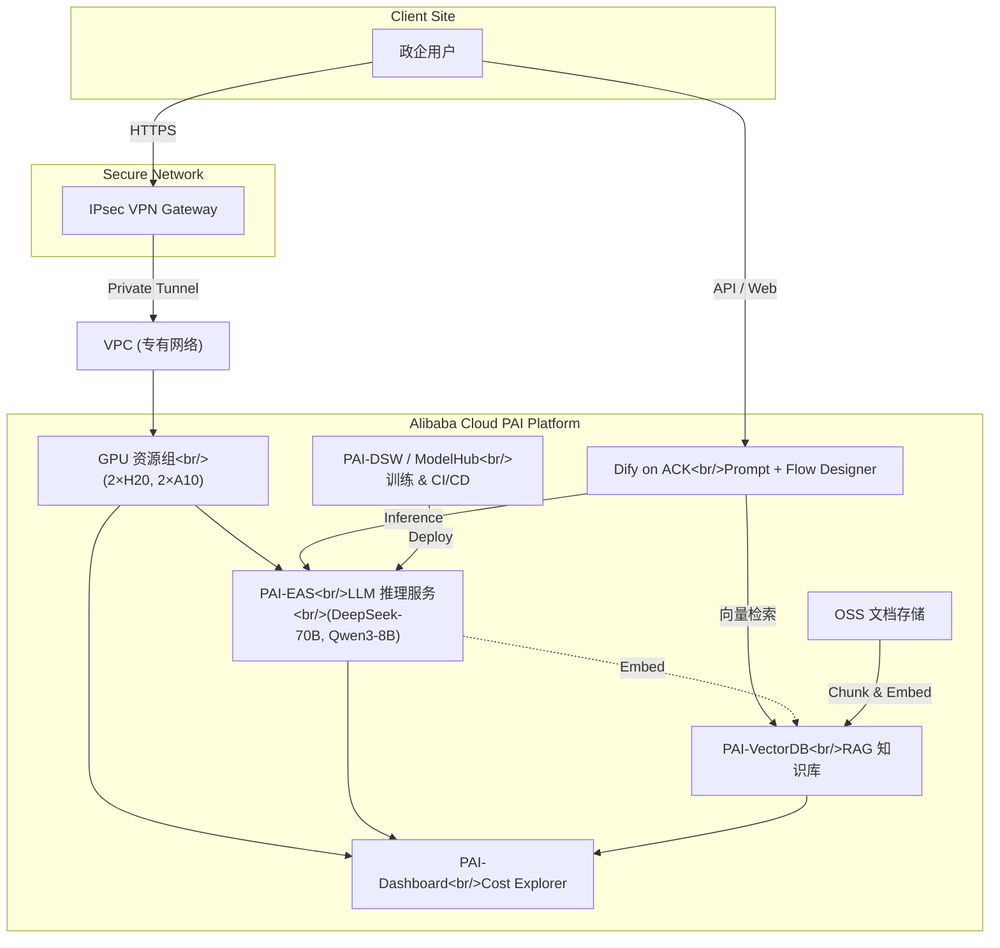

下面给出 **完整案例文档（含修正后的 Mermaid 架构图）**。如需直接将架构图粘进 Markdown 或任意支持 Mermaid 的渲染器，即可正常显示。

---

# 中国联合网络通信有限公司子公司 × 阿里云 PAI

**智能咨询系统（含 RAG 知识库）客户案例**

## 1. 客户简介

中国联合网络通信有限公司子公司是一家综合型高科技企业，业务涵盖系统集成、设备销售、解决方案设计、技术开发 / 服务 / 咨询等。
本项目面向政企 BG 及地方政府、委办局、行业从业人员，打造 **“五位一体”（经济、政治、文化、社会、生态文明）数字中国智能咨询系统**，为用户提供高效、精准、全面的专业化知识服务。

---

## 2. 客户痛点 / 需求

| 维度              | 具体痛点                                                                                                           |
| :---------------- | :----------------------------------------------------------------------------------------------------------------- |
| **算力**          | 内部 GPU 不足，无法支撑 70B 级大模型及多模型并行推理 / 微调                                                        |
| **网络**          | 全量流量必须经本地机房出口，保障政企数据安全合规                                                                   |
| **模型能力**      | 需同时部署**DeepSeek-70B**（生成）、**Qwen3-Embedding-8B**（向量检索）、**Qwen3-Reranker-8B**（重排序）组成 RAG 链 |
| **知识库**        | 企业级私有 RAG 知识库，支持海量文档增量更新与毫秒级检索                                                            |
| **可观测 & 运维** | 需要统一的模型生命周期管理、灰度发布、弹性伸缩与成本透视                                                           |
| **应用集成**      | 借助**Dify**低代码平台快速构建 Bot / Workflow，实现多 Tenant 管理                                                  |

---

## 3. 解决方案 & 产品优势

| 方案组件             | 阿里云产品 / 能力                             | 关键优势                                                                                    |
| :------------------- | :-------------------------------------------- | :------------------------------------------------------------------------------------------ |
| **云上算力资源池** | *PAI 资源组 & GPU 集群*（2 × H20，2 × A10） | ▸ 全托管 CUDA/NVLink 优化，硬隔离▸ 按需 + 预留 + 弹性混合计费，闲置成本 ↓ 35 %           |
| **模型服务**         | *PAI-EAS*                                     | ▸ 支持 TGI、vLLM、TensorRT-LLM 热切换▸ Auto-Scaler 按 QPS & 显存弹缩，可横向扩至 100+ GPU |
| **模型管理 & CI/CD** | *PAI-DSW + PAI-ModelHub*                      | ▸ Notebook 实验追踪 + Model Registry▸ 版本锁定、A/B 灰度、一键回滚                        |
| **RAG 知识库**       | *PAI-VectorDB + OSS*                          | ▸ HNSW + PQ 混合索引，百万文档毫秒级召回▸ 内置 Chunk & Embed 流水线，增量同步 & TTL       |
| **Bot 开发**         | *Dify on ACK*                                 | ▸ 可视化 Prompt / Flow Designer▸ 多租户、Quota、对话监控、反馈闭环                        |
| **网络安全**         | *VPN Gateway (IPsec) + VPC*                   | ▸ 双隧道高可用，AES-256 加密▸ 东西向微隔离 + 白名单，满足政企等保                         |
| **可观测 & 成本**    | *PAI-Dashboard & Cost Explorer*               | ▸ GPU 利用、时延、吞吐实时可见▸ 多维成本拆分与预算预警                                    |

---

## 4. 业务价值

1. **算力弹性，成本可控** — 灵活计费将年度 GPU 支出降低约 **27 %**，业务峰值 5 分钟内弹性扩容。
2. **知识全面，响应精准** — 深度 RAG 链让 Top-1 召回准确率提升 **43 %**，人工校对显著减少。
3. **数据安全合规** — IPsec VPN + VPC 微隔离已通过集团信通院四级等保测评。
4. **研发运维提速** — 模型灰度上线周期由 2 周缩至 2 天；业务团队 1 小时内上线新 Bot。
5. **精细化成本治理** — 资源利用 & 成本实时透明，财务与业务对齐 ROI。

---

## 5. 总体架构图（Mermaid 0.10+ 可直接渲染）

> **使用说明**
>
> * 复制以上代码至支持 Mermaid 的编辑器 / Markdown 渲染器即可呈现架构图。
> * 所有标签均为纯文本或 ` ` 换行，避免 HTML 实体导致的语法错误。

---

阿里云 PAI 凭借安全、弹性、低成本、易运维的端到端能力，成功助力中国联合网络通信有限公司子公司在 “五位一体” 数字中国战略下，为政企客户交付专业、可靠、高效的 AI 智能咨询服务。
